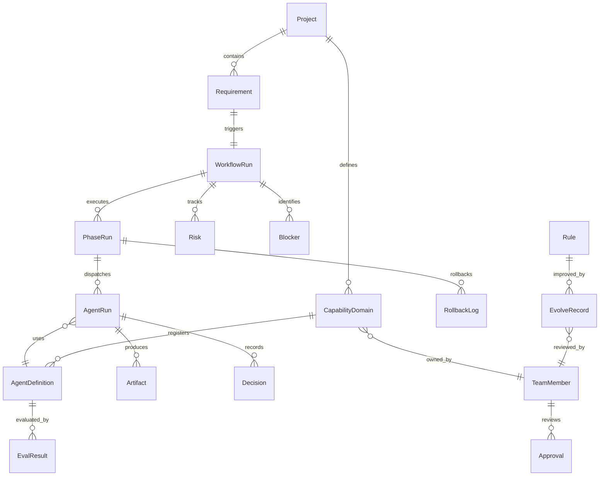
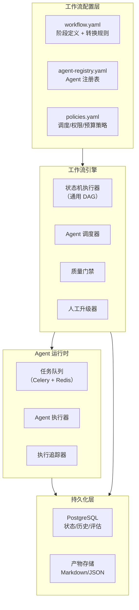
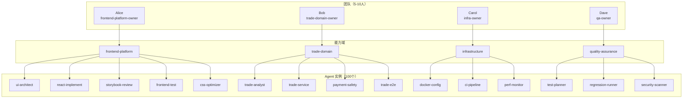
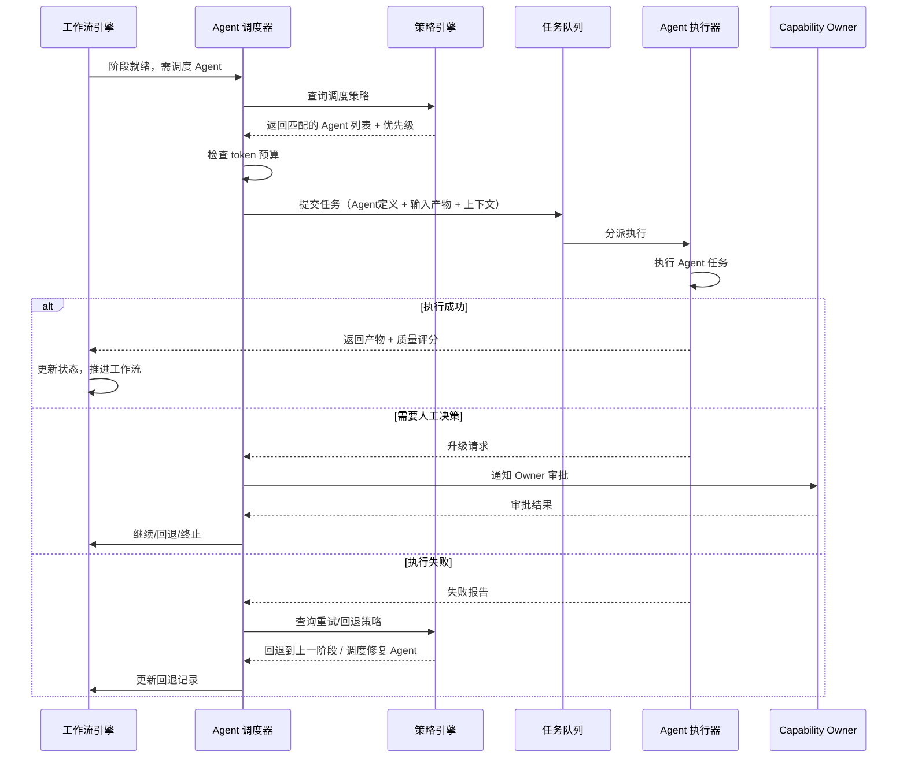
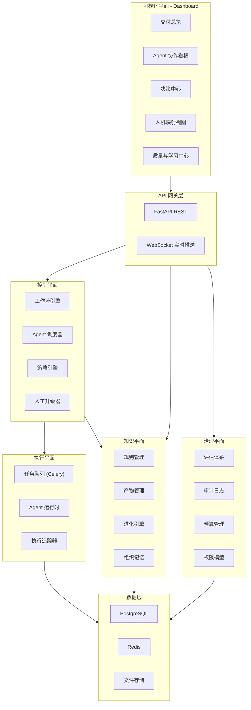

## 用户需求

在当前工作区 `/Users/stevenpxiao/Claude Code/` 下新建项目目录 `agentic-delivery-os`，启动一个通用的 AI 交付控制塔平台项目，并输出一份详尽的实施方案。

## 产品概述

**Agentic Delivery OS** — 面向团队管理者的 AI 工程交付操作系统。将 vibe-coding 项目中已验证的"文件状态机 + Agent 编排 + 人工 Gate + 进化闭环"模式，升级为通用的团队级 AI 交付控制平台。核心目标：让 5-10 人的小团队能管理和协调 100 个 AI Agent，实现需求的全流程自动化交付。

## 核心特性

### 1. 通用工作流引擎

- 可配置的 DAG/状态机工作流定义（YAML 配置化，不硬编码阶段）
- 支持阶段模板库：分析、设计、实现、验证、归档等可组合阶段
- 阶段内三步模式（预览-执行-总结确认）作为通用协议
- 支持澄清循环、质量门禁、精细化回退
- 多需求并行执行，工作流级别资源隔离

### 2. Agent 注册与调度

- Agent 注册表：每个 Agent 的角色、能力标签、适用阶段、Prompt 定义
- 调度策略：按阶段自动匹配 Agent、支持优先级调度和并行调度
- Agent 运行时：执行记录、输入输出追踪、token 消耗统计
- Agent Catalog：可复用的 Agent 模板市场

### 3. 人机映射与 Capability Owner 模型

- Capability Domain（能力域）定义：前端、后端、测试、架构等
- 人员绑定能力域，Agent 挂载到能力域下，形成多对一关系
- Owner 审批队列：待决策、待审批、待澄清项聚合
- 升级策略：Agent 遇到阻塞自动升级到对应 Owner

### 4. 管理者 Dashboard（五大视图）

- 交付总览：需求进度、阶段分布、风险热力图、回滚次数、健康度评分
- Agent 协作看板：活跃 Agent、任务时长、失败率、handoff 质量
- 决策中心：待决策项、ADR 列表、风险接受/拒绝记录
- 人机映射视图：Owner 负载、Agent 分配、审批积压、瓶颈识别
- 质量与学习中心：缺陷模式、规则改进记录、Agent 可信度评分

### 5. 知识进化体系

- 规则管理：编码规范、架构规则、审批规则的版本化管理
- 进化闭环：缺陷回溯 -> 改进建议 -> Owner 审阅 -> 规则落地
- Artifact 版本化：所有产物带版本号，支持 diff 和回溯
- 组织记忆：历史缺陷模式、最佳实践自动沉淀

## 技术栈选型

### 后端 API

- **Python 3.12 + FastAPI**：高性能异步框架，适合 AI 编排场景，生态丰富
- **SQLAlchemy 2.0 + Alembic**：ORM 和数据库迁移
- **PostgreSQL 16**：主数据库，支持 JSONB 用于灵活的工作流状态存储
- **Redis 7**：Agent 任务队列、缓存、实时状态广播
- **Celery**：异步任务队列，Agent 执行调度
- **Pydantic v2**：数据校验和 API Schema

### 前端 Dashboard

- **React 18 + TypeScript**：与 vibe-coding Web 端保持一致
- **Vite 6**：构建工具
- **Ant Design 5**：UI 组件库（与参考项目一致）
- **Zustand**：状态管理
- **Tailwind CSS**：样式系统
- **Recharts**：数据可视化图表
- **React Router 6**：路由

### 基础设施

- **Docker Compose**：本地开发环境编排
- **WebSocket (FastAPI)**：Dashboard 实时数据推送

---

## 实现方案

### 总体策略

采用"数据模型先行 + API 驱动 + Dashboard 跟进"的策略。先将 vibe-coding 中的文件系统状态机模型提炼为关系型数据模型，再构建 RESTful API 层，最后用 React Dashboard 对接。第一阶段聚焦 Single Repo Harness，即在数据库中管理单个仓库的多需求工作流。

### 核心数据模型

系统围绕以下核心实体构建：



### 工作流引擎设计

从 vibe-coding 的硬编码 15 阶段状态机，升级为 YAML 配置驱动的通用工作流引擎：



工作流配置示例（从 vibe-coding 的 phase-transitions.json 升级）：

```
# workflow-templates/fullstack-delivery.yaml
name: "全栈交付工作流"
version: "1.0"
phases:
  - id: ANALYSE_PRODUCT
    name: "产品需求分析"
    agent_role: "product-analyst"
    three_step_mode: true
    clarify_enabled: true
    outputs: ["product-requirements.md", "product-clarify.json"]
    
  - id: ANALYSE_TECH
    name: "技术需求分析"
    agent_role: "fullstack-analyst"
    three_step_mode: true
    clarify_enabled: true
    depends_on: [ANALYSE_PRODUCT]
    
  - id: ARCHITECT
    name: "架构设计"
    parallel_agents: ["backend-architect", "frontend-architect"]
    clarify_enabled: true
    depends_on: [ANALYSE_TECH]
    
  - id: IMPLEMENT
    name: "代码实现"
    dynamic_dispatch: true
    dispatch_strategy: "by_capability_domain"
    depends_on: [ARCHITECT]
    
  - id: VERIFY
    name: "验证"
    sequential_agents: ["build-verifier", "e2e-verifier", "test-engineer"]
    rollback_target: IMPLEMENT
    max_rollback: 2
    depends_on: [IMPLEMENT]
    
  - id: ARCHIVE
    name: "归档"
    agent_role: "archiver"
    depends_on: [VERIFY]

transitions:
  ANALYSE_PRODUCT: {next: ANALYSE_TECH, can_skip_to: null}
  ANALYSE_TECH: {next: ARCHITECT, can_skip_to: null}
  ARCHITECT: {next: IMPLEMENT, can_skip_to: null}
  IMPLEMENT: {next: VERIFY, can_skip_to: null}
  VERIFY: {next: ARCHIVE, can_skip_to: null, rollback_to: IMPLEMENT}
  ARCHIVE: {next: DONE, can_skip_to: null}
```

### 人机映射模型

从 vibe-coding 的"8 人分工表"升级为可配置的 Capability Owner 模型：



### Agent 调度策略



---

## 实现注意事项

### 从 vibe-coding 的复用点

- **state.json Schema** 的核心字段（currentPhase, phaseHistory, platforms, rollbackLog）直接映射为数据库表结构
- **phase-transitions.json** 的转换规则升级为工作流配置 YAML
- **三步模式**（预览-执行-总结确认）作为 PhaseRun 的标准生命周期
- **evolve 机制**的 pending/applied/rejected/deferred 状态机保留为规则进化模型
- **质量门禁** pass/warn/fail 三级评估保留

### 性能考量

- Agent 执行采用异步队列（Celery），不阻塞 API 响应
- Dashboard 实时更新通过 WebSocket 推送，避免轮询
- 工作流状态变更采用乐观锁防止并发冲突
- 大量 Agent 并行时通过 token budget 控制成本

### 安全与可靠性

- Agent 执行结果不可变（append-only log）
- 所有决策留痕（Decision 表记录 who/when/what/why）
- 回退操作需二次确认，与 vibe-coding 的 rollback-rules 保持一致
- 敏感操作（代码提交、PR 创建）需 Owner 审批

---

## 架构设计

### 系统分层架构



---

## 目录结构

项目新建在 `/Users/stevenpxiao/Claude Code/agentic-delivery-os/`：

```
agentic-delivery-os/
├── README.md                          # [NEW] 项目总览文档。包含产品定位、架构概述、快速开始指南、演进路线图。
├── docs/                              # [NEW] 项目文档目录
│   ├── PRD.md                         # [NEW] 产品需求文档。详细定义五大 Dashboard 视图的功能规格、用户故事、验收标准。
│   ├── architecture.md                # [NEW] 架构设计文档。包含四层架构详解、数据模型 ER 图、API 设计规范、部署架构。
│   ├── data-model.md                  # [NEW] 数据模型文档。所有核心实体的字段定义、关系说明、索引策略、JSONB 字段 Schema。
│   ├── workflow-engine.md             # [NEW] 工作流引擎设计文档。状态机执行逻辑、YAML 配置规范、三步模式协议、回退策略。
│   ├── agent-scheduling.md            # [NEW] Agent 调度设计文档。调度算法、并行策略、token budget 控制、失败处理。
│   ├── human-agent-mapping.md         # [NEW] 人机映射设计文档。Capability Owner 模型、审批流程、升级策略、负载均衡。
│   └── evolution-system.md            # [NEW] 知识进化系统设计文档。进化闭环流程、规则版本管理、质量评估体系。
├── backend/                           # [NEW] 后端服务目录
│   ├── pyproject.toml                 # [NEW] Python 项目配置。定义 FastAPI、SQLAlchemy、Celery 等依赖，配置 linting 和 testing 工具。
│   ├── alembic.ini                    # [NEW] Alembic 数据库迁移配置。
│   ├── alembic/                       # [NEW] 数据库迁移目录
│   │   ├── env.py                     # [NEW] Alembic 环境配置，连接 SQLAlchemy metadata。
│   │   └── versions/                  # [NEW] 迁移版本文件目录
│   │       └── 001_initial_schema.py  # [NEW] 初始数据库 Schema 迁移。创建所有核心表：projects, requirements, workflow_runs, phase_runs, agent_runs, agent_definitions, capability_domains, team_members, artifacts, decisions, risks, blockers, approvals, eval_results, rules, evolve_records, rollback_logs, budget_usages。
│   ├── app/                           # [NEW] FastAPI 应用主目录
│   │   ├── __init__.py                # [NEW] 包初始化
│   │   ├── main.py                    # [NEW] FastAPI 应用入口。配置 CORS、挂载路由、WebSocket 端点、健康检查。
│   │   ├── config.py                  # [NEW] 应用配置。数据库 URL、Redis URL、Celery broker、token budget 等环境变量管理。
│   │   ├── database.py                # [NEW] 数据库连接管理。SQLAlchemy async session factory、依赖注入。
│   │   ├── models/                    # [NEW] SQLAlchemy ORM 模型目录
│   │   │   ├── __init__.py            # [NEW] 模型包初始化，导出所有模型类
│   │   │   ├── project.py             # [NEW] Project 模型。字段：id, name, description, repo_url, created_at, updated_at。
│   │   │   ├── requirement.py         # [NEW] Requirement 模型。字段：id, project_id, name, description, priority, sla_deadline, status, prd_source, created_at。
│   │   │   ├── workflow.py            # [NEW] WorkflowRun 模型。字段：id, requirement_id, workflow_template, current_phase, status, phase_history(JSONB), platforms(JSONB), created_at, updated_at。PhaseRun 模型。字段：id, workflow_run_id, phase_id, status, started_at, completed_at, quality_gate, step(preview/execute/summary)。
│   │   │   ├── agent.py               # [NEW] AgentDefinition 模型。字段：id, name, role, capability_tags, phase_bindings, prompt_template, version。AgentRun 模型。字段：id, phase_run_id, agent_definition_id, status, input_artifacts, output_artifacts, token_usage, started_at, completed_at, error_message。
│   │   │   ├── team.py                # [NEW] TeamMember 模型。字段：id, name, email, role, avatar_url。CapabilityDomain 模型。字段：id, name, description, owner_id(FK->TeamMember)。HumanBinding 模型：agent_definition_id + capability_domain_id 关联。
│   │   │   ├── artifact.py            # [NEW] Artifact 模型。字段：id, agent_run_id, name, file_path, artifact_type, version, content_hash, created_at。
│   │   │   ├── decision.py            # [NEW] Decision 模型。字段：id, workflow_run_id, phase_run_id, decision_type, made_by(human/ai), decider_id, title, content, context, created_at。Approval 模型。字段：id, decision_id, reviewer_id, status(pending/approved/rejected), comment, created_at。
│   │   │   ├── risk.py                # [NEW] Risk 模型。字段：id, workflow_run_id, risk_id_code, title, description, severity, status, source_phase, created_at。Blocker 模型。字段：id, workflow_run_id, title, blocked_phase, assigned_to, status, resolved_at。
│   │   │   ├── quality.py             # [NEW] EvalResult 模型。字段：id, agent_definition_id, metric_name, score, sample_size, evaluated_at。Rule 模型。字段：id, name, category, content, version, status, created_at。EvolveRecord 模型。字段：id, rule_id, title, bug_source, affected_agents, improvement_type, suggestion, status(pending/applied/rejected/deferred), author_id, reviewer_id, created_at, applied_at。
│   │   │   └── budget.py              # [NEW] BudgetUsage 模型。字段：id, agent_run_id, token_input, token_output, cost_usd, budget_category。
│   │   ├── schemas/                   # [NEW] Pydantic Schema 目录
│   │   │   ├── __init__.py            # [NEW] Schema 包初始化
│   │   │   ├── project.py             # [NEW] Project 相关的请求/响应 Schema
│   │   │   ├── requirement.py         # [NEW] Requirement 相关 Schema，包含状态枚举
│   │   │   ├── workflow.py            # [NEW] WorkflowRun 和 PhaseRun 的 Schema，包含 phase_history 的嵌套结构
│   │   │   ├── agent.py               # [NEW] Agent 相关 Schema
│   │   │   ├── team.py                # [NEW] 团队和能力域 Schema
│   │   │   ├── dashboard.py           # [NEW] Dashboard 聚合查询 Schema：交付总览统计、Agent 协作指标、决策队列、Owner 负载等
│   │   │   └── quality.py             # [NEW] 质量评估和进化记录 Schema
│   │   ├── api/                       # [NEW] API 路由目录
│   │   │   ├── __init__.py            # [NEW] 路由包初始化
│   │   │   ├── projects.py            # [NEW] 项目 CRUD API
│   │   │   ├── requirements.py        # [NEW] 需求 CRUD API + 状态流转
│   │   │   ├── workflows.py           # [NEW] 工作流操作 API：启动、推进、回退、断点恢复。核心端点：POST /workflows/{id}/advance, POST /workflows/{id}/rollback
│   │   │   ├── agents.py              # [NEW] Agent 管理 API：注册、配置、执行记录查询
│   │   │   ├── team.py                # [NEW] 团队管理 API：成员 CRUD、能力域配置、Agent 绑定
│   │   │   ├── dashboard.py           # [NEW] Dashboard 聚合 API：交付总览、Agent 指标、决策队列、Owner 负载、质量趋势
│   │   │   ├── decisions.py           # [NEW] 决策和审批 API：创建决策、提交审批、审批操作
│   │   │   └── evolution.py           # [NEW] 进化系统 API：提交改进建议、审阅操作、规则管理
│   │   ├── services/                  # [NEW] 业务逻辑层目录
│   │   │   ├── __init__.py            # [NEW] 服务包初始化
│   │   │   ├── workflow_engine.py     # [NEW] 工作流引擎核心服务。实现：YAML 配置解析、状态机推进、三步模式生命周期、澄清循环、质量门禁检查、流转守卫校验。参考 vibe-coding 的 SKILL.md 和 phase-transitions.json 逻辑。
│   │   │   ├── agent_scheduler.py     # [NEW] Agent 调度服务。实现：按阶段匹配 Agent、优先级排序、并行/串行调度、token budget 检查、失败重试策略。参考 vibe-coding 的 implement-rules.md 和 build-verify-rules.md。
│   │   │   ├── escalation.py          # [NEW] 人工升级服务。实现：阻塞检测、Owner 路由、通知发送、超时处理。
│   │   │   ├── dashboard_aggregator.py # [NEW] Dashboard 数据聚合服务。实现五大视图的数据计算：交付指标、Agent 效能、决策队列、Owner 负载、质量趋势。
│   │   │   └── evolution_service.py   # [NEW] 进化引擎服务。实现：改进建议生成、规则版本管理、审阅流程、效果评估。参考 vibe-coding 的 evolve.md 逻辑。
│   │   ├── tasks/                     # [NEW] Celery 异步任务目录
│   │   │   ├── __init__.py            # [NEW] 任务包初始化，Celery app 配置
│   │   │   └── agent_executor.py      # [NEW] Agent 执行异步任务。实现：加载 Agent 定义、注入上下文、调用 LLM、收集产物、记录执行数据。
│   │   └── websocket/                 # [NEW] WebSocket 模块
│   │       ├── __init__.py            # [NEW] WebSocket 包初始化
│   │       └── events.py              # [NEW] 实时事件推送。事件类型：workflow_updated, phase_changed, agent_completed, decision_required, risk_identified。
│   ├── tests/                         # [NEW] 测试目录
│   │   ├── __init__.py                # [NEW] 测试包初始化
│   │   ├── conftest.py                # [NEW] Pytest fixtures：测试数据库、测试客户端、工厂函数
│   │   ├── test_workflow_engine.py    # [NEW] 工作流引擎单元测试：状态推进、回退、门禁、守卫校验
│   │   └── test_agent_scheduler.py    # [NEW] Agent 调度单元测试：匹配、优先级、并行、预算控制
│   └── Dockerfile                     # [NEW] 后端服务 Docker 镜像配置
├── frontend/                          # [NEW] Dashboard 前端目录
│   ├── package.json                   # [NEW] 前端依赖配置。React 18 + TypeScript + Vite 6 + Ant Design 5 + Zustand + Recharts + Tailwind CSS。
│   ├── tsconfig.json                  # [NEW] TypeScript 配置
│   ├── vite.config.ts                 # [NEW] Vite 构建配置，含 API 代理
│   ├── tailwind.config.js             # [NEW] Tailwind CSS 配置
│   ├── index.html                     # [NEW] HTML 入口
│   ├── public/                        # [NEW] 静态资源目录
│   └── src/                           # [NEW] 前端源码目录
│       ├── main.tsx                   # [NEW] React 应用入口
│       ├── App.tsx                    # [NEW] 根组件，路由配置
│       ├── api/                       # [NEW] API 客户端层
│       │   ├── client.ts              # [NEW] Axios 实例配置、拦截器、WebSocket 连接
│       │   ├── workflows.ts           # [NEW] 工作流相关 API 调用
│       │   ├── agents.ts              # [NEW] Agent 相关 API 调用
│       │   ├── team.ts                # [NEW] 团队相关 API 调用
│       │   ├── dashboard.ts           # [NEW] Dashboard 聚合 API 调用
│       │   └── decisions.ts           # [NEW] 决策审批 API 调用
│       ├── stores/                    # [NEW] Zustand 状态管理
│       │   ├── workflowStore.ts       # [NEW] 工作流状态 Store
│       │   ├── dashboardStore.ts      # [NEW] Dashboard 数据 Store，含 WebSocket 实时更新
│       │   └── authStore.ts           # [NEW] 用户认证 Store
│       ├── pages/                     # [NEW] 页面组件目录
│       │   ├── DeliveryOverview.tsx    # [NEW] 交付总览页。需求进度表、阶段分布饼图、风险热力图、回滚统计、健康度评分卡。
│       │   ├── AgentBoard.tsx         # [NEW] Agent 协作看板页。Agent 列表、任务时长图表、失败率趋势、handoff 质量矩阵。
│       │   ├── DecisionCenter.tsx     # [NEW] 决策中心页。待决策队列、ADR 列表、风险审批记录、历史决策搜索。
│       │   ├── TeamMapping.tsx        # [NEW] 人机映射视图页。Owner 负载仪表盘、Agent 树状图、审批积压、瓶颈告警。
│       │   ├── QualityCenter.tsx      # [NEW] 质量与学习中心页。缺陷模式图、规则改进记录、Agent 可信度排行、进化日志。
│       │   ├── WorkflowDetail.tsx     # [NEW] 工作流详情页。阶段时间线、当前状态、产物列表、回退历史。
│       │   └── Settings.tsx           # [NEW] 系统设置页。工作流模板管理、Agent 注册配置、团队成员管理。
│       ├── components/                # [NEW] 通用组件目录
│       │   ├── Layout.tsx             # [NEW] 全局布局组件。顶部导航 + 侧边菜单 + 内容区。
│       │   ├── PhaseTimeline.tsx      # [NEW] 阶段时间线组件。可视化展示工作流阶段进度，参考 vibe-coding 的 output-formats.md 样式。
│       │   ├── AgentCard.tsx          # [NEW] Agent 卡片组件。展示 Agent 状态、当前任务、Owner 信息。
│       │   ├── DecisionCard.tsx       # [NEW] 决策卡片组件。展示待决策项、审批按钮、上下文信息。
│       │   ├── RiskBadge.tsx          # [NEW] 风险徽章组件。高中低三级风险颜色标识。
│       │   └── MetricCard.tsx         # [NEW] 指标卡片组件。数值 + 趋势箭头 + 迷你图表。
│       ├── hooks/                     # [NEW] 自定义 Hooks 目录
│       │   ├── useWebSocket.ts        # [NEW] WebSocket 连接 Hook，自动重连、事件分发。
│       │   └── useDashboardData.ts    # [NEW] Dashboard 数据 Hook，定时刷新 + 实时更新融合。
│       └── types/                     # [NEW] TypeScript 类型定义
│           └── index.ts               # [NEW] 所有实体类型定义，与后端 Schema 对齐。
├── workflow-templates/                # [NEW] 工作流模板目录
│   ├── fullstack-delivery.yaml        # [NEW] 全栈交付工作流模板。从 vibe-coding 的 15 阶段提炼的通用模板。
│   ├── frontend-only.yaml             # [NEW] 纯前端交付工作流模板。
│   └── hotfix.yaml                    # [NEW] 热修复工作流模板。简化阶段：分析->实现->验证->归档。
├── agent-catalog/                     # [NEW] Agent 目录
│   ├── README.md                      # [NEW] Agent Catalog 说明。注册规范、Prompt 编写指南、评估标准。
│   ├── analysis/                      # [NEW] 分析类 Agent 定义目录
│   │   └── product-analyst.yaml       # [NEW] 产品需求分析 Agent 定义。从 vibe-coding 的 product-analyst.md 提炼为通用 YAML 格式。
│   ├── architecture/                  # [NEW] 架构类 Agent 定义目录
│   │   ├── backend-architect.yaml     # [NEW] 后端架构 Agent 定义
│   │   └── frontend-architect.yaml    # [NEW] 前端架构 Agent 定义
│   ├── implementation/                # [NEW] 实现类 Agent 定义目录
│   │   └── domain-developer.yaml      # [NEW] 领域开发 Agent 定义模板（参数化，支持不同领域实例化）
│   ├── verification/                  # [NEW] 验证类 Agent 定义目录
│   │   ├── build-verifier.yaml        # [NEW] 编译验证 Agent 定义
│   │   └── test-engineer.yaml         # [NEW] 测试 Agent 定义
│   └── operations/                    # [NEW] 运维类 Agent 定义目录
│       └── archiver.yaml              # [NEW] 归档 Agent 定义
├── docker-compose.yml                 # [NEW] 本地开发环境编排。服务：postgres, redis, backend, frontend, celery-worker。
└── .gitignore                         # [NEW] Git 忽略配置
```

---

## 关键代码结构

### 1. 工作流引擎核心接口

```python
# backend/app/services/workflow_engine.py

from enum import Enum
from typing import Optional

class PhaseStep(str, Enum):
    PREVIEW = "preview"
    EXECUTE = "execute" 
    SUMMARY = "summary"

class WorkflowEngine:
    """通用工作流引擎 - 从 vibe-coding 的 SKILL.md 编排逻辑升级"""
    
    async def load_template(self, template_path: str) -> "WorkflowTemplate": ...
    async def start_workflow(self, requirement_id: int, template_name: str) -> "WorkflowRun": ...
    async def advance_phase(self, workflow_id: int, user_confirmation: bool) -> "PhaseRun": ...
    async def rollback_phase(self, workflow_id: int, reason: str) -> "RollbackLog": ...
    async def resume_workflow(self, workflow_id: int) -> "WorkflowRun": ...
    
    # 流转守卫 - 对应 vibe-coding 的 phase-transitions.json 校验
    async def validate_transition(self, current_phase: str, target_phase: str) -> bool: ...
    
    # 三步模式生命周期
    async def preview_phase(self, workflow_id: int) -> dict: ...
    async def execute_phase(self, workflow_id: int) -> "AgentRun": ...
    async def summarize_phase(self, workflow_id: int) -> dict: ...
```

### 2. Agent 调度器接口

```python
# backend/app/services/agent_scheduler.py

class AgentScheduler:
    """Agent 调度器 - 从 vibe-coding 的 implement-rules.md 调度逻辑升级"""
    
    async def dispatch(self, phase_run: "PhaseRun") -> list["AgentRun"]: ...
    async def dispatch_repair(self, rollback_log: "RollbackLog") -> list["AgentRun"]: ...
    
    # 策略方法
    async def match_agents(self, phase_id: str, capability_tags: list[str]) -> list["AgentDefinition"]: ...
    async def check_budget(self, agent_def: "AgentDefinition", budget_category: str) -> bool: ...
    async def route_to_owner(self, agent_run: "AgentRun", reason: str) -> "Approval": ...
```

### 3. Dashboard 聚合数据类型

```typescript
// frontend/src/types/index.ts

interface DeliveryOverview {
  totalRequirements: number;
  inProgress: number;
  completed: number;
  blocked: number;
  phaseDistribution: Record<string, number>;
  riskHeatmap: { severity: string; count: number }[];
  rollbackCount: number;
  healthScore: number;  // 0-100
  avgDeliveryDays: number;
}

interface AgentMetrics {
  totalAgents: number;
  activeAgents: number;
  avgTaskDuration: number;
  failureRate: number;
  retryRate: number;
  handoffQuality: { from: string; to: string; reworkRate: number }[];
  topBlockingAgents: { agentName: string; blockCount: number }[];
}

interface OwnerWorkload {
  memberId: number;
  memberName: string;
  agentCount: number;
  pendingApprovals: number;
  activeTaskCount: number;
  avgResponseTime: number;  // hours
  isBottleneck: boolean;
}
```

## 设计风格

采用现代企业级控制台设计风格，以深色侧边栏 + 浅色内容区为基础布局。Dashboard 以数据密度优先，使用卡片式布局呈现多维度指标，辅以图表和时间线实现数据可视化。整体设计追求专业、高效、信息密度适中的管理驾驶舱体验。

## 页面规划

### 页面 1：交付总览（默认首页）

- **顶部导航栏**：Logo + 产品名称 + 项目切换下拉框 + 用户头像
- **侧边菜单**：五大视图入口 + 设置入口，深色背景，图标 + 文字
- **指标卡片区**：4 个 MetricCard 横排（需求总数/进行中/已完成/阻塞），数值突出 + 趋势箭头
- **主内容区左侧**：需求列表表格，每行显示名称、当前阶段进度条、Owner、健康度徽章
- **主内容区右侧**：阶段分布环形图 + 风险热力图（按严重度和模块交叉矩阵）
- **底部区域**：最近回滚事件时间线（最近 5 条），附回退原因和修复状态

### 页面 2：Agent 协作看板

- **顶部**：Agent 数量统计卡片（总数/活跃/空闲/失败）
- **中部左侧**：Agent 列表，卡片视图，每张卡片显示 Agent 名称、角色标签、当前任务、Owner 头像、状态灯（绿/黄/红）
- **中部右侧**：协作链路图（Sankey 图），展示阶段间 Agent 的 handoff 关系和返工率
- **底部**：Agent 效能排行表格（首次通过率、平均耗时、token 消耗），支持排序

### 页面 3：决策中心

- **顶部**：待决策数量徽章 + 紧急程度筛选器
- **主区域**：决策卡片流，每张卡片含标题、上下文摘要、选项按钮（批准/拒绝/暂缓）、关联的工作流链接
- **侧边栏**：ADR 列表（可折叠）、历史决策搜索框
- **底部**：风险接受/拒绝统计饼图

### 页面 4：人机映射视图

- **左侧**：团队成员列表，卡片式，显示头像、姓名、能力域标签、负载进度条
- **中部**：选中成员的 Agent 树状图，展示该 Owner 名下所有 Agent 及各自当前状态
- **右侧**：选中成员的审批积压列表 + 响应时间趋势图
- **底部**：瓶颈告警区域，高亮显示过载的 Owner

### 页面 5：质量与学习中心

- **顶部**：质量趋势折线图（首次通过率、回滚率、缺陷泄漏率按周统计）
- **中部左侧**：缺陷模式热力图（按 Agent 类型 x 缺陷类型）
- **中部右侧**：进化日志列表（pending/applied/rejected 三种状态 Tab 切换）
- **底部**：规则改进前后效果对比卡片（规则名称 + 改进前指标 + 改进后指标）

## Agent Extensions

### Skill

- **skill-creator**
- Purpose: 在项目中创建 Claude Code Skill，使得 agentic-delivery-os 项目本身也能通过 `/ados:init` 等命令驱动工作流
- Expected outcome: 生成 `.claude/skills/ados-workflow/SKILL.md` 等文件，让项目具备 AI 辅助开发能力

### SubAgent

- **code-explorer**
- Purpose: 探索 vibe-coding 仓库中的具体实现细节，确保新项目的数据模型和工作流引擎精确复用已验证的模式
- Expected outcome: 从 vibe-coding 的 SKILL.md、state-schema.json、phase-transitions.json 等文件中提取可复用的设计模式