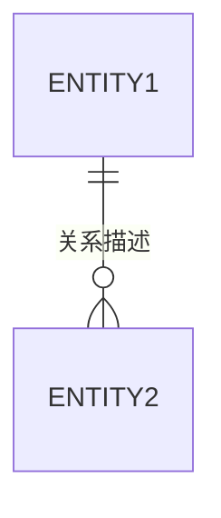

# 领域模型设计模板

> **触发条件**: 当服务需要定义聚合根、实体、值对象时加载此模板
> **加载位置**: 追加到 `## 1. 领域职责` 之后

---

## 2. 领域模型

### 2.1 聚合根

| 聚合根 | 描述 | 生命周期 |
|--------|------|----------|
| {AggregateRoot} | | 创建/更新/删除规则 |

#### 聚合根详细定义

```java
// 示例：聚合根关键属性和行为
public class {AggregateRoot} {
    // 唯一标识
    private {Id} id;
    
    // 关键业务属性
    
    // 核心业务方法
}
```

### 2.2 实体关系图



### 2.3 实体定义

| 实体 | 所属聚合 | 描述 | 主键 |
|------|----------|------|------|
| | | | |

### 2.4 值对象

| 值对象 | 描述 | 组成属性 | 不变性约束 |
|--------|------|----------|------------|
| | | | |

### 2.5 领域事件

| 事件名称 | 触发时机 | 携带数据 | 消费者 |
|----------|----------|----------|--------|
| | | | |

---

## 领域模型检查清单

- [ ] 聚合根已识别并定义边界
- [ ] 实体关系图已绘制
- [ ] 值对象已定义不变性
- [ ] 领域事件已梳理
