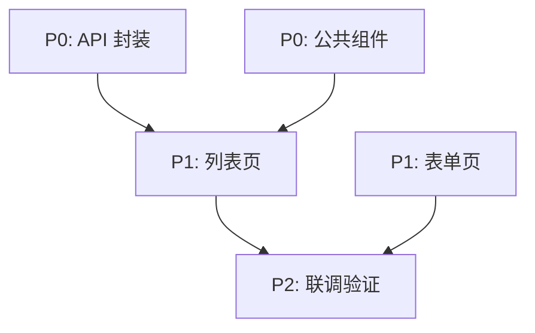

# 开发任务拆解模板

> **模板类型**: 必须加载模板
> **适用平台**: 所有前端平台
> **使用者**: 资深前端架构师 Agent
> **消费者**: 资深 Web 端代码开发 Agent / 资深小程序端代码开发 Agent

---

## 使用说明

本模板定义了开发任务拆解的输出格式。前端架构师输出的 Task 列表是下游开发工程师 Agent 的**直接输入**，因此必须满足以下要求：

1. **自包含**: 每个 Task 包含足够信息，开发 Agent 无需回溯架构文档即可执行
2. **可执行**: 每个 Task 有明确的输入、输出和验收标准
3. **有序**: Task 之间的依赖关系清晰，开发顺序明确
4. **粒度适中**: 一个 Task 对应一个开发工程师可在一次迭代中完成的工作单元

---

## Task 列表格式（合并到 §7）

### 7.1 Task 总览

| Task ID | 标题 | 优先级 | 依赖 | 预估复杂度 | 关联需求点 |
|---------|------|--------|------|-----------|-----------|
| FE-A-{序号} | {标题} | P0/P1/P2 | {依赖的 Task ID，无依赖填 "-"} | 低/中/高 | {US-xxx} |

> **Task ID 命名规则**:
> - Web 端: `FE-A-{三位序号}`（如 `FE-A-001`）
> - 小程序端: `FE-M-{三位序号}`（如 `FE-M-001`）

### 7.2 优先级定义

| 优先级 | 含义 | 执行顺序 |
|--------|------|----------|
| P0 | 基础设施 / 被多个 Task 依赖 | 最先执行 |
| P1 | 核心功能页面 | P0 完成后执行 |
| P2 | 辅助功能 / 优化项 | P1 完成后执行 |

### 7.3 Task 详情

为每个 Task 填写以下详情：

```markdown
---

### Task {FE-X-NNN}: {标题}

**优先级**: P{N}
**依赖**: {依赖的 Task ID 列表，无依赖填 "-"}
**关联需求点**: {US-xxx}
**预估复杂度**: 低/中/高

#### 目标
{一句话描述这个 Task 要完成什么}

#### 涉及文件

| 文件路径 | 操作 | 说明 |
|----------|------|------|
| `{path}` | 新增/修改 | {说明} |

#### 接口依赖（若有）

| 接口 | 引用 | 说明 |
|------|------|------|
| `{METHOD} /api/v1/{path}` | 总纲 API-xxx | {用途说明} |

#### 实现要点
1. {要点 1}
2. {要点 2}
3. {要点 3}

#### 验收标准
- [ ] {标准 1}
- [ ] {标准 2}
- [ ] {标准 3}

---
```

---

## Task 拆分原则

### 拆分粒度

| 类型 | 粒度建议 | 示例 |
|------|----------|------|
| 基础设施 | 1 个 Task = 1 个公共模块 | "封装 API 请求层" |
| 页面开发 | 1 个 Task = 1 个完整页面（四文件） | "开发商品列表页" |
| 组件开发 | 1 个 Task = 1 个全局组件 | "开发 GoodsCard 组件" |
| 状态管理 | 1 个 Task = 1 个 Store | "实现购物车 Store" |
| 集成联调 | 1 个 Task = 1 个集成场景 | "联调登录流程" |

### 拆分顺序原则

```
1. 基础设施 Task（P0）
   └── API 封装、公共类型定义、全局 Store、公共 Hooks
2. 公共组件 Task（P0/P1）
   └── 被多个页面依赖的组件
3. 核心页面 Task（P1）
   └── 主流程页面，按用户操作路径排序
4. 辅助页面 Task（P2）
   └── 非核心流程页面
5. 集成联调 Task（P2）
   └── 前后端联调、跨页面流程验证
```

### 依赖关系描述

Task 之间的依赖通过 `依赖` 字段声明。当存在复杂依赖链时，输出依赖图：



---

## Web 端 Task 特殊要求

Web 端 Task 在"实现要点"中必须包含：

| 要点 | 说明 |
|------|------|
| 使用的页面模板 | 指明使用 `ListPage` / `FormPage` / `BasePage` / `MultiTabListPage` 中的哪个，以及变体名（如有） |
| 四文件开发顺序 | 明确标注 `types.ts → api.ts → hooks.ts → index.tsx` |
| 使用的 Hooks | 指明使用 `useTable` / `useForm` 或自定义 Hook |
| 权限码 | 列出该页面涉及的权限码 |

---

## 小程序端 Task 特殊要求

小程序端 Task 在"实现要点"中必须包含：

| 要点 | 说明 |
|------|------|
| 所属包 | 标注该页面在主包还是分包 |
| 页面配置 | 是否需要 `index.config.ts` 中的特殊配置（如下拉刷新、自定义导航栏） |
| 原生能力 | 列出该 Task 涉及的微信原生能力 |
| 开发顺序 | 明确标注 `types.ts → api.ts → hooks.ts → index.tsx` |
