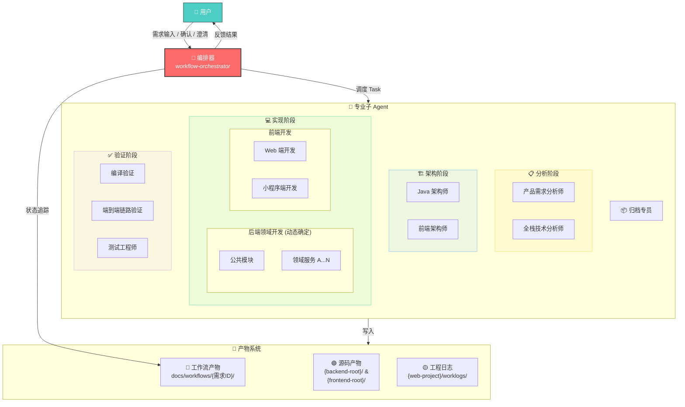
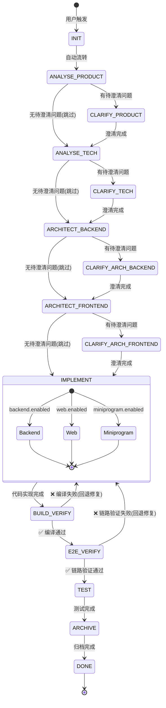
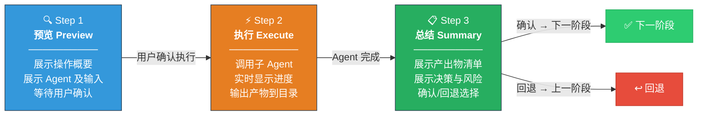
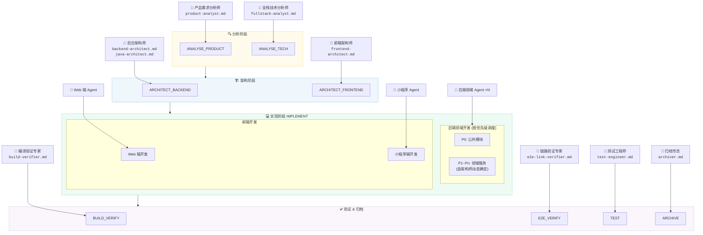
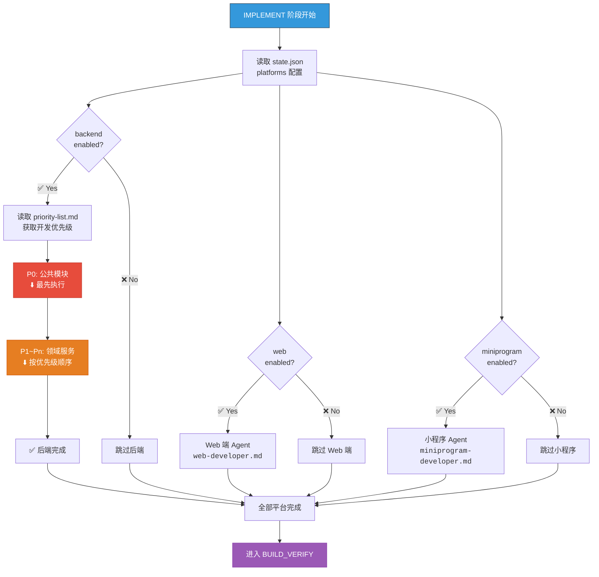
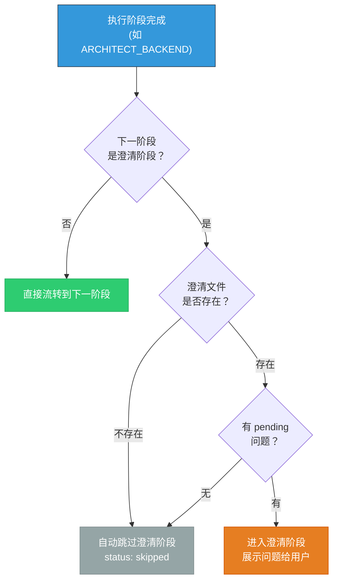
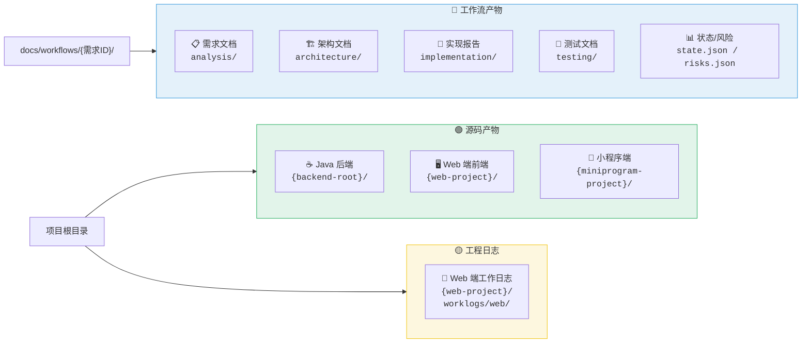
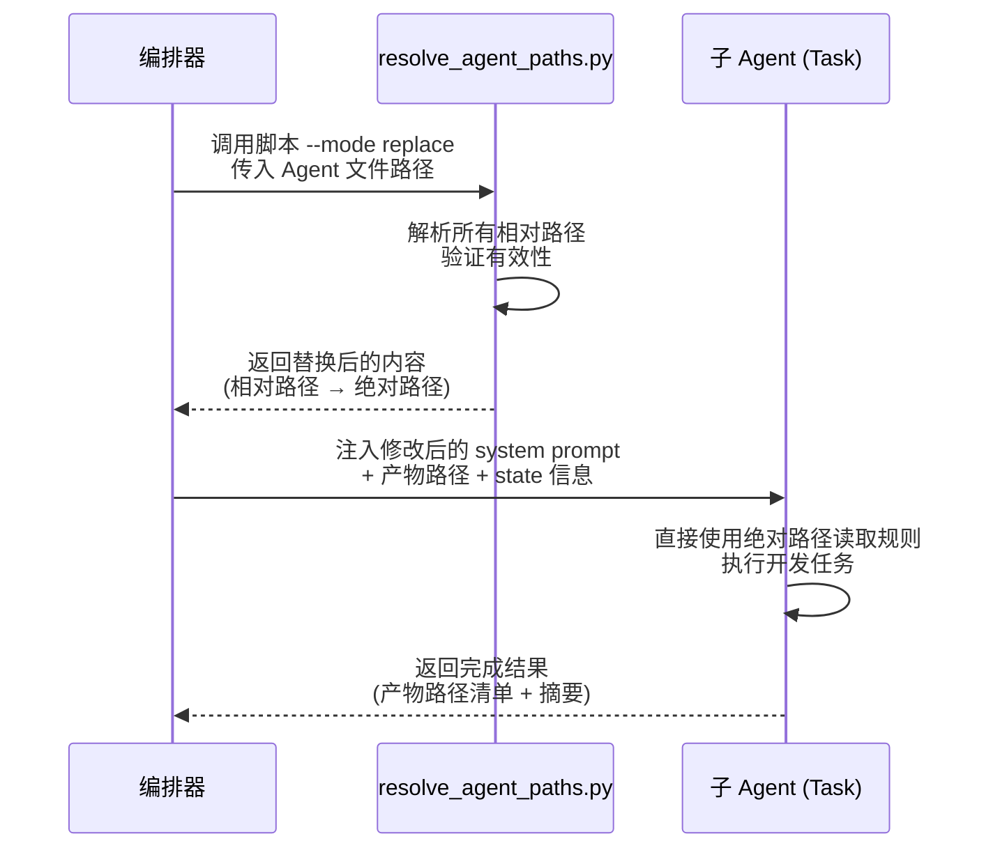

# workflow-orchestrator

> 工作流编排专家 — 需求驱动的 AI 开发流水线控制器

## 概述

本 Skill 是一个多 Agent 协作的工作流编排系统，用于将用户需求从自然语言驱动到代码实现的全流程自动化。编排器本身**不执行具体工作**（不做分析、设计、编码、测试），而是管理：

- **流程编排** — 15 个固定阶段的状态机流转
- **Agent 调度** — 按阶段调用对应的专业子 Agent
- **产物管理** — 工作流产物与源码产物的读写追踪
- **状态追踪** — `state.json` 持久化进度与元信息
- **风险管控** — `risks.json` 记录全流程风险
- **断点恢复** — 支持中断后从上次状态继续

---

## 系统架构总览



---

## 工作流阶段总览

### 状态机流转图



### 阶段定义表

| # | 阶段 ID | 名称 | 子 Agent | 说明 |
|---|---------|------|----------|------|
| 0 | `INIT` | 初始化 | 无 | 搭脚手架，自动流转，唯一不需要用户确认的阶段 |
| 1 | `ANALYSE_PRODUCT` | 产品需求分析 | 资深需求分析专家 | 分析用户需求，输出产品需求文档 |
| 2 | `CLARIFY_PRODUCT` | 产品需求澄清 | 无（编排器处理） | 读取产品 clarify.json，展示给用户，回填答案 |
| 3 | `ANALYSE_TECH` | 技术需求分析 | 资深全栈开发专家 | 基于产品需求做技术可行性分析，输出技术需求文档 |
| 4 | `CLARIFY_TECH` | 技术需求澄清 | 无（编排器处理） | 读取技术 clarify.json，展示给用户，回填答案 |
| 5 | `ARCHITECT_BACKEND` | 后端架构设计 | 资深 Java 架构师 | 后端架构设计，输出架构文档 |
| 6 | `CLARIFY_ARCH_BACKEND` | 后端架构澄清 | 无（编排器处理） | 读取后端架构 clarify.json |
| 7 | `ARCHITECT_FRONTEND` | 前端架构设计 | 资深前端架构师 | 前端架构设计（支持多端） |
| 8 | `CLARIFY_ARCH_FRONTEND` | 前端架构澄清 | 无（编排器处理） | 读取前端架构 clarify.json |
| 9 | `IMPLEMENT` | 代码实现 | 动态调度多 Agent | 后端按领域拆分调度，根据需求动态决定调用哪些端和领域 |
| 10 | `BUILD_VERIFY` | 编译验证 | 编译验证专家 | **P0 质量门禁**：编译验证，确保变更模块可编译通过 |
| 11 | `E2E_VERIFY` | 端到端链路验证 | 链路验证专家 | 跨组件运行时依赖验证，检查调用路径上下文依赖 |
| 12 | `TEST` | 测试验证 | 测试验证专家 | 生成测试方案并执行验证 |
| 13 | `ARCHIVE` | 完成归档 | 归档总结专家 | 汇总变更报告，更新项目上下文，可选 Git 提交 |
| 14 | `DONE` | 已完成 | 无 | 终态 |

---

## 三步模式（每阶段执行流程）

每个非 INIT 阶段严格遵循 **预览 → 执行 → 总结确认** 三步模式：



### 质量门禁

子 Agent 产出物可携带 `qualityGate` 字段，编排器据此在总结确认步骤中展示对应警告：

| qualityGate | 表现 | 说明 |
|-------------|------|------|
| `pass` ✅ | 正常流转 | 无额外提示 |
| `warn` 🟡 | 黄色警告 | 质量评分较低，建议在澄清阶段补充信息 |
| `fail` 🔴 | 红色警告 | 质量评分极低，强烈建议回退补充需求描述 |

> **注意**: 质量门禁**不强制阻断**流程，最终决策权始终在用户。

---

## 子 Agent 注册表

### Agent 角色与阶段映射关系



### 分析与架构阶段

| Agent | 文件 | 调用阶段 |
|-------|------|----------|
| 产品需求分析师 | `agents/product-analyst.md` | ANALYSE_PRODUCT |
| 全栈技术分析师 | `agents/fullstack-analyst.md` | ANALYSE_TECH |
| Java 架构师 | `agents/java-architect.md` | ARCHITECT_BACKEND（Java 项目） |
| 后台架构师（通用版） | `agents/backend-architect.md` | ARCHITECT_BACKEND（非 Java 项目） |
| 前端架构师 | `agents/frontend-architect.md` | ARCHITECT_FRONTEND |

### 实现阶段 — 后端领域开发 Agent

后端领域开发 Agent 的数量和领域划分由 Java 架构师在 ARCHITECT_BACKEND 阶段根据项目实际情况动态确定。Agent 定义文件存放在 `agents/java-domain-developers/` 目录下，每个微服务对应一个领域开发 Agent。

调度顺序依据 `architecture/backend/priority-list.md` 中定义的优先级执行。

### 实现阶段 — 前端开发 Agent

| Agent | 文件 | 调用阶段 |
|-------|------|----------|
| Web 端开发 | `agents/web-developer.md` | IMPLEMENT（web） |
| 小程序端开发 | `agents/miniprogram-developer.md` | IMPLEMENT（miniprogram） |

### 验证与归档

| Agent | 文件 | 调用阶段 |
|-------|------|----------|
| 编译验证专家 | `agents/build-verifier.md` | BUILD_VERIFY |
| 端到端链路验证专家 | `agents/e2e-link-verifier.md` | E2E_VERIFY |
| 测试工程师 | `agents/test-engineer.md` | TEST |
| 归档专员 | `agents/archiver.md` | ARCHIVE |

---

## IMPLEMENT 阶段动态调度

IMPLEMENT 阶段根据 `state.json` 中的 `platforms` 字段动态决定调用哪些开发 Agent：



> **注意**: 当需求涉及接口交互时，**后端 Agent 必须先执行**，前端 Agent 依赖后端 API 设计结果。

### 编译修复模式（BUILD_VERIFY 回退后触发）


---

## 澄清机制

每个执行阶段完成后，编排器自动判断是否需要进入澄清阶段：



### 澄清阶段映射表

| 执行阶段 | 对应澄清阶段 | 澄清文件路径 |
|---------|------------|-------------|
| ANALYSE_PRODUCT | CLARIFY_PRODUCT | `analysis/product-clarify.json` |
| ANALYSE_TECH | CLARIFY_TECH | `analysis/tech-clarify.json` |
| ARCHITECT_BACKEND | CLARIFY_ARCH_BACKEND | `architecture/backend/backend-clarify.json` |
| ARCHITECT_FRONTEND | CLARIFY_ARCH_FRONTEND | `architecture/{web,miniprogram}/*-clarify.json` |

---

## 产物分类



> ⚠️ `implementation/` 目录只存放**报告文件**（如 `*-report.md`），不存放源码。

### 需求目录结构

```
docs/workflows/
  └── YYYYMMDD-需求名称/
      ├── state.json                      # 状态追踪核心文件
      ├── risks.json                      # 风险追踪文件
      │
      ├── analysis/                       # 需求分析
      │   ├── product-requirements.md     #   产品需求文档
      │   ├── product-clarify.json        #   产品需求澄清
      │   ├── tech-requirements.md        #   技术需求总纲
      │   ├── tech-requirements-backend.md
      │   ├── tech-requirements-web.md
      │   ├── tech-requirements-miniprogram.md
      │   └── tech-clarify.json           #   技术需求澄清
      │
      ├── architecture/                   # 架构设计
      │   ├── backend/                    #   后端架构
      │   │   ├── architecture.md
      │   │   ├── dependency-graph.md
      │   │   ├── priority-list.md
      │   │   ├── backend-clarify.json
      │   │   └── {service-name}/         #   各领域 tech-requirements.md (动态生成)
      │   ├── web/                       #   Web 端架构 (按需生成)
      │   │   ├── architecture.md
      │   │   └── web-clarify.json
      │   └── miniprogram/                #   小程序端架构 (按需生成)
      │       ├── architecture.md
      │       └── miniprogram-clarify.json
      │
      ├── implementation/                 # 实现报告（⚠️ 仅报告，不含代码）
      │   ├── backend/                    #   各领域 *-report.md
      │   ├── web/                       #   web-report.md
      │   └── miniprogram/                #   miniprogram-report.md
      │
      └── testing/                        # 测试方案 & 报告
          ├── test-plan.md
          └── test-report.md
```

---

## 路径约定

本 Skill 使用路径占位符体系，在运行时由编排器替换为实际值（详见 SKILL.md §4.3 和 §12.1）：

| 占位符 | 说明 | 示例值 |
|--------|------|--------|
| `{backend-root}` | 后端微服务组根目录 | `microservice-group/` |
| `{frontend-root}` | 前端项目组根目录 | `frontend-group/` |
| `{web-project}` | Web 端项目目录 | `frontend-group/operation-fe/` |
| `{miniprogram-project}` | 小程序端项目目录 | `frontend-group/miniprogram-fe/` |
| `{skill-root}` | Skill 安装路径（自动注入） | `.codebuddy/skills/workflow-orchestrator/` |

### 路径类型

| 路径类型 | 基准 | 示例 | 使用场景 |
|----------|------|------|----------|
| **短路径** | 需求根目录 | `analysis/product-requirements.md` | Agent 文档中的产物引用 |
| **项目相对路径** | 项目根目录 | `{backend-root}/{service-name}/` | 源码产物 & 工程日志 |

编排器在调用子 Agent 时，将短路径拼接为绝对路径注入：

```
绝对路径 = {项目根目录} / docs/workflows / {需求ID} / {短路径}
```

### Agent 路径替换流程



---

## SKILL.md 章节索引

| 章节 | 标题 | 内容摘要 |
|------|------|----------|
| §1 | 角色定位 | 编排器核心职责与关键原则 |
| §2 | 固定流程（状态机） | 阶段定义、流转规则、质量门禁、三步模式 |
| §2.1 | 阶段定义 | 15 个阶段的表格定义 |
| §2.2 | 阶段流转规则 | 严格顺序执行、用户确认机制 |
| §2.3 | 质量门禁处理规则 | 质量评分处理策略 |
| §2.4 | 三步模式详解 | 预览 → 执行 → 总结 |
| §2.5 | 澄清阶段判断流程 | 自动跳过判断逻辑 |
| §3 | 子 Agent 注册表 | 专业子 Agent 的文件路径与调用阶段 |
| §3.4 | 子 Agent 调用规范 | Task 工具注入上下文方式 |
| §4 | 资产管理 | 存储根路径、目录结构、产物分类 |
| §4.3 | **产物分类说明（CRITICAL）** | 🔵 工作流产物 / 🟢 源码产物 / 🟡 工程日志的区分 |
| §5 | 状态追踪（state.json） | 核心字段定义与更新规则 |
| §6 | 风险追踪（risks.json） | 风险来源、标记格式 |
| §7 | 启动与恢复 | 触发方式、启动流程、INIT 阶段、断点恢复、重复检测 |
| §8 | 多需求并行管理 | 并行需求的隔离与切换 |
| §9 | 编排器行为约束 | DO / DON'T 强制规则 |
| §10 | 阶段规则按需加载映射表 | 按需加载 phases/ 和 references/ 下的规则 |
| §11 | 子 Agent 规则加载 | 按需加载 rules/ 目录下的开发规范 |
| §12 | 项目适配配置 | 路径占位符映射、领域 Agent 动态注册、通知机制 |

---

## 文件组织结构

```
workflow-orchestrator/
├── SKILL.md                          # 核心编排文档（状态机、调度、资产管理等全部规则）
├── README.md                         # 本文件：概述与导航索引
│
├── agents/                           # 子 Agent 定义（system prompt）
│   ├── product-analyst.md            #   产品需求分析师
│   ├── fullstack-analyst.md          #   全栈技术分析师
│   ├── java-architect.md             #   Java 架构师（Java 项目专用）
│   ├── backend-architect.md          #   后台架构师（通用版，技术栈无关）
│   ├── frontend-architect.md         #   前端架构师
│   ├── web-developer.md             #   Web 端开发
│   ├── miniprogram-developer.md      #   小程序端开发
│   ├── build-verifier.md             #   编译验证专家
│   ├── e2e-link-verifier.md          #   端到端链路验证专家
│   ├── test-engineer.md              #   测试工程师
│   ├── archiver.md                   #   归档专员
│   └── java-domain-developers/       #   后端领域开发 Agent（按项目动态确定）
│       └── ...                       #     每个微服务一个 Agent 定义文件
│
├── phases/                           # 阶段规则片段（编排器按需加载）
│   ├── clarify-rules.md              #   澄清流程 + 回填规范
│   ├── implement-rules.md            #   动态调度 + 编译修复模式
│   ├── build-verify-rules.md         #   精细化回退策略
│   ├── output-formats/               #   展示格式模板（按阶段拆分，按需加载）
│   │   ├── common.md                #     通用格式（预览/总结/澄清/列表/PRD重复/二次确认）
│   │   ├── analyse-tech-formats.md  #     ANALYSE_TECH Agent Teams 专用格式
│   │   ├── architect-backend-formats.md # ARCHITECT_BACKEND Agent Teams 专用格式
│   │   ├── implement-formats.md     #     IMPLEMENT Agent Teams 专用格式
│   │   └── build-verify-formats.md  #     BUILD_VERIFY Agent Teams 专用格式
│   └── rollback-rules.md             #   通用回退规则 + 产物删除映射
│
├── references/                       # 数据结构定义
│   ├── state-schema.json             #   state.json 的 JSON Schema
│   ├── phase-transitions.json        #   阶段流转合法性定义
│   ├── clarify-schema.json           #   *-clarify.json 的 JSON Schema
│   └── risks-schema.json             #   risks.json 的 JSON Schema
│
├── templates/                        # 产物模板（子 Agent 按需加载）
│   ├── fullstack-analyst/            #   技术分析模板
│   ├── frontend-architect/           #   前端架构模板
│   └── ...                           #   其他产物模板
│
├── rules/                            # 开发规范（子 Agent 按需加载）
│   ├── java-backend/                 #   Java 后端规范集（meta-rule.md 总纲 + 子规则）
│   ├── frontend-web.md              #   Web 端开发规范
│   ├── miniprogram.md                #   小程序开发规范
│   └── testing.md                    #   测试规范
│
└── scripts/                          # 辅助脚本
    └── resolve_agent_paths.py        #   路径替换工具
```

---

## 触发方式

通过以下关键词触发：

- 启动工作流 / 新建需求 / 继续工作流
- 需求开发 / run agent workflow
- 工作流编排 / 开发流水线
