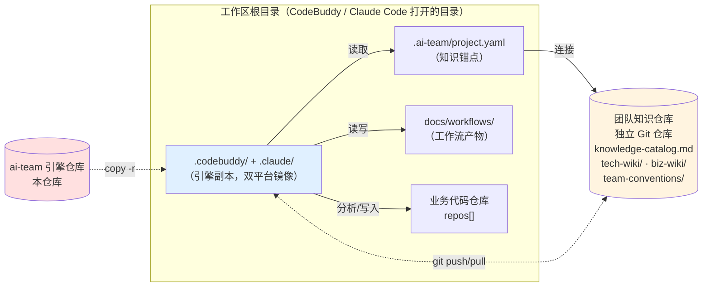
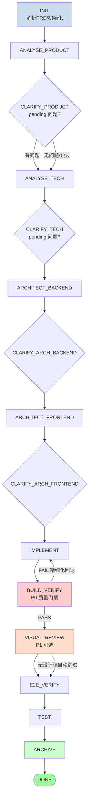
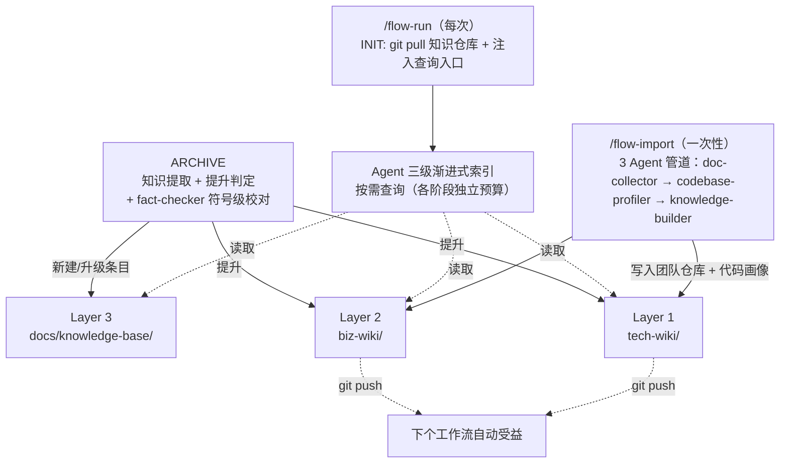

# ARCHITECTURE — AI Team 工程交付编排系统

> **本文档是 ai-team 引擎仓库的「单一架构权威源」。**
> 每次新对话开始，AI 必须先通读本文件建立项目背景；每次迭代新功能，必须同步更新本文件对应章节并在「附录 A 更新日志」追加记录。
> 协作约定见 [`CLAUDE.md`](./CLAUDE.md) / [`CODEBUDDY.md`](./CODEBUDDY.md)；入口与快速开始见 [`README.md`](./README.md)。

---

## 目录

1. [项目定位与设计哲学](#1-项目定位与设计哲学)
2. [整体架构](#2-整体架构)
3. [双平台镜像设计](#3-双平台镜像设计)
4. [工作流：16 阶段状态机](#4-工作流16-阶段状态机)
5. [Agent 编制全景](#5-agent-编制全景)
6. [知识体系](#6-知识体系)
7. [核心工程机制](#7-核心工程机制)
8. [数据模型（state.json）](#8-数据模型statejson)
9. [特性专题](#9-特性专题)
10. [目录结构详解](#10-目录结构详解)
11. [扩展指南](#11-扩展指南)
- [附录 A：更新日志](#附录-a更新日志)
- [附录 B：已知待办](#附录-b已知待办)

---

## 1. 项目定位与设计哲学

### 1.1 这是什么

AI Team 是一套**工作流引擎**，安装到业务项目后，用一条命令 `/flow-run` 驱动多个 AI Agent 协作完成"需求分析 → 架构设计 → 编码 → 验证 → 归档"的全流程交付。它不是独立平台、不依赖数据库、不引入任何运行时服务——只是一组 IDE 原生识别的 **Skill / Agent / Command 定义文件**：`.codebuddy/` 给 CodeBuddy 用、`.claude/` 给 Claude Code 用，**双平台镜像维护、功能完全等价**。

### 1.2 核心理念

| 理念 | 实现 |
|------|------|
| **文件系统即状态机** | `state.json` 是唯一状态源，阶段产物即进度凭证。无数据库、无后台服务，所有恢复点写在磁盘上 |
| **领域知识是永恒资产** | Skill / Agent / 工具链会随模型迭代换代，但**领域知识**（业务规则 / 技术决策 / 团队约定 / 已知陷阱）会持续累积。引擎把每次交付的知识自动沉淀到团队共享 Git 仓库 |
| **按需查询胜过强制注入** | Agent 不被动接收固定数量的知识推荐，而是通过三级渐进式索引主动查阅，每个阶段有独立预算 |
| **单仓 / 多仓零分支判断** | 用统一的 `repos[]` 模型描述，单仓 = 1 个元素，多仓 = N 个元素，所有阶段遍历 `repos[]` 执行 |
| **人机协同三步模式** | 每个非 INIT 阶段都遵循 Preview（预览计划）→ Execute（执行）→ Summary（总结确认），每步人工可控 |
| **安全降级** | Agent Teams 三级降级（Teams → Task 流水线 → 单体兜底）+ 检查点断点恢复，防止单点失败拖垮整个工作流 |
| **IDE 原生** | `.codebuddy/` + `.claude/` 双平台镜像目录驱动，无独立平台、无 CLI 安装、无 npm 包 |

### 1.3 与同类系统的差异

| 维度 | 传统 AI 工程化方案 | AI Team |
|------|------------------|---------|
| 状态管理 | 数据库 / 服务 / 工作流引擎（n8n / Temporal 等） | `state.json` 文件，文件系统即状态机 |
| 知识沉淀 | 文档库 / wiki / 向量数据库（外部依赖） | Git 仓库 + 三层成熟度模型 + 双信号衰减（自治） |
| Agent 协作 | 单一 Agent 长上下文执行 | 多 Agent Teams + 上下文防火墙（结构化结论压缩 ~10x） |
| 部署 | 服务部署 + 配置中心 | `cp -r` 两个目录到业务项目即可 |
| 多仓 | 分支判断 / 配置不同的 pipeline | `repos[]` 数组模型，零分支 |

### 1.4 设计灵感来源

- **[Karpathy LLM Wiki](https://gist.github.com/karpathy/1dd0294ef9567971c1e4348a90d69285)** — 知识复合增长：Ingest + Query + Lint 三位一体
- **[vibe-coding](../vibe-coding/)** — 生产验证的文件状态机 + Agent 编排模式
- **[oh-my-claudecode](https://github.com/yeachan-heo/oh-my-claudecode)** — IDE 原生 Skill / Rule 架构

---

## 2. 整体架构

### 2.1 部署拓扑全景



**三类仓库各司其职**：

| 类别 | 内容 | 个数 | 谁负责 |
|------|------|------|--------|
| **ai-team 引擎仓库**（本仓库） | 工作流引擎源码 | 1 | 引擎维护者 |
| **业务项目仓库** | 业务代码 + `docs/` + 引擎副本 | 1 ~ N | 业务团队 |
| **团队知识仓库** | 跨项目共享的知识库 | 1（团队共享） | 团队 maintainer |

### 2.2 部署模式：单仓 vs 多仓

支持单仓和多仓（小仓 / 微服务拆分），统一 `repos[]` 模型，**无需切换模式**。

**单仓模式**（一个 Git 仓库包含所有代码）：

```
工作区根/（= Git 仓库根）
├── .codebuddy/  +  .claude/      ← 引擎副本（双平台镜像）
├── .ai-team/project.yaml          ← 知识锚点
├── docs/workflows/                ← 工作流产物
├── src/                           ← 你的代码
└── pom.xml / package.json

repos[]: [{ name: "my-project", path: "./", type: "fullstack" }]
```

**多仓模式**（多个独立 Git 仓库，微服务拆分）：

```
工作区根/（CodeBuddy 打开的父目录，不是 Git 仓库）
├── .codebuddy/  +  .claude/       ← 引擎副本
├── .ai-team/project.yaml          ← 知识锚点
├── project-docs/      (.git/)     ← 文档仓（type=docs）
│
├── ad-service/        (.git/)     ← Git 仓库 A（后端微服务）
├── creative-service/  (.git/)     ← Git 仓库 B（后端微服务）
└── ad-frontend/       (.git/)     ← Git 仓库 C（前端）

repos[]: [
  { name: "project-docs",     path: "project-docs/",     type: "docs"     },
  { name: "ad-service",       path: "ad-service/",       type: "backend"  },
  { name: "creative-service", path: "creative-service/", type: "backend"  },
  { name: "ad-frontend",      path: "ad-frontend/",      type: "frontend" }
]
```

两种模式的工作流**完全一致**：`/team-init` 引导填充 `repos[]`，后续阶段遍历 `repos[]` 执行。多仓模式下 `docs/` 由独立的 `type=docs` 仓库承载，`projectConfig.docsRoot` 自动解析路径，Agent 无需感知单仓 / 多仓差异（详见 [§9.2 多仓文档仓 docsRoot 机制](#92-多仓文档仓docsroot-机制)）。

### 2.3 团队知识仓库的角色

独立 Git 仓库，所有团队成员 clone，跨项目 / 跨工作区共享：

```
team-knowledge.git
├── knowledge-catalog.md      ← 全景目录（Agent 按需查询入口）
├── tech-wiki/                ← 技术知识（按语言/框架/模式）
├── biz-wiki/{domain}/        ← 业务知识（按领域）
├── team-conventions/         ← 团队编码约定
├── contributions/            ← 贡献暂存与冲突记录
└── .knowledge-config.yaml    ← 衰减规则 / 事实校对配置
```

不同业务项目可以连接同一个团队知识仓库——这是**跨项目知识复用**的关键。

---

## 3. 双平台镜像设计

### 3.1 为什么要双平台

`.codebuddy/` 给腾讯 CodeBuddy IDE 用，`.claude/` 给 Anthropic Claude Code 用。两个平台对 Skill / Agent / Command 的目录约定**几乎一致但不完全相同**（如 frontmatter 字段、Skill 加载机制存在细微差异），且工具调用语法 / 工具名 / 部分术语存在「方言级」差异。

**核心约束：功能完全等价**。两个目录是事实上的**镜像**——同一个 Agent / Command 在两个平台执行时**用户可观察到的行为必须一致**，但**实现细节（工具名 / 路径 / 术语）按各自平台方言书写**。

### 3.2 权威方向（v2 修正）

> ⚠️ **Plan v1 写的"`.claude/` 为权威源"是错的**，已在 Plan v2 修正。

**实际维护工作流**：

```
.codebuddy/  （前线）  →  人工或脚本翻译  →  .claude/  （同步副本）
   ↑                                              
 维护者优先在这里改
```

- **`.codebuddy/` 是前线**：维护者（用 CodeBuddy IDE）日常迭代时优先在此目录改
- **`.claude/` 是同步副本**：从 `.codebuddy/` 同步过来时**需要做平台适配翻译**（工具名 / IDE 名 / 路径 / 术语等方言对应），不能简单 cp
- **方言差异是 feature，不是 bug**：见 §3.3「平台方言对照」
- **极特殊场景**（如某些只在 Claude Code 才有的能力）才会出现 `.claude/` 单边新增，这种应在 [附录 B 已知待办](#附录-b已知待办) 显式登记

### 3.3 平台方言对照（已确认的映射对）

| 类别 | `.codebuddy/`（前线） | `.claude/`（同步副本） |
|------|------------------|--------------------|
| 工作流术语 | `Agent Teams` / `Agent Teams 模式` | `Parallel Agent` / `Parallel Agent 调度` |
| 工具名 | `read_file` | `Read` |
| 工具名 | `write_to_file` | `Write` / `MultiEdit` |
| 工具名 | `replace_in_file` | `Edit` |
| 工具名 | `list_dir` | `Glob` |
| 工具名 | `codebase_search` | `Grep` |
| 工具名 | `execute_command` | `Bash` |
| 工具名 | `ask_followup_question` | `AskUserQuestion` |
| 工具名 | `Task` | `Task`（同名） |
| Skill 调用 | `use_skill('X')` | `Skill 工具（skill: "X"）` |
| IDE 名 | `CodeBuddy` / `CodeBuddy IDE` | `Claude Code` / `Claude Code IDE` |
| 安装目录 | `.codebuddy/` | `.claude/` |
| 全局配置 | `~/.codebuddy/` | `~/.claude/` |
| MCP 配置 | `mcp.json` | `settings.json` |

> 这个清单的机器化登记位置：`meta/platform-divergence.yaml` 的 `paired_translation` 段（17 条映射）。`platform-symmetry` 体检在比对前先 normalize（把双方文本中的 claude 形式统一替换为 codebuddy 基线），相等即视为方言-only 差异**自动豁免**，仅真功能差异计入 FAIL。

### 3.4 对称约束清单（功能层）

| 对称项 | 说明 |
|--------|------|
| Skill 目录 | `.claude/skills/{skill-name}/` ↔ `.codebuddy/skills/{skill-name}/` 文件名 / 子目录结构一对一 |
| Command 文件 | `.claude/commands/{cmd}.md` ↔ `.codebuddy/commands/{cmd}.md` 名称与功能对称 |
| Rules 文件 | `.claude/rules/` ↔ `.codebuddy/rules/` |
| References 文件 | `.claude/references/` ↔ `.codebuddy/references/` |
| 内容**功能** | 同名文件功能等价；**实现细节按各自方言** |

### 3.5 已知偏差容忍

当前存在的单平台特例（详见 [附录 B](#附录-b已知待办)）：

- `iwiki-operation` Skill 仅存在于 `.codebuddy/skills/`（依赖 iwiki MCP，Claude Code 平台暂未对等支持）
- `.codebuddy/plans/` 含临时草稿文件，`.claude/` 无对应目录
- `rules/tcb/CLAUDE.md` ↔ `rules/tcb/CODEBUDDY.md` 按平台命名约定故意分文件名

容忍这些差异的前提：**显式登记到 `meta/platform-divergence.yaml`** 或 [附录 B 已知待办](#附录-b已知待办)，**未登记的偏差视为漂移**，由 `scripts/consistency_check.py` 拦截。

### 3.6 协作约定中的双平台条款

- 修改时**优先改 `.codebuddy/`**，再翻译同步到 `.claude/`（v2 修正前的"两个平台都要改"措辞过于简化，实际是"先 codebuddy 再 claude，且需翻译"）
- 与本仓库相关的 `ai-team-project/` 和 `git-viewer/ur-ai-team/` 目录文件**不要直接修改**——它们通过本仓库 push 后从远程同步
- `scripts/mirror_platforms.py` 对账工具协助这一流程（`--status` 列出未豁免的真漂移），但**不引入自动翻译**（误伤风险与维护成本权衡后决定）

---

## 4. 工作流：16 阶段状态机

> 状态机共 **16 个 PhaseId**（`INIT`=0 … `DONE`=15，含 4 个 `CLARIFY_*` 澄清阶段）。

### 4.1 流程图



### 4.2 阶段全表

<!-- BEGIN AUTO-GEN: arch-phase-table hash=28445d721178911b source=state-schema.json#PhaseId + 现状 -->


| # | 阶段 ID | Agent | 做什么 |
|---|--------|-------|--------|
| 0 | `INIT` | 编排器 | 解析 PRD、加载 `repos[]`、注入团队知识仓库路径、TAPD 检测、IntentGate 意图分析（自动流转，唯一无需用户确认的阶段） |
| 1 | `ANALYSE_PRODUCT` | 4 成员产品 Agent Teams | 需求分析：迭代判定、基线对比、用户故事 / 业务规则提取、视觉分析 |
| 2 | `CLARIFY_PRODUCT` | 编排器 | 读取产品澄清问题，向用户提问，回填答案 |
| 3 | `ANALYSE_TECH` | 4 成员技术 Agent Teams | 技术分析：按 `repos[]` 逐仓库扫描、3 轮递进搜索、技术方案设计、分端拆解、校审 |
| 4 | `CLARIFY_TECH` | 编排器 | 技术澄清问题处理 |
| 5 | `ARCHITECT_BACKEND` | 全局架构师 + 领域架构师 ×N | 三级降级（Agent Teams → Task 流水线 → 单体兜底）+ 领域确认检查点 + 数据库 / API 契约 |
| 6 | `CLARIFY_ARCH_BACKEND` | 编排器 | 后端架构澄清 |
| 7 | `ARCHITECT_FRONTEND` | 资深前端架构师 | Web / 小程序架构设计 |
| 8 | `CLARIFY_ARCH_FRONTEND` | 编排器 | 前端架构澄清 |
| 9 | `IMPLEMENT` | 各端开发 Agent 并行 | 按 `domain-registry.json` 分配领域所有权，每个领域独立 Agent，LSP 实时诊断；前端可由 D2C 直通完成 |
| 10 | `BUILD_VERIFY` | 后端 / Web / 小程序验证 Agent | **P0 质量门禁**，Agent Teams 模式下按平台并行验证，精细化回退仅重跑失败平台 |
| 11 | `VISUAL_REVIEW` | 视觉验收 Agent | **P1 质量门禁**（可选），AI 对比设计稿 vs 实现截图，还原度评分（A/B/C/D/F），无设计稿时自动跳过 |
| 12 | `E2E_VERIFY` | 端到端链路验证 Agent | 跨组件 / 跨服务运行时依赖验证（7 维度） |
| 13 | `TEST` | 测试验证 Agent | 生成测试方案并执行验证（3 层测试体系） |
| 14 | `ARCHIVE` | `@archiver` + `@fact-checker` | 汇总变更报告、知识提取与提升判定、团队知识仓库 push、TAPD 附件回写、企微归档通知 |
| 15 | `DONE` | — | 终态（仅 `@archiver` 可流转至此） |

<!-- END AUTO-GEN: arch-phase-table -->

### 4.3 三步模式（每个非 INIT 阶段必须遵循）

```
┌─ Preview ──┐    ┌─ Execute ──┐    ┌─ Summary ──┐
│ 展示计划   │ → │ 执行任务   │ → │ 总结+确认  │
│ 等用户确认 │    │ 写入产物    │    │ 用户继续？ │
└────────────┘    └────────────┘    └────────────┘
```

- **Preview**：编排器展示本阶段的工作计划（哪些 Agent / 哪些产物 / 预计耗时），等待用户输入"继续 / 调整"
- **Execute**：实际执行 Agent 调用、写产物、更新 `state.json`
- **Summary**：展示阶段产出 + 质量信号 + 下一阶段预告，等待用户确认流转

确保每一步人工可控。`CLARIFY_*` 仅当对应澄清文件有 `pending` 问题时进入，否则自动跳过（记录 `status: "skipped"`）。

### 4.4 流转守卫（防漂移核心防线）

`state.json.currentPhase` 的每次更新必须经过 [`references/phase-transitions.json`](.claude/skills/workflow-orchestrator/references/phase-transitions.json) 守卫校验：

```jsonc
{
  "transitions": {
    "INIT":              { "next": "ANALYSE_PRODUCT",     "canSkipTo": null },
    "ANALYSE_PRODUCT":   { "next": "CLARIFY_PRODUCT",     "canSkipTo": "ANALYSE_TECH" },
    "TEST":              { "next": "ARCHIVE",             "canSkipTo": null },
    "ARCHIVE":           { "next": "DONE",                "canSkipTo": null },
    "DONE":              { "next": null,                  "canSkipTo": null }
    // ... 共 16 条目（含 DONE 终态）
  },
  "rules": {
    "forward":     "新 currentPhase 必须 ∈ {transitions[current].next, canSkipTo}",
    "skipCondition": "canSkipTo 仅在澄清自动跳过条件满足时启用",
    "rollback":    "BUILD_VERIFY/VISUAL_REVIEW → IMPLEMENT 是非直接前驱回退特例",
    "termination": "仅 ARCHIVE 阶段的 archiver Agent 可将 currentPhase 设为 DONE"
  }
}
```

**关键反漂移约束**：

- ❌ **BUILD_VERIFY PASS ≠ 工作流完成**（必须继续 VISUAL_REVIEW → E2E → TEST → ARCHIVE）
- ❌ **TEST PASS ≠ 工作流完成**（必须流转到 ARCHIVE，由 archiver 写入 DONE）
- ✅ **DONE 终态保护**：写入前校验所有 14 个前置阶段均有 `phaseHistory` 记录

详见 [§7 核心工程机制](#7-核心工程机制) 中的「流转守卫」「DONE 终态保护」条目，及 SKILL.md §2.2 / §5.3 / §5.4。

---

## 5. Agent 编制全景

### 5.1 静态 Agent 编制

`.claude/skills/workflow-orchestrator/agents/` 下的 Agent 按团队 / 职责划分：

| 团队 / 单体 | 成员 | 调用阶段 |
|------------|------|---------|
| **产品分析团队**（4 成员）| `@product-collector` · `@baseline-differ` · `@product-extractor` · `@quality-assessor` | `ANALYSE_PRODUCT` |
| **技术分析团队**（4 成员）| `@tech-explorer` · `@tech-designer` · `@tech-splitter` · `@tech-reviewer` | `ANALYSE_TECH` |
| **构建验证团队**（3 成员）| `@backend-build-verifier` · `@web-build-verifier` · `@miniprogram-build-verifier` | `BUILD_VERIFY` |
| **知识导入团队**（3 成员）| `@doc-collector` · `@codebase-profiler` · `@knowledge-builder` | `/flow-import` |
| **后端开发通用规范** | `backend-dev-specification.md`（按需实例化为领域 Agent） | `IMPLEMENT` |
| **单体 / 降级 Agent** | `product-analyst` · `fullstack-analyst` · `build-verifier`（三级降级时使用） | 对应阶段 |
| **架构师** | `java-architect`（Java 专版） · `backend-architect`（通用版） · `frontend-architect` | `ARCHITECT_*` |
| **前端开发** | `web-developer` · `miniprogram-developer` | `IMPLEMENT` |
| **验证 / 验收 / 归档** | `e2e-link-verifier` · `test-engineer` · `visual-reviewer` · `archiver` · `fact-checker` | `E2E_VERIFY` / `TEST` / `VISUAL_REVIEW` / `ARCHIVE` |

合计 **13 个独立 Agent 文件 + 5 个团队子目录**（共约 34 个 Agent 定义文件，详见 [§10.3](#103-skillsworkflow-orchestrator-内部组织)）。

### 5.2 动态 Agent 编制

部分阶段在运行时根据 `domain-registry.json` 动态实例化 Agent：

| 动态 Agent | 触发阶段 | 实例化依据 |
|-----------|---------|-----------|
| **领域架构师** `@domain-architect-{N}` | `ARCHITECT_BACKEND` | 由 `@global-architect` 在阶段一拆分领域后实例化，每个领域一名（≤8） |
| **领域开发 Agent** | `IMPLEMENT` | 按 `domain-registry.json` 的 `domains[]` 分配领域所有权，每个领域独立 Agent |

> ⚠️ `domain-registry.json` **不是引擎仓库的静态文件**，它由 `@global-architect` 在 `ARCHITECT_BACKEND` 阶段三（`domains_confirmed`）写入需求工作目录，是**运行时产物**。引擎仓库内只在 `state-schema.json` 的 `architectBackendCheckpoint.step` 枚举中引用其存在状态。

### 5.3 Agent Teams 三级降级

为避免单一 Agent 长上下文执行的不稳定性，工作流引入**三级降级**机制：

| 级别 | 模式 | 说明 | 上下文压缩 |
|------|------|------|------|
| **L1 Agent Teams** | 多 Agent 并行 | 团队成员各自独立上下文执行，仅传结构化结论 | ~10x |
| **L2 Task 串行管道** | 串行 Task 调用 | 用 IDE Task 工具串行调用同样的成员，无并行优势 | ~5x |
| **L3 单体兜底** | 单 Agent 长上下文 | 用 `product-analyst` / `fullstack-analyst` / `build-verifier` 等单体 Agent 一次性处理 | 1x |

L1 失败自动降到 L2，L2 失败自动降到 L3，每级降级写入 `state.json.{phase}Mode` 字段。适用阶段：`ANALYSE_PRODUCT`、`ANALYSE_TECH`、`ARCHITECT_BACKEND`、`BUILD_VERIFY`（仅前两级）。

### 5.4 检查点恢复

复杂阶段拆分多个检查点，断点续传时按最近检查点恢复：

| 阶段 | 检查点序列 |
|------|-----------|
| `ARCHITECT_BACKEND` | `global_pending → global_completed → domains_confirmed → domains_completed`（4 步） |
| `ANALYSE_PRODUCT` | `teams → pipeline → fallback`（三级恢复） |

检查点写入 `state.json.architectBackendCheckpoint` 和 `state.json.analyseProduct*`。

---

## 6. 知识体系

> 这是整个系统**最重要的设计**。Skill / Agent / 工具链会随模型迭代更新，但**领域知识是永恒的**。

### 6.1 三正交维度

知识体系由三个**完全正交**的维度组成：

| 维度 | 问题 | 定义 |
|------|------|------|
| **存储层（在哪）** | 知识存在哪里？ | Layer 0-P / 0-T / 1 / 2 / 3 — 从个人到团队到项目 |
| **知识类型（是什么）** | 知识描述的是什么？ | `model` / `decision` / `guideline` / `pitfall` / `process` — 按内容维度分类 |
| **成熟度（多可信）** | 知识经过多少验证？ | `draft → verified → proven`（仅知识条目有，规范 / 偏好没有） |

### 6.2 存储层 × 知识类型 × 成熟度

```
Layer 0-P  个人偏好（~/.ai-team/preferences/）         ← 无类型/成熟度，是配置
Layer 0-T  团队约定（{知识仓库}/team-conventions/）     ← 无类型/成熟度，是规范

Layer 3    项目知识（{项目}/docs/knowledge-base/）      ← 知识条目的初始着陆层
              │  所有 5 种类型都可能存在，maturity 为 draft
              │
              ├──→ 提升判定 Q1: 是否项目特有？ → 是：留在 Layer 3
              ├──→ 提升判定 Q2: 是否通用技术？ → 是：提升到 Layer 1
              └──→ 提升判定 Q3: 是否通用业务？ → 是：提升到 Layer 2

Layer 1    技术知识（{知识仓库}/tech-wiki/）            ← decision, guideline, pitfall, model
Layer 2    业务知识（{知识仓库}/biz-wiki/{domain}/）    ← model, process, guideline, pitfall
              ↑ 提升到 Layer 1/2 的条目初始 maturity 为 draft
              ↑ 被其他工作流引用后自动升为 verified → proven
```

### 6.3 知识流动闭环



### 6.4 五种知识类型

> **分类原则**：按「知识描述的是什么」分类（客观、稳定、MECE），来源阶段记录在 `source` 元数据中用于溯源分析。

| 类型 | 定义 | 子字段 | 典型存储层 | 示例 |
|------|------|--------|-----------|------|
| `model` | 实体定义、数据结构、关系图 | — | Layer 2 entities / relations | "广告计划包含预算 / 出价 / 投放时段三个核心字段" |
| `decision` | 技术选型、架构决策、方案取舍及理由 | — | Layer 1 patterns | "选择事件驱动而非 RPC 同步，因为广告状态变更需要解耦" |
| `guideline` | 推荐做法或禁止做法 | `polarity: recommend \| avoid` | Layer 1 / Layer 0-T | recommend: "公共模块变更后的兼容性检查清单" |
| `pitfall` | 已知风险、故障模式、排查步骤 | — | Layer 1 anti-patterns / Layer 2 pitfalls | "广告预算扣减在高并发下会超扣" |
| `process` | 业务流程、状态机、操作步骤 | — | Layer 2 flows | "广告审核：提交 → 机审 → 人审 → 上线" |

### 6.5 三级成熟度与双信号衰减

```
draft（新提取，单一来源）→ verified（在 1 个工作流中被成功引用）→ proven（在 ≥2 个不同项目中被验证）
```

**双信号衰减**：成熟度由两组**正交**信号共同维护——

- **时间信号**：proven 12 个月未引用 → verified；verified 6 个月未引用 → draft；draft 持续未引用 → Lint 标记后归档。判定时引入**模块活跃度抑制**，避免误伤季节性活跃模块（如对账 / 结算只在月末 / 年末活跃），关联模块休眠 6 ~ 24 月时跳过降级，超过 24 月强制衰减。
- **事实信号**：每次 ARCHIVE 由 `@fact-checker` 子 Agent 针对本次变更模块的关联知识做**符号级校对**——引用文件整体消失则降级，关键符号消失则打标 `code-fact-drift` 待人工复查。可通过 `/knowledge fact-check` 手动触发（支持指定模块或最近变更范围）。

阈值通过 `{知识仓库}/.knowledge-config.yaml` 的 `decay_rules` 和 `fact_check` 段配置。

> 成熟度仅适用于**知识条目**（Layer 1/2/3），不适用于个人偏好（Layer 0-P）和团队约定（Layer 0-T）。

### 6.6 按需查询：三级渐进式索引

Agent **不被动接收**固定数量的知识推荐，而是通过三级索引**主动查阅**：

| 级别 | 文件 | 大小 | 作用 |
|------|------|------|------|
| **全景目录** | `{知识仓库}/knowledge-catalog.md` | ~50 行 | 知识库有哪些分类、各多少条，按阶段推荐查阅路径 |
| **分类清单** | 各目录下的 `catalog.md` | ~100-300 行 | 每条知识一行摘要（ID + 标题 + 成熟度 + 适用阶段），可快速过滤 |
| **完整条目** | 具体的 TK-*.md / BK-*.md | ~50-200 行 | 完整知识内容，可沿 `source_references` 追溯原始产物 |

### 6.7 各阶段查询预算

各阶段有**独立的查询预算**（分类清单不计入配额，只有完整条目和归档产物计入）：

| 阶段 | Agent | 完整条目 | 归档产物 | 查询的存储层 | 重点知识类型 |
|------|-------|---------|---------|------------|------------|
| ANALYSE_PRODUCT | @product-collector | 5 | 3 | Layer 2 (biz-wiki) + 归档索引 | model, process, pitfall |
| ANALYSE_PRODUCT | @product-extractor | 5 | 2 | Layer 2 (biz-wiki) | guideline, model |
| ANALYSE_TECH | @tech-explorer | 8 | 5 | Layer 1 (tech-wiki) + 归档索引 | decision, guideline(avoid), pitfall |
| ANALYSE_TECH | @tech-designer | 5 | 3 | Layer 1 (tech-wiki) | decision, guideline(recommend) |
| ARCHITECT | @backend-architect 等 | 8 | 5 | Layer 1 patterns + Layer 2 relations | decision, model |
| IMPLEMENT | 各开发 Agent | 5 | 2 | Layer 1 + Layer 0-T | guideline, pitfall |
| BUILD_VERIFY | 各验证 Agent | 3 | 0 | Layer 1 anti-patterns | pitfall, guideline(avoid) |

### 6.8 团队协作

通过 `/team-init` 连接独立 Git 知识仓库。所有成员的工作流 `ARCHIVE` 阶段自动提取知识并 push。

**冲突解决**：纯新增 / 证据追加 → 自动合并；内容矛盾 → 写入 `contributions/conflicts/`，maintainer 裁决。

**角色**：

- **maintainer**：裁决冲突、审批 `proven` 提升
- **contributor**：自动贡献（默认所有团队成员）
- **reader**：只消费（按知识仓库配置授权）

---

## 7. 核心工程机制

### 7.1 11 项工程能力一览

| 机制 | 说明 |
|------|------|
| **上下文防火墙** | 搜索密集型工作在独立 Agent Teams 上下文窗口执行，仅将结构化结论（~10x 压缩）传递给下游成员 |
| **Agent Teams 三级降级** | L1 Agent Teams → L2 Task 串行管道 → L3 编排器直接执行（详见 [§5.3](#53-agent-teams-三级降级)） |
| **IntentGate 意图分析** | INIT 后前置执行：5 类意图分类（`new-feature` / `feature-modify` / `bug-fix` / `tech-refactor` / `d2c-to-workflow`）+ 歧义检测 + 影响范围预估 + 路由提示，写入 `state.json.intentAnalysis` |
| **检查点恢复** | `ARCHITECT_BACKEND` 四阶段（global_pending → global_completed → domains_confirmed → domains_completed）；`ANALYSE_PRODUCT` 三级恢复（teams / pipeline / fallback） |
| **流转守卫** | 每次更新 `currentPhase` 前查 `references/phase-transitions.json`，非法跳跃强制阻断；**DONE 终态保护**（写入前校验所有 14 个前置阶段均有 phaseHistory 记录） |
| **阶段计时协议** | `phaseHistory` 5 时间戳：`startedAt`（预览开始）/ `confirmedAt`（用户确认）/ `executionStartedAt` / `executionCompletedAt` / `completedAt`（总结确认）逐轮填充 |
| **运行时上下文健康度** | 每次阶段切换估算工具调用次数与压缩事件，写入 `contextHealth.phaseMetrics`，> 150 次累计建议 `/compact` |
| **搜索预算** | 每个 Agent 有独立配额（搜索密集型 ≤60、设计型 ≤5、开发型 ≤30 / 领域、验证型 ≤20）；优先链：`read_lints` → LSP → Grep → Glob → `codebase_search` |
| **LSP 诊断** | `IMPLEMENT` 每次写入后 `read_lints`，`BUILD_VERIFY` 全项目扫描，预防 80% 编译失败 |
| **knowledgeReferences 校验** | 每个阶段总结确认时强制检查核心产物含 `knowledgeReferences` 字段（即使为 `[]`），缺失则标 🟡 warn |
| **代码溯源（@changelog）** | 每个源文件头部维护 `\| 版本 \| REQ:{需求ID} \| TECH:{方案文档} \| 摘要 \| 日期 \|` 表格 + `@author agent:{name}`，实现 O(1) 需求 - 代码关联查找 |
| **通知机制** | `architect_review` / `build_verify_fail` / `visual_review_fail` / `workflow_done` 四类事件经 `send-flow-message` 主动推送到企微（探测到技能时自动启用） |

### 7.2 防漂移防线总览

把"易漂移"的几条规则集中说明，便于维护者快速定位：

| 防线 | 实现位置 | 作用 |
|------|---------|------|
| 阶段流转守卫 | `references/phase-transitions.json` + SKILL.md §5.3 | 防 `currentPhase` 非法跳跃 |
| 阶段命名严格校验 | SKILL.md §5.4 | 防阶段 ID 拼写漂移（如写成 `analyse_product` 而非 `ANALYSE_PRODUCT`） |
| DONE 终态保护 | `phase-transitions.json` rules.termination | 防 BUILD/TEST PASS 误判为完成 |
| 双平台对称约束 | `CLAUDE.md` / `CODEBUDDY.md` §3 | 防单平台修改漏同步 |
| 更新日志强制 | `CLAUDE.md` / `CODEBUDDY.md` §2 | 防架构性变更失忆 |
| 字段命名一致性 | SKILL.md §7.3 g + state-schema.json | 防驼峰 / 蛇形漂移（如 `auto_commit` vs `autoCommit`） |

---

## 8. 数据模型（state.json）

> `state.json` 是工作流的**唯一状态源**（SKILL.md §5 标题"唯一状态源 CRITICAL"）。完整 Schema 定义见 [`.claude/skills/workflow-orchestrator/references/state-schema.json`](.claude/skills/workflow-orchestrator/references/state-schema.json)。

### 8.1 顶层字段总览

按 schema 定义顺序排列，**共 31 个顶层字段**：

| 分组 | 字段 | 类型 | 必填 | 用途 |
|------|------|------|:---:|------|
| **标识** | `id` | string | ✅ | 需求 ID |
| | `name` | string | ✅ | 需求名称 |
| | `description` | string | ✅ | 需求描述 |
| | `createdAt` | datetime | ✅ | 创建时间 |
| | `updatedAt` | datetime | ✅ | 最后更新时间 |
| **状态机核心** | `currentPhase` | PhaseId | ✅ | 当前阶段（受流转守卫保护） |
| | `phaseHistory` | array | ✅ | 阶段历史（含 5 时间戳） |
| | `platforms` | object | ✅ | 各端平台状态 |
| **降级模式标识** | `implementMode` / `agentTeam` | string | | IMPLEMENT 模式与团队记录 |
| | `analyseTechMode` / `analyseTechTeam` | string | | ANALYSE_TECH 模式与团队 |
| | `buildVerifyMode` / `buildVerifyTeam` | string | | BUILD_VERIFY 模式与团队 |
| | `analyseProductMode` / `analyseProductTeam` | string | | ANALYSE_PRODUCT 模式与团队 |
| | `analyseProductPipeline` / `analyseProductFallback` | object | | ANALYSE_PRODUCT 降级日志 |
| | `architectBackendMode` / `architectBackendTeam` | string | | ARCHITECT_BACKEND 模式与团队 |
| | `architectBackendCheckpoint` | object | | ARCHITECT_BACKEND 检查点 |
| **质量门禁** | `visualReviewResult` | object | | VISUAL_REVIEW 评分与结论 |
| **配置与上下文** | `prdSource` | object | | PRD 来源（路径 / TAPD / 口述） |
| | `projectConfig` | object | | 项目配置（含 `repos[]`、`docsRoot`、`docsRepoMode`） |
| | `knowledgeContext` | object | | 团队知识仓库连接信息 |
| | `notificationConfig` | object | | 企微通知配置 |
| | `tapdConfig` | object | | TAPD 集成配置 |
| **意图分析** | `intentAnalysis` | object | | IntentGate 产出（5 类意图 + d2cConfig） |
| **运行时观测** | `contextHealth` | object | | 上下文健康度（phaseMetrics + overallRisk） |
| **日志** | `docsRepoCommitLog` | array | | 多仓文档仓自动 commit/push 日志 |
| | `rollbackLog` | array | | 回退操作日志 |

> `definitions` 中还定义了两个共享类型：`PhaseId`（16 个枚举值，含 DONE 终态）和 `PlatformStatus`（各端平台状态字段集）。

### 8.2 关键字段交叉表

哪些 Agent / 阶段读写哪些字段，便于扩展时定位影响面：

| 字段 | 主要写入方 | 主要读取方 | 关联机制 |
|------|----------|----------|---------|
| `currentPhase` | 编排器（流转守卫保护） | 所有 Agent 入口 | 流转守卫、DONE 终态保护 |
| `phaseHistory[]` | 编排器（每阶段三步模式完成时） | `/flow-status`、断点恢复 | 5 时间戳计时协议 |
| `projectConfig.repos[]` | `/team-init` + INIT 阶段 4.5 | 所有 ANALYSE_* / IMPLEMENT / BUILD_VERIFY | 单仓多仓零分支判断 |
| `projectConfig.docsRoot` | INIT 阶段 4.5 | 编排器路径拼接 | docsRoot 机制 |
| `projectConfig.docsRepoMode` | INIT 阶段 4.5 | `archiver`、文档仓 commit 钩子 | embedded / standalone |
| `intentAnalysis` | IntentGate（INIT 后） | 编排器路由决策 | 5 类意图分类 |
| `architectBackendCheckpoint.step` | `@global-architect` / `@domain-architect-*` | 断点恢复 | 4 阶段检查点 |
| `contextHealth.phaseMetrics` | 编排器每阶段切换 | `/compact` 建议 | 工具调用次数累计 |
| `docsRepoCommitLog[]` | 编排器（阶段总结后） + `@archiver`（ARCHIVE） | 失败诊断、用户回看 | 失败容忍策略 |
| `rollbackLog[]` | 编排器（回退发生时） | `/flow-status`、复盘 | 防漂移审计 |
| `notificationConfig` | `/team-init` | `send-flow-message` 调用方 | 通知机制 |

---

## 9. 特性专题

### 9.1 D2C 双模式

Figma 设计稿转代码（`figma-d2c` Skill）有**两种**与工作流的集成方式，通过 `state.json.intentAnalysis.d2cConfig.mode` 区分：

| 模式 | 触发场景 | 工作流路径 |
|------|---------|----------|
| **standalone**（直通） | 用户直接粘贴 Figma 链接、无 PRD 上下文 | D2C 完成 → 自动生成 PRD → `intentType = d2c-to-workflow` → 简化执行 ANALYSE/ARCHITECT_FRONTEND → IMPLEMENT 前端部分**跳过**（D2C 已完成）→ BUILD_VERIFY 起正常 |
| **embedded**（嵌入） | 已有 PRD + 关联 Figma | 正常执行 ANALYSE/ARCHITECT，IMPLEMENT 阶段前端开发 Agent 调用 D2C 生成基础代码后做业务增强 |

两种模式均支持 **16 步检查点协议**（CP-0 → CP-M），断点续传、回归对比、视觉验收自动衔接。详见 `.claude/skills/figma-d2c/SKILL.md`。

### 9.2 多仓文档仓（docsRoot 机制）

多仓模式下 `docs/workflows/` 不属于任何业务 Git 仓库——通过 `projectConfig.docsRoot` + `docsRepoMode` 解决：

| 字段 | 取值 | 含义 |
|------|------|------|
| `docsRoot` | `"./"` / `"project-docs/"` | 文档仓根相对 workspace 的路径 |
| `docsRepoMode` | `embedded` / `standalone` | 内嵌（单仓 docs 在业务仓内）/ 独立（多仓独立 Git） |

**INIT 阶段自动检测**：

- **单仓** → `embedded`（无需用户介入）
- **多仓且 `repos[].type=docs` 已配置** → `standalone`
- **多仓但 workspace 根已有 `docs/` 但无 `.git/`**（存量项目）→ 弹三选项：「原地 Git 化（推荐）/ 迁移到 `project-docs/` / 暂不处理」
- **全新多仓项目**（无 `docs/`）→ 弹三选项：「自动创建 project-docs / 指定已有目录 / 暂不配置」

**Agent 完全无感**：所有 Agent 文档中 `docs/...` 前缀路径保持不变，**编排器运行时拼接 `{docsRoot}` 解析为绝对路径**。

**自动 Commit 规则**（详见 SKILL.md §7.3 g）：

- 当 `docsRepoMode = "standalone"` 且 `autoCommit = true`：每个非 INIT 阶段「总结确认」后由**编排器**自动 commit 到文档仓（13 次/需求）；ARCHIVE 那次由 `@archiver` 阶段四第 5 步显式执行（避免双重提交）
- `autoPush = false`（默认）→ 仅本地 commit；`autoPush = true` / `"on_archive"` → 追加 `git push`
- 失败容忍：commit / push 失败不阻断工作流，记录到 `state.json.docsRepoCommitLog[]`

### 9.3 /flow-import 冷启动管道

对已有代码库，先跑一次 `/flow-import` 构建知识基线：

```
@doc-collector → 多源资料收集（文档/TAPD/iwiki/口述/代码扫描）
  ↓
@codebase-profiler → 代码画像（技术栈/模块/依赖/模式，60 次搜索预算）
  ↓
@knowledge-builder → 知识标准化（4 维基线 + ≤13 条知识条目 + 归档总结）
```

产出直接写入团队知识仓库（`knowledge-baseline.json` 四维度：用户故事 / 业务规则 / 数据实体 / UI 模式），所有条目初始 `maturity` 为 `draft`，后续工作流的 ANALYSE 阶段自动消费。

---

## 10. 目录结构详解

### 10.1 仓库根结构

```
仓库根/
├── README.md                          # 入口手册（项目介绍 + 安装 + 快速开始 + 命令清单 + 文档导航）
├── ARCHITECTURE.md                    # 本文件（项目骨架 + 更新日志）
├── CLAUDE.md  +  CODEBUDDY.md         # AI 协作约定（迭代本仓库时生效）
│
├── .codebuddy/   ←─┐                  # CodeBuddy 平台
└── .claude/      ←─┘                  # Claude Code 平台（与 .codebuddy/ 镜像维护）
    ├── skills/                        # Skill 定义
    ├── commands/                      # 9 个用户命令
    ├── references/                    # 顶层引用资料
    ├── rules/                         # 业务项目用编码规则（会被部署到业务项目）
    └── plans/                         # 临时规划草稿（非核心）
```

> **「业务项目用编码规则」与「引擎自身协作约定」的边界**：`.{platform}/rules/` 是**业务项目集成的**编码规则，会随 `.codebuddy/` 一起部署到业务项目；`CLAUDE.md` / `CODEBUDDY.md` 是**仅本仓库迭代时生效**的协作约定，不会被部署。

### 10.2 双平台并列结构

```
.codebuddy/   .claude/
├── skills/   ├── skills/              # .codebuddy/ 18 个 Skill / .claude/ 17 个 Skill（差异为 iwiki-operation，仅在 .codebuddy/）
├── commands/ ├── commands/            # 9 个用户命令
├── rules/    ├── rules/               # 业务项目用编码规则
├── references/ ├── references/        # 顶层引用资料
└── plans/    └── plans/               # 临时规划草稿（非核心）
```

### 10.3 skills/workflow-orchestrator/ 内部组织

最核心的 Skill，内部组织如下：

```
skills/workflow-orchestrator/
├── SKILL.md                           # 主入口（§1-§12，约 76 KB，运行时定义）
├── agents/                            # 子 Agent 定义
│   ├── archiver.md / fact-checker.md
│   ├── backend-architect.md / java-architect.md / frontend-architect.md
│   ├── e2e-link-verifier.md / test-engineer.md / visual-reviewer.md
│   ├── build-verifier.md / fullstack-analyst.md / product-analyst.md
│   ├── web-developer.md / miniprogram-developer.md
│   ├── backend-developers/            # IMPLEMENT 后端领域开发通用规范
│   ├── build-verifiers/               # BUILD_VERIFY 多平台并行验证（3 成员）
│   ├── import-agents/                 # /flow-import 3 Agent 串行管道
│   ├── product-analysts/              # ANALYSE_PRODUCT 4 成员团队
│   └── tech-analysts/                 # ANALYSE_TECH 4 成员团队
├── phases/                            # 阶段调度规则（按需加载，13 个 md）
│   ├── analyse-product-rules.md / analyse-tech-rules.md
│   ├── architect-backend-rules.md + level{1,2,3}.md
│   ├── implement-rules.md / build-verify-rules.md / visual-review-rules.md
│   ├── archive-rules.md / clarify-rules.md / rollback-rules.md
│   ├── import-rules.md
│   └── output-formats/                # 预览/总结/澄清的格式模板
├── references/                        # Schema 与配置（state-schema/phase-transitions 等）
├── rules/                             # 编码规范、LSP、视觉协议、知识查询协议
├── templates/                         # Agent Prompt 模板
└── scripts/                           # resolve_agent_paths.py 等辅助脚本
```

### 10.4 顶层目录用途边界

| 目录 | 用途 | 是否会被部署到业务项目 |
|------|------|---------------------|
| `.{platform}/skills/` | Skill 定义（含 workflow-orchestrator 核心引擎） | ✅ |
| `.{platform}/commands/` | 用户命令（`/flow-run` 等 9 个） | ✅ |
| `.{platform}/rules/` | 业务项目用编码规则（CloudBase / AnyDev 等） | ✅ |
| `.{platform}/references/` | 顶层引用资料（agent-catalog / workflow-templates / legacy-docs） | ✅ |
| `.{platform}/plans/` | 临时规划草稿（非核心，可忽略） | ⚠️ 可选清理 |
| `scripts/` | **引擎维护者工具链**（一致性体检 / 影响分析 / dry-run / 渲染 / 镜像） | ❌ **不部署**（仅本仓库迭代时使用） |
| `meta/` | **引擎维护者 DSL**（工作流元模型单一真相源：phases.yaml / state-schema.yaml / commands.yaml） | ❌ **不部署**（仅本仓库迭代时使用） |
| `README.md` / `ARCHITECTURE.md` / `CLAUDE.md` / `CODEBUDDY.md` | 引擎仓库自身文档与协作约定 | ❌ 不部署 |

> **使用者 vs 维护者 边界（重要）**：
>
> - **团队小伙伴**（工作流使用者）：在自己的业务项目执行 `cp -r .codebuddy/` + `cp -r .claude/` 即可，`scripts/` / `meta/` / `ARCHITECTURE.md` / `CLAUDE.md` 等**全部无需拷贝**。`/flow-run` 运行时编排器只读 `.{platform}/skills/...` 下的文件，**与 `scripts/` / `meta/` 完全解耦**。
> - **引擎维护者**（迭代本仓库者）：完整 clone 本仓库，`scripts/` 是自检/影响分析工具，`meta/` 是 DSL 单一真相源。改完后通过 `python3 scripts/consistency_check.py` 验证是否引入漂移。

---

## 11. 扩展指南

> 本节为**未来维护者**而写。每次迭代新功能，必须遵循对应章节的标准步骤，否则会破坏单一权威源。

### 11.1 通用 5 项必勾清单（每次扩展共通）

无论扩展哪类资产，都必须完成以下 5 项：

- [ ] **双平台对称**：`.claude/` 和 `.codebuddy/` 同步修改
- [ ] **ARCHITECTURE.md 章节更新**：找到对应章节（如新增 Skill → §10.2 / §10.3 引用，新增阶段 → §4 / §5）并同步
- [ ] **附录 A 更新日志追加**：按格式约定追加一条 `### YYYY-MM-DD — 主题`
- [ ] **README 同步**（仅在用户可见行为变化时）：命令清单 / Skills 清单 / 安装步骤 / 快速开始
- [ ] **CLAUDE.md ↔ CODEBUDDY.md 100% 一致**：两份逐字相同

### 11.2 新增 Skill

**最小 Skill 结构 = 单个 `SKILL.md` 文件**（如 `git-push-helper/SKILL.md`、`prd-creator/SKILL.md`）。复杂 Skill 可加 `references/` / `scripts/` / `templates/` / `agents/` 子目录（如 `workflow-orchestrator/`）。

**标准步骤**：

1. 在 `.claude/skills/{skill-name}/SKILL.md` 创建 Skill 文件，frontmatter 至少含 `name` + `description` + `triggers`
2. 在 `.codebuddy/skills/{skill-name}/SKILL.md` 创建对称副本（如有平台特性差异，在该 SKILL.md 内显式说明）
3. 如新 Skill 与 `workflow-orchestrator` 协作，在 SKILL.md §3 子 Agent 注册表中添加引用（如适用）
4. ARCHITECTURE.md §10.2 双平台并列结构 Skills 数量同步
5. README 「可用 Skills」表格添加一行
6. 完成 [§11.1 通用 5 项](#111-通用-5-项必勾清单每次扩展共通) 清单

### 11.3 新增 Command

**Command 文件位置**：`.claude/commands/{name}.md` 和 `.codebuddy/commands/{name}.md`。

**最小 frontmatter**：

```
---
name: my-command
description: 一句话描述（用于 / 自动补全列表）
---
```

**标准步骤**：

1. 在双平台 `commands/{name}.md` 创建文件，frontmatter 含 `name` + `description`
2. 文件正文按现有 commands（参考 `flow-run.md` / `knowledge.md`）的格式编写：使用场景 / 执行流程 / 参数说明 / 输出格式
3. ARCHITECTURE.md：若与工作流核心有交互，更新 §4 / §7；若是辅助命令，仅在 README 命令表登记
4. README 「可用命令」表格添加一行
5. 完成 [§11.1 通用 5 项](#111-通用-5-项必勾清单每次扩展共通) 清单

### 11.4 新增 Agent

**Agent 文件位置**：`.claude/skills/workflow-orchestrator/agents/{agent-name}.md`（或团队子目录如 `agents/product-analysts/{member}.md`）。

**标准步骤**：

1. 在双平台 `agents/{agent-name}.md` 创建文件，文件结构参考既有 Agent（角色定位 / 输入 / 输出 / 工具配额 / 知识查询预算 / 协作关系图）
2. 在 SKILL.md §3 「子 Agent 注册表」添加一行
3. 若 Agent 在某阶段独立调用，在 SKILL.md §10 「阶段规则按需加载映射表」中关联
4. 若是团队成员，在对应 `phases/{stage}-rules.md` 的团队定义中添加
5. ARCHITECTURE.md §5 Agent 编制全景：单体 Agent 加入 §5.1 表，动态实例化的加入 §5.2 表
6. README「Agent 编制」段落（如有）同步
7. 完成 [§11.1 通用 5 项](#111-通用-5-项必勾清单每次扩展共通) 清单

> ⚠️ 动态 Agent（如领域架构师 / 领域开发 Agent）**不需要**单独创建文件，由运行时根据 `domain-registry.json` 实例化通用规范（如 `backend-developers/backend-dev-specification.md`）。

### 11.5 新增阶段

> ⚠️ **高风险变更**：新增阶段会影响流转守卫、阶段计时协议、phaseHistory schema、所有相关 Agent 的入口与出口约束。建议先评估是否能复用现有 `CLARIFY_*` 或子检查点机制。

**标准步骤**：

1. 更新 `.claude/skills/workflow-orchestrator/references/phase-transitions.json`：
   - 在 `transitions` 顶层对象添加新阶段（`next` + `canSkipTo`）
   - 修改上游 / 下游阶段的 `next` 或 `canSkipTo` 指向新阶段
2. 更新 `.claude/skills/workflow-orchestrator/references/state-schema.json` 中 `definitions.PhaseId` 枚举
3. 创建 `phases/{new-phase}-rules.md`（含三步模式：Preview / Execute / Summary）
4. 更新 SKILL.md：
   - §2.1 阶段定义新增
   - §10 阶段规则按需加载映射表新增一行
   - §2.2 / §5.3 流转守卫如有特例条款（如 BUILD_VERIFY/TEST PASS 防漂移）一并补
5. 如阶段有专属 Agent，按 [§11.4 新增 Agent](#114-新增-agent) 标准步骤同步
6. ARCHITECTURE.md：
   - §4.1 流程图（mermaid）补节点
   - §4.2 阶段全表加一行（重新编号）
   - §6.7 各阶段查询预算表如适用补一行
   - §5 Agent 编制全景对应位置同步
7. ARCHITECTURE §4「16 阶段状态机」描述 / 流程图同步（注意：阶段数变化时所有"16 阶段"措辞都要批量改；README 仅在命令 / Skills 清单受影响时同步）
8. 完成 [§11.1 通用 5 项](#111-通用-5-项必勾清单每次扩展共通) 清单

### 11.6 新增 state.json 字段

**标准步骤**：

1. 更新 `.claude/skills/workflow-orchestrator/references/state-schema.json`：
   - 在 `properties` 中添加字段定义（类型 / description / 必填性）
   - 如属 `definitions` 共享类型，加在 `definitions` 段
   - 字段命名**必须驼峰**（杜绝 `auto_commit` 这类蛇形漂移）
2. 在 SKILL.md §5.2 「核心字段」 同步说明（如属核心字段）
3. 找到字段的**写入方**（哪个 Agent / 哪个阶段写入），在对应 Agent / phase rules 中写明写入时机与值约定
4. 找到字段的**读取方**（哪个 Agent / `/flow-status` / 哪个机制消费），更新读取协议
5. **默认值兼容**：考虑老 state.json 没有此字段的情况，是否需要 fallback（如 `field ?? defaultValue`）
6. ARCHITECTURE.md §8.1 顶层字段总览补一行，§8.2 关键字段交叉表补一行（如属关键字段）
7. 完成 [§11.1 通用 5 项](#111-通用-5-项必勾清单每次扩展共通) 清单

### 11.7 维护者自检触发条件

| 改动类型 | 必须更新 ARCHITECTURE 的章节 |
|---------|---------------------------|
| 新增 / 删除 / 重命名 Skill | §10.2 双平台并列结构（Skills 数量） + README Skills 表 |
| 新增 / 删除 / 重命名 Command | README 命令表 + `/flow-run` 等核心命令引用同步 |
| 新增 / 删除 / 重命名 Agent | §5.1（静态）或 §5.2（动态） |
| 修改 16 阶段流程 | §4.1 流程图 + §4.2 阶段全表（重新编号） |
| 修改 Agent Teams / 三级降级 | §5.3 三级降级表 + §7.1 工程能力清单 |
| 修改知识体系（层级 / 类型 / 成熟度 / 查询预算） | §6 全章 |
| 修改 `repos[]` / 单仓多仓拓扑 | §2.2 部署模式 + §8.2 关键字段交叉表 |
| 修改 `/flow-import` 流程 | §9.3 冷启动管道 + §6.3 流动闭环图 |
| 修改 state.json schema | §8.1 顶层字段总览 + §8.2 关键字段交叉表 + §11.6 |
| 修改双平台对称约束 | §3 全章 + CLAUDE/CODEBUDDY §3 |
| 修改防漂移机制 | §7.2 防漂移防线总览 |

---

## 附录 A：更新日志

> 用于记录引擎自身的架构性迭代历史，便于新对话开始时快速了解项目演化脉络。
> 维护约定见 [`CLAUDE.md`](./CLAUDE.md) / [`CODEBUDDY.md`](./CODEBUDDY.md) — 凡是涉及命令 / Skill / Agent / 16 阶段流程 / 知识体系 / 部署拓扑等"用户可见行为"的变更，都需要在此追加一条记录。

### 格式约定

每条记录使用 `### YYYY-MM-DD — 一句话主题` 作为小节标题，正文按以下结构组织（无内容的小节可省略）：

- **背景 / 动机**：为什么做这次变更
- **变更内容**：具体改了什么（按 commands / skills / agents / phases / knowledge / docs 分类）
- **影响面**：用户可观察到的行为变化、是否需要重新部署 / 重新跑 `/team-init`
- **关联文件**：本次变更涉及的核心文件路径

### 2026-06-26 — 四份核心文档一致性校准 + 统一「16 阶段」+ README 复原为门户

- **背景 / 动机**：用户审阅 `README.md` / `ARCHITECTURE.md` / `CLAUDE.md` / `CODEBUDDY.md` 后指出三类问题：① 四份文件失同步（阶段数 15/16 打架、Skills 数 19/18 vs 18/17、测试基线 61 vs 115、CLAUDE 引用了 README 不存在的章节名、"必读 README vs ARCHITECTURE" 自相矛盾）；② README 与 ARCHITECTURE 大面积内容重复（部署拓扑 / 阶段表 / 知识体系 / 工程机制几乎逐字重叠）；③ README「开发者工具链」段落充斥 Phase 编号溯源、v1 遗留删除线、诚实清单等赘述。根因是 2026-05-28（夜）那次把 README 瘦身到 ~130 行后，README 又在某次**未登记 changelog** 的改动中被重新扩写回全文（628 行），导致门户 / 权威源分工塌陷。
- **变更内容**：
  - **统一阶段口径为「16 阶段」**（`INIT`…`DONE` 共 16 个 PhaseId）：ARCHITECTURE 目录 / §4 标题 / §11.5 / §11.7 / 附录 A 标准说明的「15 阶段」措辞全部改为「16 阶段」（历史 changelog 条目保留原措辞不改写，忠实记录当时表述）；CLAUDE / CODEBUDDY 本就为「16 阶段」，仅修正其引用的 README 章节名。
  - **README 复原为薄门户**：仅保留 这是什么 / 安装 / 快速开始 / 可用命令（AUTO-GEN 表保持不变）/ 可用 Skills / 文档导航 / License。删除与 ARCHITECTURE 重复的 部署拓扑 / 阶段状态机 / 核心工程机制 / Agent 编制 / 知识体系 / 冷启动 / 目录结构 / 设计哲学 / 设计灵感，以及 README 自带的「更新日志」（违反"附录 A 唯一入口"原则、且仅 2 条陈旧记录）和「已知待办」（含已解决的僵尸条目）；新增「文档导航」表指向 ARCHITECTURE 各章 + `scripts/README.md` + `meta/README.md`。
  - **README「开发者工具链」整段移除**：Phase 进度 / v1 遗留 / 显式不做 / AUTO-GEN·DSL·方言豁免叙事下沉到 ARCHITECTURE（附录 A / C）与 `scripts/README.md`，门户只在文档导航留一行指针。
  - **修正失同步数字**：README Skills 数对齐为 `.codebuddy/` 18 / `.claude/` 17；CLAUDE / CODEBUDDY 测试基线 `61 用例` → `115 用例`；§1 "约 500 行" 描述改为「门户 + 权威源」双读。
  - **CLAUDE / CODEBUDDY §1 / §2 重写**：§1 改为「先读 README 门户、再通读 ARCHITECTURE 权威源」并消除与 ARCHITECTURE 头部"必读本文件"的冲突；§2 同步表重写为「README 只同步命令 / Skills / 安装，架构性内容一律同步 ARCHITECTURE」，修正所有指向 README 已删除章节的指针。两份保持 byte-equal。
  - **顺手修正 ARCHITECTURE §3.3 / §3.6 的过时措辞**（"Phase 3-new 完成后才会自动豁免" → 现已生效）与 附录 C.1 IntentGate 意图类型（对齐 §7.1 的 `new-feature` / `feature-modify` / `bug-fix` / `tech-refactor` / `d2c-to-workflow`）。
  - **运行时文件阶段口径校准**（涉及 `.codebuddy/` + `.claude/` 双平台）：① `skills/workflow-orchestrator/README.md` §2.1 描述「15 个阶段」→「16 个阶段」（§2.1 表实际为 `INIT`…`DONE` 共 16 行）；② 进度展示示例分母统一为 `/15`（0-based 最大索引 = `DONE`，与 `commands/flow-status.md` 的 `{N}/15` 一致）——修正 `phases/output-formats/{analyse-product,analyse-tech,architect-backend,build-verify,implement,common}.md` 与 `phases/visual-review-rules.md` 中原先 `/13`·`/14` 混用的 9 处展示点。`commands/flow-status.md` 的 `{N}/15`、`legacy-docs/*` 的「15 阶段（vibe-coding 旧机）」、`phases/import-rules.md` 的「14 个实质阶段」均为合理表述，**保持不变**。
- **影响面**：纯文档 / 展示文案变更，**不影响任何运行时逻辑**——`.claude/` / `.codebuddy/` 下 Skill / Agent / Command 的执行逻辑零改动（仅调整 README 描述与进度展示示例的分母文案），无需重新部署 / 无需重跑 `/team-init`。对未来对话的影响：新会话先读薄 README 建立全景、再读 ARCHITECTURE 权威源；维护者迭代时架构性内容只需同步 ARCHITECTURE，README 只在命令 / Skills 清单变化时同步，冗余维护成本显著下降。阶段口径已全仓库统一为 0-based「16 个 PhaseId（0..15）」：展示分母统一 `/15`，`flow-status` 的 `{N}/15` 为有意保留（15 = `DONE` 最大索引）。
- **关联文件**：`README.md`（复原为门户）、`ARCHITECTURE.md`（目录 / §4 / §11 / 本附录 A 条目 + §3.3 / §3.6 / 附录 C.1 措辞修正）、`CLAUDE.md`（§1 / §2 重写 + 测试基线 + 自检清单）、`CODEBUDDY.md`（同步 byte-equal）；运行时（双平台对称）：`skills/workflow-orchestrator/README.md`、`phases/output-formats/{analyse-product,analyse-tech,architect-backend,build-verify,implement,common}.md`、`phases/visual-review-rules.md`。

### 2026-05-29（Phase V / v2）— 工作流可视化：单文件零依赖交互式 HTML

- **背景 / 动机**：v2 完整收官 + 方法论固化进 CLAUDE.md/CODEBUDDY.md 后，团队成员要查看工作流仍需读 16 阶段 phases.yaml + 28 个 Agent 文件 + 19 条 Rules + 13 个 Templates + 9 个 References + 76KB SKILL.md，**信息密度高但缺乏交互式入口**。本 Phase 新增「工作流可视化」能力：基于现有 DSL 骨架与所有内容文件离线编译生成单文件 HTML，团队成员双击浏览器即可交互查看；并固化进 pre-commit hook 自动重生，确保 clone 仓库即同步最新工作流面貌。
- **变更内容**：
  - 新增 `scripts/lib/visualization_data.py`（loader）：扫描 `.codebuddy/skills/workflow-orchestrator/{phases,agents,rules,templates,references}` + SKILL.md + 调用 `consistency_check.py` 子进程获取 12 维度快照。含核心函数 `normalize_phase_field()` 处理 5 种 frontmatter 变体（裸 ID / 反引号 / 括号修饰 / 描述长句 / 逗号分隔）；`map_phase_rules_to_phase_ids()` 启发式映射不规则 phase-rules 文件名（如 `analyse-product-rules.md` → `ANALYSE_PRODUCT`）
  - 新增 `scripts/lib/html_renderer.py`（渲染层）：极简 md→HTML（11 种语法，零依赖）+ JSON 安全嵌入（防 `</script>` 注入 + U+2028/U+2029 转义）+ SVG 流程图（蛇形布局，next 实线/canSkipTo 虚线，按 autoFlow/threeStepMode 着色）+ 完整 HTML 模板（HTML5 + 内嵌 CSS + 内嵌 vanilla JS + 7 Tab + 右侧抽屉）
  - 新增 `scripts/render_visualization.py`（主脚本，CLI 对齐 `render_artifacts.py`）：`--write` / `--check` / `--no-consistency` / `--format=console|md|json`，退出码 0/1/2/3
  - 新增 3 个测试文件共 **54 个 pytest 用例**：`test_visualization_data.py`（17 用例：normalize 5 种边界 + Agent 加载兜底 + 启发式映射 + 真实仓库集成）+ `test_html_renderer.py`（21 用例：md→HTML / XSS 防御 / JSON 安全 / SVG 节点边 / 锚点 / 零外部依赖）+ `test_render_visualization.py`（7 用例：CLI 子进程端到端）
  - 修改 `scripts/hooks/pre-commit`：第 2 步 FAIL/WARN 不再 `exit 0` 改为继续走第 3 步；新增第 3 步 `render_visualization.py --write --no-consistency` + sha256 hash 比对 + 产物变化时 `git add`；warn 模式不阻断
  - 修改 `.gitignore`：`docs/` 整目录忽略 → 添加 `!docs/workflow-visualization.html` 例外
  - 新增产物 `docs/workflow-visualization.html`（2.6MB 单文件：16 phase + 28 agent + 19 rules + 13 templates + 9 references + 13 phase_rules + SKILL.md 全文 + 12 维度体检快照全部 inline）
  - 同步更新 `CLAUDE.md` / `CODEBUDDY.md`（byte-equal 双平台）：§4.1 决策树新增 render_visualization 行 + 自检清单文件层新增一项
  - 同步更新 `README.md`「开发者工具链」段落：新增 render_visualization.py 行，pytest 用例数从 61 → 115
- **影响面**：团队成员 clone 仓库后在 `docs/workflow-visualization.html` 直接双击浏览器，无需任何环境（包括 Python）即可交互式查看完整工作流：
  - **Phases Tab**：SVG 流程图，点击节点查看该阶段对应的 phase-rules 全文 + 关联 Agent 列表 + 跳转抽屉显示 Agent prompt 全文
  - **Agents Tab**：28 个 Agent 卡片按 phase 分组（4 个 orphan agents 单独归类——3 个 import-agents 真无 frontmatter / fact-checker 真是描述句委派调用）
  - **Rules / Templates / References Tab**：列表搜索 + 点击查看全文（References 以 JSON 代码块呈现）
  - **SKILL Tab**：左侧 TOC + 中部正文 + 锚点跳转
  - **Health Tab**：12 维度体检状态表格 + 每个维度的 finding 列表
  - **顶栏**：全局搜索（`/` 聚焦） + Tab 切换（`1-7`） + 抽屉（`Esc` 关闭） + commit 短 SHA + 生成时间戳
  - 测试基线：pytest **115/115 PASS**（原 61 + 新 54）
  - 体检基线：12 维度 `9 PASS / 1 INFO / 7 WARN / 13 FAIL`（与 v2 末尾一致，零回归）
  - 产物体积 2.6MB，生成耗时 < 3s
- **承诺三段式落地情况**：
  - ✅ 硬承诺全部兑现：单文件零依赖 / 5 数据视图 + 体检快照 / hook 集成 / FAIL ≤ 13 / pytest +54
  - ✅ 软承诺达成：phase-rules 启发式映射命中率 100%（13/13 文件全部成功映射）；md 极简渲染覆盖 99%（仅嵌套表格 / HTML 内联不支持，但工作流文档不用）
  - 🔻 一处实施期发现的细节：原 plan 假设 19 phases，实际 phases.yaml 只有 16（IMPORT/ROLLBACK 是命令级而非 phase）—— 测试用例同步修正为 16 个
- **关联文件**：`scripts/lib/visualization_data.py`（新增）、`scripts/lib/html_renderer.py`（新增）、`scripts/render_visualization.py`（新增）、`scripts/tests/test_visualization_data.py`（新增）、`scripts/tests/test_html_renderer.py`（新增）、`scripts/tests/test_render_visualization.py`（新增）、`scripts/hooks/pre-commit`（修改）、`.gitignore`（修改）、`docs/workflow-visualization.html`（新增产物）、`CLAUDE.md`（修改）、`CODEBUDDY.md`（修改 byte-equal）、`README.md`（修改）、本附录 A 条目。

### 2026-05-29（Phase R+ / v2）— 方法论固化进 CLAUDE.md / CODEBUDDY.md

- **背景 / 动机**：v2 完整收官（Phase R / 2.5 / 3-new）后，用户提出关键问题——「新开一个会话，Agent 会自己知道这套迭代方式吗？」实证发现：CLAUDE.md / CODEBUDDY.md（67 行）当前只覆盖"读 README + 双平台同步 + 7 项自检清单"，**完全没有**承载 v2 引入的开发者工具链使用方式 / 测试先行 / 承诺管理 / DSL 真权威源 / 方言豁免等核心方法论。新会话的 Agent 仅能读到 README 「开发者工具链」段落，**70% 的方法论未固化**，会出现「改 SKILL.md §2.1 不知道是 AUTO-GEN 区段 → 不更新 hash → hook 报错」「改 meta/phases.yaml 不知道要跑 --write-json --write → DSL 与 disk JSON 漂移」等典型问题。Phase R+ 把 v2 方法论系统性固化进双平台 CLAUDE.md / CODEBUDDY.md。
- **变更内容**：
  - **CLAUDE.md / CODEBUDDY.md 从 67 行扩为 223 行**（byte-equal 双平台同步）
  - **§1 必读 README 触发条件**新增两条：「开发者工具链 12 维度体检 + DSL 单一真相源 + 平台方言豁免」「16 阶段状态机的整体流程」
  - **§2 README 同步触发表**新增三条：`meta/`（DSL 真相源） / `scripts/`（开发者工具链） / 「新增/修改开发者脚本」 / 「新增/修改体检维度」；并明确「更新日志强制项」从 README 末尾改为 `ARCHITECTURE.md` 附录 A（之前 README 没有专门的更新日志板块，本仓库的演化脉络唯一入口是附录 A）
  - **§3 双平台镜像方向（v2 修正）全新章节**：
    - 修正 v1 错误描述「`.claude/` 为权威源」 → 实际工作流是 `.codebuddy/` 是前线、`.claude/` 是带平台适配翻译的同步副本
    - 明确「不能简单 cp」（需平台适配翻译，引用 ARCHITECTURE §3.3 + meta/platform-divergence.yaml 的 paired_translation 段 17 条映射）
    - 提供「改双平台文件的 5 步 SOP」
  - **§4 修改时必跑的命令（机器化纪律）全新章节**：
    - 「§4.1 按改动类型 → 必跑命令」决策树表格，11 行覆盖 lib / 主脚本 / DSL / SKILL.md AUTO-GEN 区段 / 双平台文件 / Agent / commit 前等场景
    - 「§4.2 当前体检基线」明示 `9 PASS / 1 INFO / 7 WARN / 13 FAIL` 并要求「FAIL ≤ 13」
    - 「§4.3 12 维度体检速查」表格：每个维度的检查内容 + 触发改动场景
  - **§5 v2 工程纪律（5 条铁律）全新章节**：
    - 铁律 1：测试先行（lib/ 改动必守，先写 pytest FAIL → 实施 → PASS）
    - 铁律 2：承诺三段式（硬/软/不承诺，未达到必须显式说明）
    - 铁律 3：承诺降级必修文档（plan 主体 + 脚本注释 + README + 附录 A 四处）
    - 铁律 4：每个 Phase 端到端 demo（一句命令跑完看效果）
    - 铁律 5：小步可回滚（禁止 Phase N 改动 Phase N-1 核心资产）
  - **§6 显式不做的事 全新章节**：6 项明确放弃事项（自动方言翻译 / 30 条业务路径 / byte-equal / SKILL.md 拆分 / 运行时校验 / CI 集成）
  - **末尾自检清单从 7 项扩为 12+ 项**，分为四层：文件层（4 项）+ 文档层（5 项）+ 体检层（4 项）+ 一致性层（2 项），每项含具体待跑命令
- **影响面**：用户可观察到的行为变化 — **不影响任何运行时行为**。但**新会话 Agent 行为发生重要改变**：
  - 改前：Agent 仅读 README → 不知道 scripts/ 工具链、不知道 v2 工程纪律、不知道双平台方向修正
  - 改后：Agent 必读 CLAUDE.md / CODEBUDDY.md（系统注入）→ 知道 11 类改动对应的必跑命令 / 5 条铁律 / 6 项显式不做 / 4 层自检清单
  - 端到端测试：新会话冷启动模拟「改 meta/phases.yaml 后跑什么？」「改 SKILL.md §2.1 后跑什么？」两道典型问题，预期 Agent 能直接命中 §4.1 决策树正确答出
  - 体检 `collab-docs-identical` 维度：PASS（双平台 byte-equal 维持）
  - 体检整体：`9 PASS / 1 INFO / 7 WARN / 13 FAIL`（与 Phase 3-new 末尾完全一致，零回归）
  - pytest：61/61 PASS（零回归）
- **关联文件**：`CLAUDE.md`（67 → 223 行重写）、`CODEBUDDY.md`（同步 byte-equal）、本附录 A 条目。本次变更不动 `scripts/` / `meta/` / `.claude/` / `.codebuddy/`（CLAUDE.md / CODEBUDDY.md 是仓库根的开发者协作约定文件，不部署到业务项目）。

### 2026-05-29（Phase 3-new / v2）— 双平台方言豁免清单 + normalize 体检静默

- **背景 / 动机**：Phase R 末尾仓库存在 54 项 platform-symmetry FAIL，多数为「方言差异」（同一概念在 `.codebuddy/` 与 `.claude/` 用不同的工具名 / 术语 / IDE 名 / 路径表达，但语义等价）。维护者长期看到 54 FAIL 会麻木，违反"体检报告应可执行"原则。v1 原 Phase 3 设计「自动镜像 + 单向覆盖」基于错误假设（`.claude/` 为权威源），用户揭示真实工作流是 `.codebuddy/` → `.claude/` 且需平台适配翻译，原方案撤销。v2 改为「豁免清单 + 体检静默」：方言-only 差异自动豁免，**不引入自动翻译镜像**（误伤风险 + testCases 0 覆盖率）。
- **变更内容**：
  - **`meta/platform-divergence.yaml` 新增 `paired_translation` 段**（17 条方言映射对，5 类）：
    - **term**（2 条）：`Parallel Agent 调度` ↔ `Agent Teams 模式`、`Parallel Agent` ↔ `Agent Teams`
    - **tool_name**（10 条）：`AskUserQuestion` / `MultiEdit` / `Read` / `Write` / `Edit` / `Glob` / `Grep` / `Bash` / `Task` ↔ CodeBuddy 对应（`ask_followup_question` / `write_to_file` / `read_file` / `replace_in_file` / `list_dir` / `codebase_search` / `execute_command` / `Task`）
    - **ide_name**（2 条）：`Claude Code IDE` ↔ `CodeBuddy IDE`、`Claude Code` ↔ `CodeBuddy`
    - **path**（2 条）：`~/.claude/` ↔ `~/.codebuddy/`、`.claude/` ↔ `.codebuddy/`
    - **config_file**（1 条）：`settings.json` ↔ `mcp.json`
    - 排序原则：长字符串优先（避免短词截断长短语，如 `Parallel Agent 调度` 必须先于 `Parallel Agent`）
  - **`scripts/lib/platform_mirror.py` 新增**：
    - `normalize_text(text, pairs) -> str`：把文本中所有 claude 形式替换为 codebuddy 基线形式（codebuddy 是前线，作为统一参照），简单字符串替换（不做正则上下文判断），仅用于"normalize 后是否相等"的等价性判定，不改文件
    - `_is_paired_translation_only(rel, divergence) -> bool`：双方文件 normalize 后相等返回 True
    - `collect_mirror_report` 在 `_is_only_on_platform_waived` / `_is_content_diff_waived` 之后增加 `_is_paired_translation_only` 第三道豁免；命中后差异移到 `report.waived` 而非 `report.content_diff`
    - `load_divergence_from_dsl` 解析新的 `paired_translation` 段并以 `{kind, claude, codebuddy}` 形式返回
  - **`scripts/tests/test_phase_3_new.py` 新增 7 个 pytest 用例**：normalize 工具名 / 术语 / 路径替换的正例、空 pairs 不变、方言-only 差异豁免、真漂移保留、DSL `paired_translation` 段加载验证
  - **`scripts/mirror_platforms.py`**（v1 半成品转为正式工具）：`--status` 列出未豁免漂移，`--mirror=<file> --from=codebuddy/--from=claude --write` 单文件全量覆盖（明确**不翻译**）。明示"维护者改完 codebuddy 后跑此命令同步到 claude，且需自行处理方言"
- **影响面**：用户可观察到的行为变化 — **本次新增体检静默能力，不影响任何运行时行为**。维护者跑 `python3 scripts/consistency_check.py` 时 `platform-symmetry` 维度 FAIL 数从 54 → 13（消除 76%，剩余 13 项是真功能差异，需人工同步）。`mirror_platforms.py --status` 也报相同的 13 项。e2e 已验证：方言替换（如 `read_file` ↔ `Read` 替换 .md 中同一行）→ 静默 PASS；真新增段落（codebuddy 多一段 .claude/ 没有的内容）→ 仍触发 FAIL，**区分精准**。无需重新部署 / 无需重跑 `/team-init`。
- **关联文件**：`meta/platform-divergence.yaml`（新增 paired_translation 段，17 条映射）、`scripts/lib/platform_mirror.py`（新增 normalize_text / _is_paired_translation_only + collect_mirror_report 集成 + load_divergence_from_dsl 扩展）、`scripts/tests/test_phase_3_new.py`（新增 7 用例）、`scripts/mirror_platforms.py`（保持半成品的 v1 状态确认转为正式工具）。Phase 3-new 不改动 `.claude/` / `.codebuddy/` 任何文件——核心工作仅是在体检中静默已知方言差异。

### 2026-05-29（Phase 2.5 / v2）— DSL 真权威源切换：sentinel 注入 + 第 12 体检维度

- **背景 / 动机**：Phase 2 落地 `meta/` DSL + canonical-equal 等价性校验，但 DSL 只是"等价镜像"——维护者既可以改 `meta/*.yaml`，也可以直接改 `.{platform}/.../*.json`，**没有锁定权威源**。Phase R 体检还暴露了一个 v1 遗留漂移：`meta/state-schema.yaml` 比双平台 `state-schema.json` 多一个 `docsRepoCommitLog` 字段，导致 `dsl-equivalence` 维度 FAIL。Phase 2.5 在解决这个漂移的同时，把 DSL 真正变成"必经之路"：所有 disk JSON 头部注入 `$generatedFrom` + `$doNotEdit` sentinel，明示"这个 JSON 由 DSL 编译产出"。
- **变更内容**：
  - **`scripts/validate_meta.py` 编译器增强**：
    - `compile_phases_to_transitions` 输出新增 `$schema` / `$generatedFrom` / `$doNotEdit` 三字段
    - `compile_state_schema` 在 `$schema` 之后立即插入 `$generatedFrom` + `$doNotEdit` sentinel
    - 新增模块级常量 `SENTINEL_FIELDS = {"$generatedFrom", "$doNotEdit"}`
    - `_diff_objects` 比较 dict 时剔除 SENTINEL_FIELDS 后再比，使 sentinel 元数据不影响等价性判定
  - **`scripts/render_artifacts.py` 新增 `--write-json` 模式**：从 `meta/phases.yaml` + `meta/state-schema.yaml` 编译产出双平台 4 个 JSON 文件（`.{platform}/skills/workflow-orchestrator/references/state-schema.json` + `phase-transitions.json`），canonical 格式（`json.dumps(indent=2, ensure_ascii=False)` + 末尾 `\n`），默认 dry-run 显示 size 对比，加 `--write` 才落盘。退出码：`0` 全 unchanged / `1` 有 needs-update（dry-run）/ `2` 写入失败 / `3` DSL 缺失
  - **`scripts/consistency_check.py` 新增第 12 维度 `dsl-source-marker`**：扫描双平台 4 个 JSON 文件头部是否含 `$generatedFrom`，缺失 WARN（向后兼容）/ 值错误 FAIL（指向错误 DSL 源）/ 全员正确 PASS。归类到 `scope=dsl`
  - **首次 `--write-json --write` 已落盘**：4 个 JSON 文件全部更新（双平台 phase-transitions.json 1932 → 2198 字节、state-schema.json 37735/37765 → 47063 字节）。体积增大原因：① 注入 sentinel 元数据；② 同步 docsRepoCommitLog 完整字段定义到 disk JSON（修复 v1 遗留漂移）；③ canonical 格式不再用人工选择性紧凑数组，运行时 `json.load` 后行为完全相同
  - **`scripts/tests/test_phase_2_5.py` 新增 6 个 pytest 用例**：sentinel 字段注入校验、SENTINEL_FIELDS 不参与等价比较、deterministic 编译产出、`check_dsl_source_marker` 维度的 WARN / PASS 行为
- **影响面**：用户可观察到的行为变化 — **本次为 DSL 权威源切换 + 修复 v1 遗留漂移，运行时行为完全等价**（json.load 后对象树与改前相同）。维护者改 `meta/*.yaml` 后必须运行 `python3 scripts/render_artifacts.py --write-json --write` 重新生成 disk JSON，否则 `consistency_check.py` 的 `dsl-equivalence` / `dsl-source-marker` 维度会捕捉差异；直接改 disk JSON 也会被 `dsl-equivalence` 检测到（与 DSL 不等价 → FAIL）。consistency_check 12 维度状态从 Phase R 末尾的 `7 PASS / 1 INFO / 7 WARN / 54 FAIL` 改善为 `9 PASS / 1 INFO / 7 WARN / 52 FAIL`（PASS +2：dsl-equivalence 恢复 + dsl-source-marker 新维度通过；FAIL -2：双平台 state-schema.json 体积都重写为相同 47063 字节，消除 v1 30 字节差异）。无需重新部署 / 无需重跑 `/team-init`；业务项目运行时仍只读 `.{platform}/skills/.../references/*.json`，对 `meta/` 与 `scripts/` 完全无感知。
- **关联文件**：`scripts/validate_meta.py`（compile 函数注入 sentinel + SENTINEL_FIELDS 常量 + _diff_objects 跳过）、`scripts/render_artifacts.py`（新增 `--write-json` 模式 + `_run_write_json_mode` + `_canonical_json_dumps` + `import json`）、`scripts/consistency_check.py`（新增 `check_dsl_source_marker` 函数 + DIMENSIONS 注册第 12 维度）、`scripts/tests/test_phase_2_5.py`（新增 6 用例）、`.claude/skills/workflow-orchestrator/references/state-schema.json`（重写：含 `$generatedFrom` + `docsRepoCommitLog`）、`.claude/skills/workflow-orchestrator/references/phase-transitions.json`（重写：含 `$generatedFrom`）、`.codebuddy/` 下两份对应文件（同步重写）。

### 2026-05-29（Phase R / v2 收口）— 测试套件 + hook 实测 + v1 承诺缺口诚实化

- **背景 / 动机**：v1 plan 在执行完 Phase 0/1/2 后用户审计发现多处「承诺管理失败」：① `scripts/` 下 0 个测试文件、零单元测试覆盖（用"端到端跑一次"代替验证）；② `pre-commit hook` 写完后**未在真实 commit 流程中实测**，不知道 FAIL 阻断 / `--no-verify` 跳过 / 软链接 broken 等行为是否如预期；③ `dry_run.py` 顶部注释承诺"Phase 4 将增强 30 条业务路径"实际并未规划；④ `validate_meta.py` 把"byte-equal 验收"中途降级为"canonical-equal"，但 plan 主体未同步修正；⑤ `ARCHITECTURE §3` 双平台描述写"`.claude/` 为权威源"，与维护者实际工作流（**`.codebuddy/` 是前线**，`.claude/` 是带平台适配翻译的同步副本）方向相反。Plan v2 启动后，先用 Phase R 把这些「承诺—现实」缺口补齐，再推进 Phase 2.5 / 3-new。
- **变更内容**：
  - **新增** `scripts/tests/` pytest 测试套件（**48 个测试用例，全 PASS / < 0.2s**）：
    - `conftest.py` — 共享 fixture（`tmp_repo` / `sample_quote_frontmatter_md` / `sample_descriptive_frontmatter_md` / `sample_gfm_table_md` / `sample_autogen_md` / `sample_dsl_phases`），自动把 `scripts/` 注入 sys.path
    - `test_paths.py`（6 用例）— 仓库根定位 + claude/codebuddy 双向路径转换 + is_in_platform 识别
    - `test_md_parser.py`（11 用例）— quote-block frontmatter 解析（含描述性句子鲁棒性）+ GFM 表格（含代码块跳过 + 列访问）+ heading 下表格定位
    - `test_autogen_block.py`（12 用例）— compute_block_hash 归一化、render_block_comments hash 注入、find_blocks 拒绝未关闭/重复 ID、replace_block_in_file 幂等、wrap_lines_in_file 双平台 byte-equal 归一化
    - `test_meta_loader.py`（7 用例）— DSL 加载缺失返回 None / 空文件兜底 {} / 顶层 list 抛错 / 保序假设（PyYAML safe_load + CPython 3.7+ dict）
    - `test_platform_mirror.py`（9 用例）— DEFAULT_DIVERGENCE 结构 + 文件 / 目录 / 前缀豁免命中 + 双平台对账分类（only-claude / only-codebuddy / content-diff / waived）+ DSL fallback
    - `test_smoke.py`（3 用例）— pytest 骨架冒烟 + lib/ 5 模块可导入 + tmp_repo fixture
    - `tests/README.md` — 测试运行说明 + 退出码协议
  - **新增** `scripts/hooks/README.md` — pre-commit hook **端到端实测日志**（warn 模式默认不阻断 commit，strict 模式 `AI_TEAM_HOOK_STRICT=1` 阻断 / `--no-verify` 跳过 / 软链接 broken 边界）
  - **重写** `scripts/hooks/pre-commit` — 把 v1 的「FAIL 总是阻断」逻辑改为**默认 warn 模式 + 严格模式开关**。原因：仓库当前 54 项已知双平台漂移，硬阻断会让任何 commit 都失败（包括与漂移完全无关的改动），违反维护者日常体验。退出码协议 `0` PASS / `1` WARN / `2` FAIL / `3` ERROR；`set -u` 但移除 `set -e`（避免吞退出码差异）
  - **修正承诺措辞**：
    - `scripts/dry_run.py` 顶部注释：明确声明"**仅校验状态机骨架（图遍历），不模拟业务路径**"，把 v1 plan 承诺的「IntentGate 5 意图 × D2C 双模式 × 三级降级 30 条路径」转列入 ARCHITECTURE 附录 C「Phase 4 候选项」
    - `scripts/validate_meta.py` 顶部注释：明确"**承诺降级声明**"——byte-equal 降级为 canonical-equal 的原因（phase-transitions.json 手工对齐空格 + state-schema.json 选择性紧凑数组 + 运行时 json.load 后行为完全相同）
  - **修正 ARCHITECTURE §3 双平台镜像设计**：
    - 新增 §3.2「权威方向（v2 修正）」明确 `.codebuddy/` 是前线、`.claude/` 是带平台适配翻译的同步副本
    - 新增 §3.3「平台方言对照」表格列出 14 类已确认映射（工作流术语 / 工具名 / IDE 名 / 路径 / MCP 配置）
    - 重命名 §3.2 → §3.4「对称约束清单（功能层）」并修订措辞为"功能等价 + 实现按方言"
    - §3.5 已知偏差容忍 追加 `rules/tcb/CLAUDE.md ↔ rules/tcb/CODEBUDDY.md` 配对豁免说明
    - §3.6 协作条款 修订为「优先改 `.codebuddy/`，再翻译同步到 `.claude/`」
  - **README 新增「开发者工具链」段落**：诚实清单形式，区分「已交付实测通过」与「显式不做」与「Phase 进度」三栏。明确登记 v1 遗留问题（`docsRepoCommitLog` 字段 yaml/json 不一致 + 54 项双平台漂移）
  - **重新执行** `render_artifacts.py --write`：补回 v1 一度落地但被 stash/reset 流程意外丢失的 5 个 AUTO-GEN 包裹（`.claude/SKILL.md` §2.1 / §10、`.codebuddy/SKILL.md` §2.1 / §10、`README.md` 命令表），现 6/6 区段全部 wrapped
- **影响面**：用户可观察到的行为变化 — **本次仍是新增检测能力 + 措辞诚实化，不影响任何运行时行为**。维护者改完 lib/ 后必须运行 `python3 -m pytest scripts/tests` 全 PASS 才 commit；pre-commit hook 默认 warn 模式（不阻断），可用 `AI_TEAM_HOOK_STRICT=1 git commit` 严格化或 `git commit --no-verify` 跳过。当前 11 维度体检状态 `7 PASS / 1 INFO / 7 WARN / 54 FAIL / 0 ERROR`（PASS 数从 v1 末尾的 8 → 7，少 1 个是因为 `dsl-equivalence` 维度暴露了 `meta/state-schema.yaml` 比 `state-schema.json` 多 `docsRepoCommitLog` 字段的 v1 遗留漂移——这正是体检该捕捉的真实问题，Phase R 不主动修复，留给 Phase 2.5 / 后续维护者按需对齐）。无需重新部署 / 无需重跑 `/team-init`。
- **关联文件**：`scripts/tests/`（新增整个目录，含 6 个 .py + README）、`scripts/hooks/pre-commit`（重写）、`scripts/hooks/README.md`（新增）、`scripts/hooks/install.sh`（保持不变）、`scripts/dry_run.py`（顶部注释）、`scripts/validate_meta.py`（顶部注释）、`scripts/requirements.txt`（追加 pytest）、`ARCHITECTURE.md`（§3 重写为 §3.1-§3.6 含权威方向 + 方言对照表 + 本附录 A 条目）、`README.md`（新增「开发者工具链」段落 + 重新包裹命令表 AUTO-GEN）、`.claude/skills/workflow-orchestrator/SKILL.md`（重新包裹 §2.1 + §10 AUTO-GEN）、`.codebuddy/skills/workflow-orchestrator/SKILL.md`（同步）。本次变更不要求双平台镜像 `scripts/` / `meta/` / `ARCHITECTURE.md`（仓库根级开发者文件，不部署）。

### 2026-05-29（Phase 2）— 引入 DSL 单一真相源 `meta/` + DSL ↔ JSON 等价性校验

- **背景 / 动机**：Phase 0/1 已经能捕捉「双平台镜像差异」「核心大表 hash 失配」等结构性漂移，但仍有一类核心漂移无法机器化：**state.json schema 字段定义、阶段流转规则、命令清单等元数据散落在 4-5 处文档中**——比如新增一个 state.json 字段需要同时改 `state-schema.json` / SKILL.md §5.2 / ARCHITECTURE.md §8.1 / §8.2 / §11.6 / agents 文档引用。每处都靠人工记忆，缺一处就成漂移。需要把这些元数据集中到「单一真相源」DSL，让维护者只改一处。
- **变更内容**：
  - **新增** `meta/` 目录（仓库根，与 `scripts/` 同级，**不部署到业务项目**），含三个 YAML DSL 文件：
    - `meta/phases.yaml`（121 行）— 16 阶段定义（id / name / order / next / canSkipTo / autoFlow / threeStepMode）+ rules 段（forward / skipCondition / rollback / termination）
    - `meta/state-schema.yaml`（1269 行）— state.json 顶层 31 字段 + `definitions.PhaseId` / `definitions.PlatformStatus` 共享类型，完整保留所有 description / examples / enum / pattern 等 JSON Schema 元数据
    - `meta/commands.yaml`（30 行）— 9 个用户命令的 name / description / file 路径
    - `meta/README.md` — DSL 维护使用说明、与现有产物关系图、维护者标准流程
  - **新增** `scripts/lib/meta_loader.py` — DSL 加载器（PyYAML safe_load + 保序）
  - **新增** `scripts/seed_meta_from_existing.py` — 反向生成器，从现有 JSON Schema 一键产出 DSL 草稿（首次种子用，平时不需要）
  - **新增** `scripts/validate_meta.py` — DSL 校验器，三组校验：① DSL 内部一致性（id 唯一 / next-canSkipTo 引用合法 / commands.yaml file 路径存在）；② DSL → JSON 对象树等价（深度对比 phases.yaml 编译产出 vs phase-transitions.json，state-schema.yaml vs state-schema.json）；③ 现有产物完整性（JSON 文件存在且可解析）
  - **`consistency_check.py` 新增第 11 维度** `dsl-equivalence`：调用 validate_meta 的等价性校验，集成到 10 维体检中。DSL 缺失时返回 INFO（向后兼容 Phase 2 之前的状态）
  - **验收策略调整**：原 plan 的 "byte-equal 验收" 改为 **"对象树等价（canonical-equal）验收"** —— 现有 `phase-transitions.json` 用了手工对齐空格让 `next` 列对齐、`state-schema.json` 用了选择性紧凑数组（短数组单行 / 复杂对象多行），强求字符级一致工作量大于价值（运行时 `json.load` 后行为完全相同）。canonical-equal 已能保证运行时正确性；未来某次想统一格式时再启用 `--write-json` 覆写。
  - **Phase 2 范围裁剪**：原 plan 期望同时引入 agents.yaml / skills.yaml，但现有 agents/*.md 用 quote-block frontmatter（非标准 YAML）、skills/*.md frontmatter 字段不统一，需要**先标准化 frontmatter** 才能反向生成。这两个推迟到独立 phase，Phase 2 只交付 3 个有稳定真相源的 DSL 文件。
- **影响面**：用户可观察到的行为变化 — **本次为新增 DSL 与校验，不影响任何运行时行为**。维护者改完 `meta/*.yaml` 后必须运行 `python3 scripts/validate_meta.py` 确认与现有 JSON 等价；如出现差异（DSL 改了 JSON 没同步，或反之），校验立即 FAIL 并精确定位差异路径（如 `$.transitions.ANALYSE_PRODUCT.next`）。`consistency_check.py` 的 11 维度体检目前 **8 PASS / 7 WARN / 56 FAIL / 1 INFO**（比 Phase 1 末尾多 1 PASS：`dsl-equivalence` 加入并通过）。无需重新部署 / 无需重跑 `/team-init`；`/flow-run` 等运行时命令仍只读 `.{platform}/skills/...` 下的 JSON / md，与 `meta/` DSL 完全解耦。
- **关联文件**：`meta/phases.yaml`（新增）、`meta/state-schema.yaml`（新增）、`meta/commands.yaml`（新增）、`meta/README.md`（新增）、`scripts/lib/meta_loader.py`（新增）、`scripts/validate_meta.py`（新增）、`scripts/seed_meta_from_existing.py`（新增）、`scripts/consistency_check.py`（追加 dsl-equivalence 维度）。本次变更不涉及 `.claude/` / `.codebuddy/` 任何文件，**因此不要求双平台镜像**——`meta/` 与 `scripts/` 都是仓库根级开发者文件。

### 2026-05-29（Phase 1）— AUTO-GEN 区段标记 + render_artifacts.py 渲染器

- **背景 / 动机**：Phase 0 引入的体检脚本捕捉了「双平台目录树差异」「PhaseId 枚举一致性」等结构性漂移，但还有一类难以捕捉的漂移：**SKILL.md / ARCHITECTURE.md / README.md 中的核心大表被人工改动但忘记同步关联文件**。例如改 §2.1 阶段表加了一行新阶段，但 `phase-transitions.json` 没同步、ARCHITECTURE §4.2 也忘了改。这类"人工编辑大表"的漂移没有静态特征，唯一防线是给易漂移的大表加 hash 锁，改完必须显式更新 hash 才能 commit。
- **变更内容**：
  - **新增** `scripts/render_artifacts.py`（L1 渲染器）+ `scripts/lib/autogen_block.py` 扩展 `wrap_lines_in_file()` 首次区段化函数。支持子命令：`--write` 落盘 / `--check` 仅校验 / `--rerender` 修复 hash 失配 / `--section=<id>` 选择性渲染 / `--format=console|md|json`。
  - **AUTO-GEN 区段化** 4 个核心大表（保护模式：原内容 byte-equal 保留，仅外层加 BEGIN/END 注释 + sha256 hash）：
    - `skill-phases-table` — `.{platform}/skills/workflow-orchestrator/SKILL.md` §2.1 阶段定义表
    - `skill-phase-rules-loader` — `.{platform}/skills/workflow-orchestrator/SKILL.md` §10 阶段规则按需加载映射表
    - `arch-phase-table` — `ARCHITECTURE.md` §4.2 阶段全表
    - `readme-commands-table` — `README.md` 可用命令表
  - **双平台同步渲染**：渲染器内置 `_expand_targets()` 镜像扩展逻辑，对 `.{platform}/skills/` 下的目标自动同时处理 `.claude/` + `.codebuddy/` 对称文件，确保 wrap 后两份 sha256 一致（顺手清理了原本就有的两份 SKILL.md 微小空行差异）。
  - **归一化 wrap**：`wrap_lines_in_file()` 包裹时主动剥离 body 首尾空行，输出固定结构 `BEGIN + 空行 + body + 空行 + END`，避免不同文件原始空行数差异导致 wrap 后 byte 不等。
  - **Phase 1 范围裁剪**：原 plan 计划区段化 7 个表（含 SKILL.md §3 子 Agent 注册表 / ARCHITECTURE §5.1 Agent 编制 / §6.7 查询预算 / §8.1 顶层字段总览 / README Skills 表），探索后发现这些表的「分组语义 / Agent 团队归属 / 查询预算 / Skill 数量」等元数据**没有现成的真相源**——必须等 Phase 2 引入 DSL 后才能正确渲染。Phase 1 仅区段化 4 个有稳定真相源的核心大表，剩余 3 个推迟到 Phase 2，避免 Phase 1 引入"伪渲染"。
  - **README 开发者工具链段落**：补充 `render_artifacts.py` 行 + AUTO-GEN 区段使用提示。
- **影响面**：用户可观察到的行为变化 — **本次为新增检测能力，不影响任何运行时行为**。维护者改完 SKILL.md / ARCHITECTURE / README 中已包裹的 4 个大表后，必须运行 `python3 scripts/render_artifacts.py --rerender --write` 重新计算 hash，否则下次 `consistency_check.py` 会捕捉到 `autogen-blocks` 维度的 FAIL（pre-commit hook 模式下会阻断 commit，可用 `--no-verify` 跳过）。已包裹区段的实际内容**与 Phase 0 末尾完全 byte-equal 保留**，仅外层多了 BEGIN/END 注释行——历史 git diff / 既有外部链接锚点不受影响。无需重新部署 / 无需重跑 `/team-init`。
- **关联文件**：`scripts/render_artifacts.py`（新增）、`scripts/lib/autogen_block.py`（新增 `wrap_lines_in_file` + 归一化 wrap）、`.claude/skills/workflow-orchestrator/SKILL.md`（§2.1 / §10 区段化）、`.codebuddy/skills/workflow-orchestrator/SKILL.md`（同步）、`ARCHITECTURE.md`（§4.2 区段化）、`README.md`（命令表区段化 + 开发者工具链段落补充）。

### 2026-05-28（深夜·Phase 0）— 引入静态校验工具链 `scripts/`（无运行时影响）

- **背景 / 动机**：随着引擎演进到 15 阶段 / 34+ Agent / 31 个 state.json 字段 / 双平台镜像，「改了 A 漏了 B」「改完无法验证」成为最痛的迭代瓶颈。本仓库 `.claude/` 与 `.codebuddy/` 间已积累 54 处真实内容差异（双平台镜像漂移）、3 个 Agent 未在 SKILL.md §3 注册，但只能在用户实际跑 `/flow-run` 时偶然发现。需要静态工具立即暴露这类漂移。**这是「工作流元模型 DSL 重构」分阶段交付的 Phase 0**：不引入 DSL、不动现有 JSON Schema、不动编排器，仅在仓库根新增静态校验工具，立即解决「改完无法验证」的最痛点。
- **变更内容**：
  - **新增** `scripts/` 目录（仓库根，**不被部署到业务项目**），含三件套 + 共享库 + Git hooks：
    - `scripts/consistency_check.py`（L3 体检）— 10 维度全量扫描：阶段流转闭环 / PhaseId 枚举一致性 / SKILL.md §2.1 阶段表对齐 / Agent 注册完备（SKILL.md §3 ↔ agents/*.md）/ 双平台对称（`.claude/` ↔ `.codebuddy/` 全文件 sha256 比对，含豁免清单）/ ARCHITECTURE 章节存在性 / CLAUDE.md ↔ CODEBUDDY.md byte-equal / state-schema 字段 camelCase / AUTO-GEN 区段 hash / Agent frontmatter 调用阶段合法性。
    - `scripts/impact_analyzer.py`（L4 影响分析）— 输入改动文件列表（支持 `--git-staged` / `--git-diff` / `--git-status` / `--changed=`），基于 [§2 变更类型 ↔ ARCHITECTURE 章节映射表](#2-工作流变更双文档同步) 输出待同步目标 + 已同步状态。
    - `scripts/dry_run.py`（L5 dry-run 基础版）— 从 INIT 枚举所有合法流转路径（含 `canSkipTo`），校验到达 DONE / 无环 / 无孤儿阶段 / 所有 `$ref` 可解析 / 每个非澄清阶段绑定 Agent。Phase 4 增强 IntentGate × D2C × 三级降级共 30 条路径。
    - `scripts/lib/`（共享库）— `paths.py`（仓库根 + 关键路径常量）/ `md_parser.py`（quote-block frontmatter + GFM 表格解析）/ `autogen_block.py`（AUTO-GEN 区段读写 + sha256 hash，为 Phase 1 区段化准备）/ `dependency_graph.py`（影响图与变更类型分类）/ `platform_mirror.py`（双平台对账，含 `iwiki-operation` / `plans/` 豁免）/ `reporters.py`（console 彩色 / markdown / json 三种输出 + 退出码协议）。
    - `scripts/hooks/pre-commit` + `install.sh` — 可选 Git pre-commit hook，提交前自动跑影响分析（仅提示）+ 一致性体检（FAIL 阻断，`--no-verify` 可跳过）。
    - `scripts/README.md` — 工具链使用文档；`requirements.txt`（仅 `PyYAML` + `jsonschema` + `Jinja2`，Phase 1+ 才用）。
  - **约束遵循**：所有脚本是**纯静态、零运行时依赖**——编排器（SKILL.md / phases/*.md）不引用任何 scripts/ 内容，业务项目部署时 `cp -r .codebuddy/` + `cp -r .claude/` 完全不带 `scripts/`，对运行行为零影响。
  - **退出码协议**：`0` PASS / `1` WARN / `2` FAIL / `3` ERROR，便于 CI 集成。所有脚本支持 `--format=console|md|json` 三种输出。
- **影响面**：用户可观察到的行为变化 — **本次为新增工具，不影响任何运行时行为**。维护者改完代码后可立即跑 `python3 scripts/consistency_check.py` 查看 10 维度漂移报告；改完待 commit 时跑 `python3 scripts/impact_analyzer.py --git-status` 自动列出需要同步的所有 ARCHITECTURE 章节 + 双平台镜像目标。无需重新部署 / 无需重跑 `/team-init`。**首次跑体检会大量爆 FAIL**——这是 Phase 0 的预期产出：它**忠实暴露了现存的 54 处双平台镜像漂移 / 3 个未注册 Agent 等真实问题**，由维护者后续按需修复（这些漂移在 Phase 0 引入前一直存在，只是没被显式检测到）。
- **关联文件**：`scripts/`（整个目录，含 `consistency_check.py` / `impact_analyzer.py` / `dry_run.py` / `lib/*.py` / `hooks/*` / `README.md` / `requirements.txt`）。本条目不涉及 `.claude/` / `.codebuddy/` 任何已有文件，因此**不要求双平台镜像**——`scripts/` 是仓库根级开发者工具，定位与 `ARCHITECTURE.md` / `CLAUDE.md` 平行。

### 2026-05-28（深夜·补） — 重写双平台 skills/README.md 并清理附录 B 第三项

- **背景 / 动机**：附录 B 第 3 项指出两份 `skills/README.md` 列出的 Skills 数量（15 个）与实际目录数（`.claude/` 17 个 / `.codebuddy/` 18 个）严重漂移：漏列 `pdf` / `docx` / `team-hub` / `model-router` / `skill-learner` / `token-budget-manager` 等多个 Skill；`workflow-orchestrator` 还在用过时的"16 阶段"措辞；`.codebuddy/` 版本缺登记本平台独有的 `iwiki-operation`。这些偏差让两份 skills/README.md 失去"目录索引"价值，按用户要求「执行修复后删除该条目」，本次彻底重写双平台两份 README.md 与现行 ARCHITECTURE §10.2 对齐。
- **变更内容**：
  - **重写** `.claude/skills/README.md`：新结构 = 标题 + 平台说明 + 双平台差异提示 + 17 个 Skill 按四组分类表格（核心工作流 3 / 集成与协作 4 / 元能力 6 / 通用文档处理 4）+ 调用方式 + 完整目录结构 + 相关文档锚点。`workflow-orchestrator` 描述修正为"15 阶段状态机"。
  - **重写** `.codebuddy/skills/README.md`：与 `.claude/` 版本对称，但新增第二行「集成与协作 5」（多了 `iwiki-operation`），并在表格中显式标注「`.codebuddy/` 独有」+ 链接到 ARCHITECTURE §3 双平台镜像设计与附录 B 已知偏差登记。
  - **删除** `ARCHITECTURE.md` 附录 B 第 3 项（已完成修复）；附录 B 现剩 2 项 `[x]` 已容忍偏差。
- **影响面**：纯文档维护，运行时零影响。对未来对话的实际帮助：维护者打开任一平台 `skills/README.md` 即可获得当前实际可用 Skills 的精确清单与分组（17/18 个），不再被过时的"15 个"误导；附录 B 缩短为 2 项已豁免偏差，自检清单更聚焦。
- **关联文件**：`.claude/skills/README.md`（重写）、`.codebuddy/skills/README.md`（重写）、`ARCHITECTURE.md` 附录 B（删除第 3 项）。

### 2026-05-28（深夜） — 校准附录 B 已知偏差登记（iwiki/plans 容忍 + Skill 数量精确化）

- **背景 / 动机**：附录 B 上一版（同日「夜」批次创建）将 3 项偏差全部标记为 `[ ]` 待办，但实际上前两项是经过用户确认的"接受偏差"——`iwiki-operation` 因 Claude Code 平台无 iWiki MCP 等价能力而单平台保留；`.codebuddy/plans/` 是 CodeBuddy IDE 运行时自动产生的过程文件目录（用户当前正在使用 CodeBuddy 工作）。第三项的数字描述也不够精确（仅说"实际 17 个"，未区分 `.claude/` 与 `.codebuddy/`）。统一登记为容忍偏差或精确化描述，避免每次对话开始通读时把已确认的事实当作待修复 Bug 反复触发自检告警。
- **变更内容**：
  - `ARCHITECTURE.md` 附录 B 第 1 项 `iwiki-operation`：状态 `[ ]` → `[x]`，措辞改为"保持现状 + 已知单平台特例 + 不再触发自检告警"。
  - `ARCHITECTURE.md` 附录 B 第 2 项 `.codebuddy/plans/`：状态 `[ ]` → `[x]`，明确"CodeBuddy IDE 运行时产物，不要求双平台对称"。
  - `ARCHITECTURE.md` 附录 B 第 3 项 `skills/README.md` 数字漂移：精确化为"`.claude/skills/` 17 个 / `.codebuddy/skills/` 18 个"，明确两份 skills/README.md 都漏列 `pdf` / `docx`、`workflow-orchestrator` 描述还在用过时的"16 阶段"措辞，作为待办保留 `[ ]`。
  - `ARCHITECTURE.md` §10.2 双平台并列结构：注释从"17 个 Skill（含 1 个单平台特例）"改为"`.codebuddy/` 18 个 / `.claude/` 17 个，差异为 `iwiki-operation`"。
- **影响面**：纯文档校准，运行时零影响。对未来对话的实际帮助：新对话通读 ARCHITECTURE.md 时，附录 B 中已登记为 `[x]` 的两项不会再被识别为"漂移待修复"，避免在 `iwiki-operation` 单平台事实上反复发起讨论或同步修复。
- **关联文件**：`ARCHITECTURE.md`（附录 B + §10.2）。

### 2026-05-28（夜） — 沉淀 ARCHITECTURE.md 单一架构权威源 + 协作约定升级

- **背景 / 动机**：上一轮"5-08 余尾修复"反思后发现，工作流引擎的复杂度（17 个 Skill / 25+ Agent / 15 阶段状态机 / 31 个 state.json 顶层字段 / 11 项工程机制）已经超出 README 单文件可承载的极限——README 既要承担"项目门户"职责（让新用户看完知道怎么装、怎么用），又要承担"骨架文档"职责（让维护者了解架构），导致两类信息互相挤压、漂移频发（如 5-08 那次改了 8 个文件 README 漏更新）。本次通过文档重构而非代码重构来降低维护认知负担：抽离骨架到独立的 `ARCHITECTURE.md`，并把"对话开始必读 + 迭代必同步"写成 CLAUDE/CODEBUDDY 铁律，从协作约定层建立机制级防漂移防线。
- **变更内容**：
  - **新建** `ARCHITECTURE.md`（约 850 行）：11 章 + 2 附录的项目骨架文档。1.项目定位与设计哲学；2.整体架构（含 mermaid 部署拓扑图）；3.双平台镜像设计（独立成章 + 已知偏差容忍清单）；4.工作流 15 阶段状态机详解（含 mermaid 流程图 + 阶段全表 + 三步模式 + 流转守卫 jsonc 示例）；5.Agent 编制全景（静态 / 动态 / 三级降级 / 检查点恢复）；6.知识体系（三正交维度 + mermaid 流动闭环图 + 5 类型 + 双信号衰减 + 三级索引 + 7 项查询预算表）；7.核心工程机制（11 项工程能力清单 + 防漂移防线总览 6 项）；8.数据模型（state.json 31 个顶层字段总览 + 11 行关键字段交叉表）；9.特性专题（D2C 双模式 / docsRoot 机制 / `/flow-import` 冷启动）；10.目录结构详解（仓库根 / 双平台并列 / workflow-orchestrator 内部组织 / 顶层目录用途边界）；11.扩展指南（通用 5 项必勾清单 + 新增 Skill / Command / Agent / 阶段 / state 字段五套标准步骤 + 维护者自检触发条件）；附录 A 更新日志（迁移自原 README）；附录 B 已知待办。
  - **瘦身** `README.md`（约 571 行 → 约 130 行，瘦身 77%）：仅保留项目介绍、安装、快速开始、可用命令表、可用 Skills 表、文档导航、License。删除部署拓扑详解 / 工作流详解 / 核心工程机制 / Agent 编制全景 / 知识体系 / 冷启动详解 / 目录结构详解 / 设计哲学 / 设计灵感 / 更新日志 / 已知待办（这些全部迁移到 ARCHITECTURE.md），仅在文档导航处保留指向 ARCHITECTURE.md 各锚点的链接。
  - **升级** `CLAUDE.md` / `CODEBUDDY.md`（两份逐字保持 100% 一致）：(1) §1「对话开始必读」从 `README.md` 改为 `ARCHITECTURE.md`，且要点列表换成 11 章认知；(2) §2「工作流变更同步」从"同步 README"升级为"必须同步 ARCHITECTURE 对应章节 + 附录 A 更新日志；仅当命令清单 / Skills 清单变化时同步 README"，并新增「变更类型 ↔ ARCHITECTURE 章节」映射表（11 行）替代原"README 章节"映射表；(3) §3 双平台对称约束保持不变；(4) 末尾速查自检清单替换为 7 条新检查项。
- **影响面**：纯文档重构，**不影响任何运行时行为**——`.claude/` / `.codebuddy/` 下所有 Skill / Agent / Command / 规则文件零改动，已经在跑的工作流不受任何影响，无需重新部署、无需重跑 `/team-init`。**对未来对话的影响**：新对话开始时 AI 将自动读取 `ARCHITECTURE.md` 替代原 `README.md` 来建立项目背景，README 退化为「快速参考」用途。**对维护者的影响**：迭代新功能时**必须**同步更新 ARCHITECTURE.md 对应章节并在附录 A 追加更新日志，仅当用户可见的命令 / Skills 清单变化时才需同步 README。
- **关联文件**：`ARCHITECTURE.md`（新建）、`README.md`（瘦身）、`CLAUDE.md`（升级）、`CODEBUDDY.md`（升级）。

### 2026-05-28（晚） — 修复多仓文档仓自动 Commit 规则的字段名漂移与隐式执行点

- **背景 / 动机**：在团队成员追问"过程文档具体在什么时机推送"时，回查发现 `2026-05-08 — 多仓模式文档仓支持` 这次更新留下了三个余尾问题：(1) `SKILL.md §7.3 步骤 d` 全新多仓项目分支写入 `project.yaml` 的 `repos[]` 时使用了**蛇形** `auto_commit`，而 `b-migrate` 两处与 `state-schema.json` 定义均为**驼峰** `autoCommit`，运行时按驼峰读取会静默忽略该配置，导致"用户选择 1（自动创建文档仓）"路径下阶段级自动 commit 完全失效；(2) §7.3 g 规则只说"每个阶段总结确认后 commit"，但没指认执行体（编排器还是各阶段 Agent？），phase rules 的 `Step 3` 也没有钩子，是隐式约定，存在与 `TEST → ARCHIVE` 漏流转同类的漂移风险；(3) `autoPush = false` 时是否跳过 push 只能靠默认值反推，规则措辞没有显式列出。同时 README 更新日志缺失 5-08 这条原始记录，新人无从了解 docsRoot 机制何时引入。
- **变更内容**：
  - `SKILL.md §7.3 步骤 d`：`auto_commit: true` → `autoCommit: true`，同时补齐 `hasGit: true`（与 `b-migrate` 两个分支的字段集对齐）。
  - `SKILL.md §7.3 步骤 g`：增强为 7 条子规则，**显式**列出：(a) `autoPush = false / null` 时仅 commit 不 push（避免单需求 14 次远程推送）；(b) 阶段级 commit 由**编排器**在「总结确认」之后、流转下一阶段之前的统一拦截点触发（phase rules `Step 3` 无需重复，但执行体不得跳过）；(c) ARCHIVE 那次 commit 由 **archiver Agent** 阶段四第 5 步显式执行，编排器**不再**在 ARCHIVE 总结确认后重复 commit 以避免双重提交；(d) 失败容忍——commit/push 失败均不阻断工作流，仅记录到 `state.json.docsRepoCommitLog[]`；(e) 字段名一致性约束——`autoCommit` / `autoPush` / `hasGit` 三个字段必须使用驼峰，禁止蛇形别名。
  - `references/state-schema.json`：在 `runtimeContextHealth` 与 `rollbackLog` 之间新增顶层字段 `docsRepoCommitLog[]`，含 `phase` / `action`（commit / commit+push）/ `result`（success / no-changes / commit-failed / push-failed / skipped）/ `commitHash` / `errorMessage` / `timestamp`，对应 §7.3 g 的失败容忍策略。
- **影响面**：用户可观察到的行为变化 — 走 `/team-init` 「自动创建 project-docs」路径出来的多仓项目，`autoCommit` 配置项**从静默失效恢复为生效**，每个非 INIT 阶段「总结确认」后会自动在文档仓产生一次 `feat(workflow): {需求ID} complete {phase}` 提交（共 13 次 + ARCHIVE 那次 = 14 次/需求）。`autoPush` 仍保持默认 `false`，团队成员需要远端共享时仍需自行 push（或显式改 `project.yaml` 设为 `"on_archive"` / `true`）。无需重新部署 / 无需重跑 `/team-init`，本次修复对已经在跑的工作流即时生效。
- **关联文件**：`.claude/skills/workflow-orchestrator/SKILL.md`（§7.3 d 与 g）、`.claude/skills/workflow-orchestrator/references/state-schema.json`（新增 `docsRepoCommitLog`），以及 `.codebuddy/` 下全部对称文件。

### 2026-05-28 — 修复 TEST → ARCHIVE 不自动流转的工作流缺陷

- **背景 / 动机**：团队反馈"执行完需求流程后没有自动触发 archive 流程"。排查发现：`BUILD_VERIFY` / `VISUAL_REVIEW` 两阶段在各自的 `phases/*-rules.md` 末尾都有显式的「完成处理 → 流转下一阶段」分步表（更新 `state.json.currentPhase` + 进入下一阶段预览 + 严禁操作清单），但 `TEST` 阶段在 `agents/test-engineer.md` 末尾**仅有 qualityGate 的文案性"提示进入 ARCHIVE"**，没有同等强度的指令。叠加 SKILL.md §10 阶段规则按需加载映射表中没有 `TEST` / `ARCHIVE` 行（仓库内根本不存在 `phases/archive-rules.md`）、§2.2 流转守卫只有「BUILD_VERIFY PASS ≠ 工作流完成」而没有「TEST PASS ≠ 工作流完成」、TEST 又被 §12.3 通知映射归类为"低人工介入、不发送通知"的阶段，导致编排器在 TEST 总结展示后极易误判工作流到此结束，静悄悄停在 `currentPhase = TEST`。
- **变更内容**：
  - `agents/test-engineer.md`：在「编排器对接行为（TEST 阶段）」末尾新增 §「TEST 完成后的流转指令（CRITICAL）」，含 5 步流转分步表（含加载 `phases/archive-rules.md` + 更新 `currentPhase` → `ARCHIVE` + 进入 ARCHIVE 预览）+「严禁操作」清单 +「常见漂移场景提醒」+ 完整剩余流程图（TEST → ARCHIVE → DONE）。
  - `phases/archive-rules.md`：**新建**，定义 ARCHIVE 进入条件、三步模式（预览/执行/总结确认）、状态机约束（`DONE` 写入唯一入口 = archiver Agent）、严禁操作、回退行为、完成检查清单。
  - `SKILL.md` §10 阶段规则按需加载映射表：补充 `TEST`（指向 test-engineer.md 末尾流转指令）和 `ARCHIVE`（指向 `phases/archive-rules.md` + `agents/archiver.md`）两行。
  - `SKILL.md` §2.2 流转守卫：在「BUILD_VERIFY PASS ≠ 工作流完成」之后追加「TEST PASS ≠ 工作流完成」防漂移条款，明确 TEST 总结确认后必须立即更新 `currentPhase` → `ARCHIVE`。
  - `agents/archiver.md` 协作关系图：把模糊描述「编排器: 所有阶段完成后触发 ARCHIVE」改为精确指令（依据 `phase-transitions.json` 守卫 + 加载 `phases/archive-rules.md` + 进入 ARCHIVE 三步模式）。
  - `commands/flow-status.md`：阶段总数 `({N}/13)` → `({N}/15)` 与实际状态机对齐（顺手修正历史遗留的过时常数）。
- **影响面**：用户可观察到的行为变化 — 完成 `TEST` 阶段并选择"继续"后，编排器会立即进入 `ARCHIVE` 阶段的预览（而不再是停在 TEST 不动）；归档完成后 `state.json.currentPhase` 会被 archiver 写为 `DONE`，工作流正常收尾。无需重新部署 / 无需重跑 `/team-init`；正在进行中的工作流如果当前已停留在 `TEST` 阶段，下次对编排器发指令"继续"即可正常推进到 `ARCHIVE`。
- **关联文件**：`.claude/skills/workflow-orchestrator/agents/test-engineer.md`、`.claude/skills/workflow-orchestrator/agents/archiver.md`、`.claude/skills/workflow-orchestrator/phases/archive-rules.md`（新建）、`.claude/skills/workflow-orchestrator/SKILL.md`、`.claude/commands/flow-status.md`，以及 `.codebuddy/` 下全部对称文件。

### 2026-05-08 — 多仓模式文档仓支持（docsRoot 机制）

- **背景 / 动机**：原引擎假设所有过程文档（`docs/workflows/` / `docs/prd/` / `docs/knowledge-import/` / `docs/knowledge-base/`）写在业务仓库根下，由业务仓的 Git 顺带管理。这在单仓模式（一个 Git 仓库包含所有代码）下成立；但**多仓模式**（多个独立 Git 仓库共存于工作区根，如 `ad-service/` + `creative-service/` + `ad-frontend/`）下，`docs/` 不属于任何业务仓库，**完全不在版本管理范围内**，团队成员看不到、回退不到、归档无法追溯。同时，对已经在跑的存量多仓项目（`docs/` 已有大量活跃工作流和 PRD），不能要求用户手动搬移文件，必须有零迁移成本的适配方案。
- **变更内容**：
  - `SKILL.md §7.3 步骤 4.5`：**整段新增**「文档仓检测与初始化」逻辑（约 125 行），含 a)/b)/b-migrate/c)/d)/e)/f)/g) 共 8 个子步骤——a/b 自动检测 `repos[type=docs]` 与多仓判定；b-migrate 是核心创新——对存量多仓项目（workspace 根下已有 `docs/` 但无 `.git/`）提供「**原地 Git 化**」策略：在 workspace 根 `git init` + 写 `.gitignore` 只跟踪 `docs/` 和 `.ai-team/`，文件零搬移、活跃工作流零影响；c/d 全新项目交互式创建 `project-docs/` 独立文档仓；e 用户选择「暂不配置」时降级为 `embedded` 并提示；f 写入 `state.json`；g 文档仓自动 Commit 规则（详见 2026-05-28 晚那条余尾修复）。
  - `SKILL.md §12.1 占位符映射表`：新增 `{docsRoot}` 行 + 路径解析规则（编排器拼接绝对路径时 `{workspaceRoot}/{docsRoot}/docs/workflows/...`，Agent 引用 `docs/` 前缀路径不变）。
  - `SKILL.md` 「多仓模式」提示块：新增「多仓模式文档仓支持（docsRoot 机制）」设计说明，明确两种模式（embedded / standalone）的语义边界。
  - `references/state-schema.json`：`projectConfig` 新增 `docsRoot`（路径）+ `docsRepoMode`（enum: `embedded` / `standalone`）两字段；`repos[]` 子项新增 `type=docs` 枚举值 + `autoCommit`（boolean, 默认 false）+ `autoPush`（string | boolean | null, 默认 false, 支持 `"on_archive"`）+ `hasGit`（boolean，标识该目录下是否有 `.git/`）四字段。
  - `agents/archiver.md 阶段四 第 5 步`：ARCHIVE 收尾时的文档仓 commit/push 实现——读取 `docsRepoMode`，多仓模式下检查 `.git/` 存在性 + `autoCommit == true` 后执行 `git add -A && git commit -m "feat(workflow): archive {ID}"`，`autoPush == true` 或 `"on_archive"` 时追加 `git push`。失败不阻断流程。
  - `rules/knowledge-query-protocol.md` / `rules/visual-analysis-protocol.md` / `phases/import-rules.md`：补充"基于 docsRoot 解析为绝对路径，Agent 无需感知"的路径解析说明。
- **影响面**：用户可观察到的行为变化 — 多仓项目首次执行 `/flow-run` 时，INIT 阶段会**自动检测**并交互式询问文档仓配置：(a) 存量多仓项目（有 `docs/` 无 `.git/`）→ 提示「原地 Git 化（推荐）/ 迁移到独立目录 / 暂不处理」三选项；(b) 全新多仓项目（无 `docs/`）→ 提示「自动创建 project-docs / 指定已有目录 / 暂不配置」三选项；(c) 单仓项目 → 不弹任何提示，沿用原行为（`docsRoot = "./"`, `docsRepoMode = "embedded"`）。已配置的多仓项目，归档时会自动在文档仓产生一次 commit（详见 2026-05-28 晚那条条目）。**需要重跑 `/team-init`**：仅当存量多仓项目希望启用文档仓 Git 管理时，重跑会触发 §7.3 步骤 4.5 b-migrate 流程。
- **关联文件**：`.claude/skills/workflow-orchestrator/SKILL.md`（§7.3 步骤 4.5、§12.1、多仓提示块）、`.claude/skills/workflow-orchestrator/references/state-schema.json`（`projectConfig.docsRoot` / `docsRepoMode` / `repos[].type=docs` / `autoCommit` / `autoPush` / `hasGit`）、`.claude/skills/workflow-orchestrator/agents/archiver.md`（阶段四第 5 步）、`.claude/skills/workflow-orchestrator/rules/knowledge-query-protocol.md`、`.claude/skills/workflow-orchestrator/rules/visual-analysis-protocol.md`、`.claude/skills/workflow-orchestrator/phases/import-rules.md`、`README.md`「多仓文档仓」章节，以及 `.codebuddy/` 下全部对称文件。

### 2026-05-27 — README 深度梳理 + 引入更新日志机制

- **背景**：随着引擎 19 个 Skill / 25+ 个 Agent / 15 阶段状态机持续演进，原 README 存在多处事实漂移（如「16 阶段」「12 个 Skills」「`/guard` 用途描述」等），且没有迭代历史的沉淀位置。
- **变更内容**：
  - `README.md`：
    - 修正「16 阶段」→「15 阶段」，重画状态机流程图（补全 4 个 `CLARIFY_*` 阶段）；
    - 阶段表从 7 行扩展到完整 16 行（0=INIT … 15=DONE），新增 Agent / 行为列；
    - 「核心工程机制」从 6 项扩到 11 项（新增流转守卫、阶段计时协议、运行时上下文健康度、knowledgeReferences 校验、@changelog 溯源、通知机制等）；
    - 新增「Agent 编制全景」「D2C 双模式（standalone / embedded）」「多仓文档仓（docsRoot / docsRepoMode）」三个小节；
    - 「可用 Skills」从 12 个补全到 19 个，按「核心工作流 / 集成协作 / 元能力 / 通用文档处理」四组重新分组；
    - 「可用命令」修正 `/guard` 描述（守卫模式开关 ≠ 变更守护检查）；
    - 「安装」「部署拓扑」「目录结构」「设计哲学」全部升级为双平台（`.codebuddy/` + `.claude/`）描述；
    - 引入本「更新日志」板块。
  - `CLAUDE.md` / `CODEBUDDY.md`（昨日已新建）：作为「迭代本仓库时」的 AI 协作约定，要求每次对话先读 README、架构性变更同步 README、双平台对称维护。
- **影响面**：纯文档变更，不影响任何运行时行为。新建对话时 AI 将自动读取 README + CLAUDE.md/CODEBUDDY.md 建立项目背景认知。
- **关联文件**：`README.md`、`CLAUDE.md`、`CODEBUDDY.md`。

---

## 附录 B：已知待办

> 这些是当前已知但尚未处理的不一致项，记录于此防止遗忘。处理后请移到「附录 A 更新日志」并删除本条目。

- [x] **`iwiki-operation` Skill 仅存在于 `.codebuddy/skills/`**（`.claude/skills/` 缺失）—— **保持现状**。`iwiki-operation` 依赖 CodeBuddy 平台原生集成的 iWiki MCP，Claude Code 平台暂无等价能力，作为**已知单平台特例**接受。本条目登记后视为「容忍偏差」，不再触发自检告警。
- [x] **`.codebuddy/plans/` 含临时草稿文件**（如 `team-sharing-blog-post_*.md`） —— **保持现状**。该目录是 CodeBuddy IDE 在使用过程中自动产生的过程文件目录（用户当前正在使用 CodeBuddy 工作），属于运行时产物，不要求双平台对称。

---

## 附录 C：Phase 4 候选项清单（按需启动）

> Plan v2 显式声明**不主动推进**以下事项，登记于此供未来按真实需求决定是否启动。**触发条件**列写明"什么情况下值得做"。所有候选项的引入都需要先重写一份 Plan v3 并按测试先行 + 端到端 demo 流程交付。

### C.1 dry_run 业务路径模拟（30 条）

- **当前现状**：`scripts/dry_run.py` 只做状态机骨架自检（图遍历、节点可达性、Agent 绑定、`$ref` 解析），不模拟任何业务路径
- **候选范围**：模拟 IntentGate 5 类意图（new-feature / feature-modify / bug-fix / tech-refactor / d2c-to-workflow）× D2C 双模式（standalone / embedded）× 三级降级（Agent Teams / Task Pipeline / Single Agent）= 30 条路径
- **触发条件**（任一）：
  1. 引擎新增了改变状态机分支结构的特性（如新意图类型、新降级级别）
  2. 维护者多次反馈"改完流转后还要真跑 `/flow-run` 才能验证业务行为"
  3. 出现实际线上 bug 是因为业务路径未被静态测试覆盖
- **预估工作量**：1.5-2 天（需要先标准化 IntentGate 决策树 + D2C 两模式的入参 schema + 三级降级触发条件）
- **不主动推进的原因**：业务路径正确性靠真实跑 `/flow-run` 验证已经够用，30 条路径模拟是"美化指标"而非"真实价值"

### C.2 CLAUDE.md / CODEBUDDY.md 自检清单机器化

- **当前现状**：`CLAUDE.md` / `CODEBUDDY.md` 末尾各有「7 项变更后的自检清单」（双平台对称、ARCHITECTURE 章节同步、附录 A 更新日志、CLAUDE/CODEBUDDY 100%一致等），全部是人工 checklist
- **候选范围**：把可机器化的 5 项替换为「运行 `python3 scripts/consistency_check.py --scope=...`」引用，保留 2 项需人工判断的（如「用户可观察到的行为变化是否如实描述」）
- **触发条件**（任一）：
  1. 维护者多次忘记走某项 checklist 导致 commit 后被回退
  2. 出现新的可机器化检查维度
- **预估工作量**：30 分钟
- **不主动推进的原因**：当前 7 项清单已通过 v2 Phase R 文档诚实化覆盖，且大半项目可通过 pre-commit hook 自动跑体检捕获

### C.3 CI 集成（GitHub Actions / 工蜂 CI）

- **当前现状**：仅 Git pre-commit hook（默认 warn 模式 + 严格模式开关 `AI_TEAM_HOOK_STRICT=1`），可被 `--no-verify` 跳过
- **候选范围**：在 `.github/workflows/` 或工蜂 CI 配置中增加 `pytest scripts/tests` + `consistency_check.py --strict` 步骤，PR 必须 PASS 才能合并
- **触发条件**（任一）：
  1. 团队多人协作迭代本引擎仓库（不再只是单人维护）
  2. 出现因 `--no-verify` 跳过 hook 导致的回归问题
  3. 仓库迁移到强制 CI 的环境
- **预估工作量**：1 小时（含工蜂 CI 配置 + 必要的 pip cache 优化）
- **不主动推进的原因**：当前为单人/小团队迭代，pre-commit hook 已是合理防线；CI 引入会增加 PR 提交摩擦，且需要解决 Python 3.8+ 在 CI 镜像中的可用性问题

### C.4 SKILL.md 全文拆分（明确放弃）

- **现状**：核心 SKILL.md 单文件 76KB / §1-§12，已通过 4 个 AUTO-GEN 区段（§2.1 阶段表 / §10 阶段规则映射）部分缓解
- **状态**：**v2 主体声明放弃**，不列入候选。原因：
  - 全文拆分会破坏既有外部链接锚点（GitHub / TAPD / 内部文档）
  - 拆分后跨文件引用变多，新增"小文件如何聚合 / 加载顺序"的复杂度
  - AUTO-GEN 区段已充分缓解最痛的"大表漂移"问题
  - 历史 git diff 与 blame 信息仍以单文件为单位最有用

### C.5 自动方言翻译镜像（明确放弃）

- **现状**：Phase 3-new 已通过 `paired_translation` 静默 76% 方言-only 噪声；剩余 13 项真功能差异由维护者人工同步
- **状态**：**v2 主体声明放弃**，不列入候选。原因：
  - 上下文敏感替换的误伤风险（如 `Read` 既是工具名也是英文动词）
  - 当前 testCases 0 覆盖率，无法保证翻译规则不破坏文档
  - 维护者实际工作流是改完 `.codebuddy/` 后**理解差异并人工翻译**，工具自动覆盖会移除这一层判断
  - 业务项目运行时不感知双平台差异（双平台已通过 `cp -r` 各自部署）

### C.6 byte-equal JSON 重新承诺（明确放弃）

- **现状**：Phase 2.5 起 disk JSON 由 `--write-json` 编译产出，使用 canonical 格式（`indent=2 / ensure_ascii=False`）
- **状态**：**v2 主体声明放弃**，不列入候选。原因：
  - 原 phase-transitions.json 用了人工对齐空格让 `next` 列对齐，原 state-schema.json 用了选择性紧凑数组（短数组单行 / 复杂对象多行），强求字符级一致需要自定义 JSON dumper
  - 运行时 `json.load` 后行为完全相同，canonical-equal 已能保证正确性
  - 字符级一致工作量约 5x，价值产出比不合算

### 候选项启动流程

任何候选项决定启动时，按以下 5 步：

1. 用户/维护者明示触发条件已满足
2. 用 `plan_create` 工具新建 Plan v3 描述该候选项，含「硬承诺 / 软承诺 / 不承诺」三段
3. 测试先行：在 `scripts/tests/test_phase_4_*.py` 写 pytest 用例
4. 实施 + 端到端 demo
5. 文档同步：在附录 A 追加新条目，同时把对应候选项从本附录 C 移除（改为「2026-XX-XX 已启动」状态登记）
