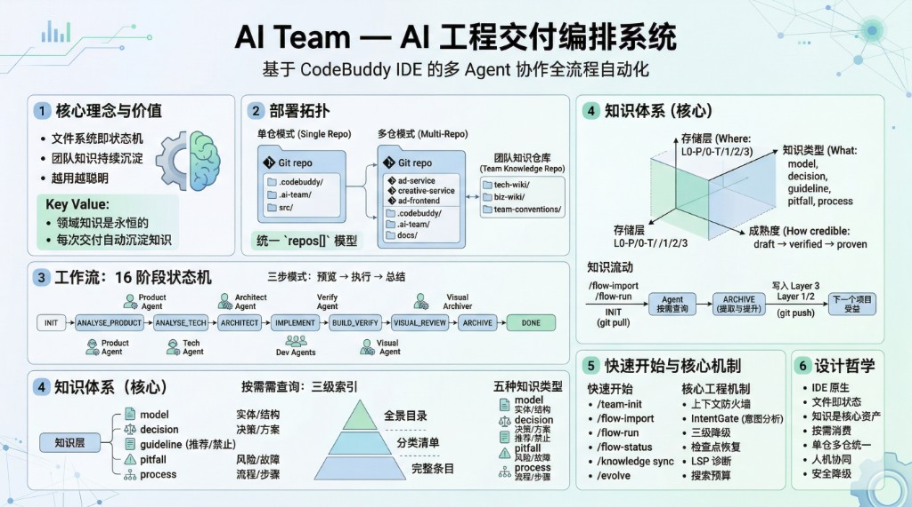
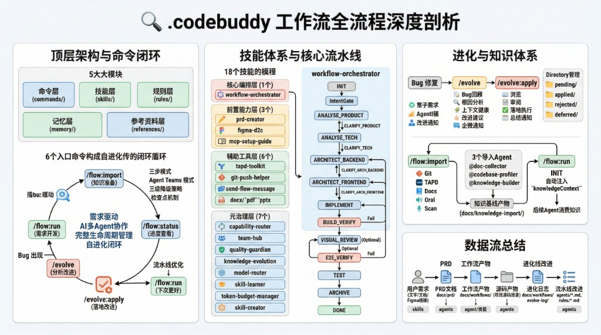

# AI Team — AI 工程交付编排系统

> 基于 CodeBuddy IDE / Claude Code 的 Skill / Command / Rule 体系，实现多 Agent 协作的全流程需求交付自动化。
> **核心理念**：文件系统即状态机，团队知识持续沉淀，越用越聪明。
>
> 📐 本文件是面向**使用者**的薄门户。完整的架构设计、16 阶段状态机、知识体系、数据模型与扩展指南，见 **[ARCHITECTURE.md](./ARCHITECTURE.md)**（单一架构权威源）。

---

## 这是什么

AI Team 是一套**工作流引擎**，安装到你的业务项目后，用一条命令 `/flow-run` 驱动 AI Agent 完成从需求分析到代码归档的全流程。它不是一个独立平台，而是一组 IDE 原生识别的 Skill / Agent / Command 定义文件——`.codebuddy/` 给 CodeBuddy 用、`.claude/` 给 Claude Code 用，**双平台镜像维护、功能完全等价**。

**核心价值**：Skill、Agent、工具链会随模型迭代更新，但**领域知识是永恒的**。AI Team 的每次交付都自动沉淀知识到团队共享仓库，所有成员共建共享，新工作流启动时自动站在前人肩上。



---

## 安装

在你的业务项目中打开 CodeBuddy 或 Claude Code，粘贴给 Agent：

```
请帮我从远程仓库拉取 ai-team 工作流系统到当前工作区。按顺序执行：

1. cd {当前工作区根目录}
   git clone --depth 1 git@git.woa.com:Agentic-CE-Infra/ur-ai-team.git .ai-team-install

2. cp -r .ai-team-install/.codebuddy ./
   cp -r .ai-team-install/.claude ./        # 双平台同步部署

3. rm -rf .ai-team-install

4. 验证：检查 .codebuddy/skills/、.codebuddy/commands/、.claude/skills/、.claude/commands/ 目录是否存在。

完成后告诉我安装结果。
```

安装后两个目录立即被对应 IDE 识别。后续可使用 `/flow-upgrade` 命令版本对比 + 选择性更新（双平台同步）。

> 团队小伙伴只需 `cp -r .codebuddy/` + `cp -r .claude/` 两个目录，**完全不需要拷贝 `scripts/` / `meta/` / `ARCHITECTURE.md` 等**——`/flow-run` 等运行时命令与维护者工具链完全解耦。

---

## 快速开始

```bash
# 1. 首次使用：连接团队知识仓库（每个项目执行一次）
/team-init

# 2. 已有代码库：导入历史知识（可选但推荐）
/flow-import

# 3. 日常开发：启动交付工作流
/flow-run                              # 从上下文推断需求
/flow-run docs/prd/my-requirement.md   # 从 PRD 文档启动

# 4. 查看进度
/flow-status

# 5. 知识库维护
/knowledge status                      # 查看知识库状态
/knowledge lint                        # 健康检查（含模块活跃度抑制 + 事实漂移扫描）
/knowledge sync                        # 同步团队知识仓库
/knowledge fact-check                  # 手动触发代码事实校对（重构后立即用）

# 6. 复盘改进
/evolve                                # 分析改进建议
/evolve-apply                          # 落地改进

# 7. 更新工作流引擎
/flow-upgrade                          # 版本对比 + 选择性更新
```

---

## 可用命令

<!-- BEGIN AUTO-GEN: readme-commands-table hash=3df811f8b308b810 source=commands/*.md frontmatter + 现状 -->

| 命令 | 用途 |
|------|------|
| `/flow-run` | 启动交付工作流（支持附带 PRD 文档启动 / 文字描述 / 直接启动三种入口） |
| `/flow-import` | 历史项目知识导入（支持 Git/TAPD/iwiki/本地文档/口述） |
| `/flow-upgrade` | 工作流版本更新（远程对比 + 选择性更新 `.codebuddy/` 与 `.claude/` 双平台同步） |
| `/flow-status` | 查看所有需求的进度、当前阶段、风险汇总（无需启动编排器） |
| `/team-init` | 初始化项目配置，连接团队知识仓库，绑定 `repos[]`、业务领域和技术栈 |
| `/knowledge` | 知识库维护（status / lint / sync / query / add / fact-check / promote） |
| `/evolve` | 流水线进化分析（基于 Bug 追溯 Agent 环节，产出改进建议存入进化日志） |
| `/evolve-apply` | 流水线进化落地（仅 Owner 使用，浏览 pending 记录后逐条审阅落地） |
| `/guard` | 守卫模式开关（开启后 AI 不直接执行操作，逐步确认推进） |

<!-- END AUTO-GEN: readme-commands-table -->

---

## 可用 Skills

> 双平台镜像维护，`.codebuddy/skills/` 共 18 个、`.claude/skills/` 共 17 个（差异为标 ⚠️ 的单平台特例，详见 [ARCHITECTURE.md 附录 B](./ARCHITECTURE.md)）。

**核心工作流类**

| Skill | 用途 |
|-------|------|
| `workflow-orchestrator` | 核心编排 — 16 阶段状态机 + Agent Teams + 三级降级 + 知识闭环 |
| `knowledge-evolution` | 知识进化引擎 — 提取 + 存储 + 按需查询 + 生命周期 + 衰减 |
| `figma-d2c` | Figma 设计稿转代码（16 步检查点协议 CP-0 → CP-M） |
| `prd-creator` | 苏格拉底式渐进提问引导创建 PRD |
| `quality-guardian` | 全流程质量监控（质量看板、回退分析、趋势对比） |
| `team-hub` | 团队级多需求协同管理（角色看板、瓶颈分析、资源冲突检测） |

**集成 / 协作类**

| Skill | 用途 |
|-------|------|
| `tapd-toolkit` | TAPD 集成（图片上传、附件上传/查询/下载，补充 MCP 原生工具） |
| `git-push-helper` | Git 自动化推送（暂存 → AI 生成 commit message → 推送 + MR + 通知） |
| `send-flow-message` | 通过 Redis 消息队列向企微群发送通知（卡片 / Markdown） |
| `iwiki-operation` ⚠️ | iWiki 文档创建/修改（仅 `.codebuddy/`，依赖 iwiki MCP） |
| `mcp-setup-guide` | MCP 服务配置引导（TAPD / iWiki / Figma 等） |

**元能力 / 优化类**

| Skill | 用途 |
|-------|------|
| `capability-router` | 意图分析与 Skill 路由（Skills 系统的智能前端） |
| `model-router` | 多模型路由（按任务复杂度/上下文长度/成本预算选模型） |
| `skill-learner` | Skill 自学习引擎（基于历史数据评估优化 Skill / Agent 表现） |
| `skill-creator` | 创建 / 改进 / 评测 Skill 的元工具 |
| `token-budget-manager` | Token 预算管理（消耗追踪、预警、成本优化） |

**通用文档处理类**（来自 Anthropic 官方 Skills）

| Skill | 用途 |
|-------|------|
| `pdf` | PDF 读写（提取/合并/分割/旋转/水印/OCR/表单） |
| `docx` | Word 文档处理（创建、读取、编辑 .docx，支持表格、目录、图片） |



---

## 文档导航

本 README 只承载使用者门户内容。**原理、运行流程、功能边界、是否需要拷贝到业务项目**见 **[使用说明.md](./使用说明.md)**；架构性细节以 **[ARCHITECTURE.md](./ARCHITECTURE.md)** 为单一权威源。

| 想了解 | 去哪看 |
|--------|--------|
| 实现原理 / 运行流程 / 功能清单 / 拷贝范围 | [使用说明.md](./使用说明.md) |
| 架构全景 / 设计哲学 / 与同类系统差异 | [ARCHITECTURE.md](./ARCHITECTURE.md) §1 |
| 部署拓扑（单仓 / 多仓 `repos[]` + 团队知识仓库） | [ARCHITECTURE.md](./ARCHITECTURE.md) §2 |
| 双平台镜像设计与方言对照 | [ARCHITECTURE.md](./ARCHITECTURE.md) §3 |
| 16 阶段状态机 / 各阶段做什么 / 流转守卫 | [ARCHITECTURE.md](./ARCHITECTURE.md) §4 |
| Agent 编制全景（静态 / 动态 / 三级降级 / 检查点） | [ARCHITECTURE.md](./ARCHITECTURE.md) §5 |
| 知识体系（存储层 / 类型 / 成熟度 / 查询预算） | [ARCHITECTURE.md](./ARCHITECTURE.md) §6 |
| 核心工程机制 / 防漂移防线 | [ARCHITECTURE.md](./ARCHITECTURE.md) §7 |
| `state.json` 数据模型 | [ARCHITECTURE.md](./ARCHITECTURE.md) §8 |
| D2C 双模式 / docsRoot 机制 / `/flow-import` 冷启动 | [ARCHITECTURE.md](./ARCHITECTURE.md) §9 |
| 目录结构详解 | [ARCHITECTURE.md](./ARCHITECTURE.md) §10 |
| 扩展指南（新增 Skill / Command / Agent / 阶段 / 字段） | [ARCHITECTURE.md](./ARCHITECTURE.md) §11 |
| 演化脉络 / 更新日志 | [ARCHITECTURE.md](./ARCHITECTURE.md) 附录 A |
| 已知待办 / 显式不做的事 | [ARCHITECTURE.md](./ARCHITECTURE.md) 附录 B / C |
| 引擎维护者工具链（`scripts/` + `meta/`，⚠️ 仅维护者用） | [`scripts/README.md`](./scripts/README.md) · [`meta/README.md`](./meta/README.md) · 协作约定 [`CLAUDE.md`](./CLAUDE.md) / [`CODEBUDDY.md`](./CODEBUDDY.md) |

---

## License

MIT
